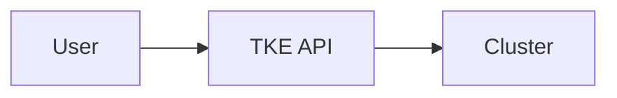

# CODEBUDDY.md This file provides guidance to CodeBuddy when working with code in this repository.

## Project Overview

This is a **MkDocs Material documentation site** for TKE (Tencent Kubernetes Engine) Workshop - a hands-on learning platform for cloud-native skills covering Kubernetes basics, networking, security, AI/ML, data workloads, and control plane management.

**Live Site**: https://tke-workshop.github.io  
**Tech Stack**: MkDocs + Material theme + Python 3.11+  
**Design Philosophy**: Agent-First (optimized for AI Agents like Claude, GPT-4)

---

## Common Development Commands

### Documentation Development

```bash
# Create virtual environment
python3 -m venv venv
source venv/bin/activate  # On macOS/Linux
# venv\Scripts\activate   # On Windows

# Install dependencies
pip install -r requirements.txt

# Start development server (with hot reload)
mkdocs serve
# Site available at http://127.0.0.1:8000

# Start on different port
mkdocs serve -a localhost:8080

# Build static site (output to ./site directory)
mkdocs build

# Build with strict mode (fail on warnings)
mkdocs build --strict

# Deploy to GitHub Pages (manual, if needed)
mkdocs gh-deploy
```

**Note**: Automatic deployment via GitHub Actions is configured - push to `main` branch triggers build and deployment.

### Cookbook Scripts (Executable Examples)

```bash
# Setup cookbook environment
cd cookbook
pip install -r requirements.txt

# Configure API credentials
cp config.example.yaml config.yaml
vim config.yaml  # Fill in SecretId and SecretKey

# Run cluster creation example
python3 cluster/create_cluster.py \
  --cluster-name my-cluster \
  --region ap-guangzhou \
  --k8s-version 1.28.3 \
  --wait

# Run workload deployment example
python3 workload/deploy_nginx.py \
  --replicas 3 \
  --expose \
  --service-type LoadBalancer

# Run GPU Pod deployment example (supernode)
python3 supernode/deploy_gpu_pod.py \
  --cluster-id cls-xxxxxxxx \
  --gpu-type T4 \
  --gpu-count 1 \
  --image nvidia/cuda:11.8-runtime \
  --wait
```

Cookbook scripts use common utilities in `cookbook/common/` (auth.py, logger.py) for authentication and logging.

### Testing & Validation

```bash
# Validate Markdown syntax
mkdocs build --strict

# Test cookbook script syntax (Python)
python3 -m py_compile cookbook/cluster/create_cluster.py

# Check for broken links (optional)
find docs -name "*.md" -exec grep -l "http" {} \;

# Validate YAML files
python3 -c "import yaml; yaml.safe_load(open('cookbook/config.example.yaml'))"
```

---

## Project Architecture

### Agent-First Design Philosophy

This project is **optimized for AI Agents** to understand and execute TKE operations autonomously:

- **Structured Metadata**: Every doc has machine-readable headers (API version, prerequisites, agent-friendliness score)
- **Complete API Tables**: Full parameter specifications with types, defaults, and constraints
- **Multi-Format Examples**: cURL, SDK (Python/Go), kubectl, and declarative YAML
- **Executable Cookbook**: Ready-to-run scripts in `cookbook/` directory with production-ready code
- **Clear Verification**: Step-by-step validation procedures with expected outputs
- **Error Handling**: Common errors with solutions and troubleshooting flows

This design allows AI Agents to:
1. Parse documentation structure programmatically
2. Execute operations using multiple methods (API, kubectl, SDK)
3. Validate results automatically
4. Troubleshoot common errors without human intervention

### Directory Structure

```
tke-workshop.github.io/
├── docs/                    # All documentation content (Markdown)
│   ├── index.md            # Custom homepage with Agent-First intro
│   ├── basics/             # Module: Getting started
│   │   ├── cluster/        # Cluster operations (create, delete, describe)
│   │   ├── node/           # Node management (add, delete, describe)
│   │   ├── nodepool/       # Node pool management
│   │   ├── supernode/      # 🆕 Supernode management (serverless nodes)
│   │   ├── workload/       # Workload deployment (Deployment, StatefulSet)
│   │   └── service/        # Service management (ClusterIP, LoadBalancer)
│   ├── ai-ml/              # Module: AI/ML workloads
│   │   └── 04-gpu-pod-best-practices.md  # 🆕 GPU Pod deployment
│   ├── security/           # Module: Security practices
│   │   └── policy-management.md  # 🆕 OPA Gatekeeper policies
│   ├── control-plane/      # Module: Cluster management
│   │   └── upgrade.md      # 🆕 Cluster upgrade procedures
│   ├── data/               # Module: Data & storage
│   ├── observability/      # Module: Monitoring/logging/tracing
│   ├── networking/         # Module: Service, Ingress, Network Policy
│   ├── stylesheets/        # Custom CSS
│   └── javascripts/        # Custom JS
├── cookbook/               # 🍳 Executable scripts (Agent-ready)
│   ├── common/             # Shared utilities
│   │   ├── auth.py         # Tencent Cloud authentication helper
│   │   └── logger.py       # Colored logging with context management
│   ├── cluster/            # Cluster operations
│   │   └── create_cluster.py  # Create TKE cluster with wait
│   ├── node/               # Node management (planned)
│   ├── workload/           # Workload deployment
│   │   ├── deploy_nginx.py    # Deploy Nginx with Service
│   │   └── deploy_nginx.yaml  # Declarative YAML config
│   ├── service/            # Service creation (planned)
│   ├── supernode/          # 🆕 Supernode & GPU Pod
│   │   ├── deploy_gpu_pod.py       # Deploy GPU Pod with drivers
│   │   └── gpu_pod_examples.yaml   # GPU Pod configurations
│   ├── scenarios/          # Complete scenarios (planned)
│   ├── requirements.txt    # Python dependencies
│   └── config.example.yaml # Configuration template
├── overrides/              # Theme customization directory
├── mkdocs.yml              # MkDocs configuration (navigation, theme, plugins)
├── requirements.txt        # Python dependencies for documentation
├── CODEBUDDY.md            # This file - AI Agent development guide
├── CONTRIBUTING.md         # Contribution guidelines
└── .github/workflows/      # CI/CD automation
```

### Cookbook Architecture

The `cookbook/` directory contains production-ready, executable scripts designed for:
- **Direct execution**: Run immediately after configuring `config.yaml`
- **Agent integration**: Structured for AI Agents to call programmatically
- **Learning reference**: Demonstrates TKE/Kubernetes best practices

**Key Design Patterns**:
- All scripts use `common/auth.py` for Tencent Cloud API client initialization
- All scripts use `common/logger.py` for consistent colored logging with context
- Configuration loaded from `config.yaml` (copy from `config.example.yaml`)
- Scripts support `--wait` flag to poll resources until ready (async → sync)
- Comprehensive error handling with actionable error messages
- Return structured outputs (JSON-compatible) for Agent parsing

**Example Cookbook Script Structure**:
```python
#!/usr/bin/env python3
from common.auth import get_tke_client
from common.logger import setup_logger

def main(cluster_name, region, wait=False):
    logger = setup_logger(__name__)
    client = get_tke_client(region)
    
    try:
        # Execute operation with error handling
        response = client.CreateCluster(...)
        
        if wait:
            # Poll until ready with timeout
            wait_for_cluster_ready(client, cluster_id, timeout=1800)
        
        return {"cluster_id": cluster_id, "status": "success"}
    except Exception as e:
        logger.error(f"Operation failed: {e}")
        return {"status": "error", "message": str(e)}
```

### Current Module Coverage

| Module | Documentation | Cookbook Scripts | Status |
|--------|---------------|------------------|--------|
| **basics/cluster** | Create/delete clusters, describe | `cluster/create_cluster.py` | ✅ Complete |
| **basics/node** | Add/delete nodes, describe | Planned | 🚧 Docs ready |
| **basics/nodepool** | Create/scale node pools | Planned | 🚧 Docs ready |
| **basics/supernode** | Supernode pool management | `supernode/deploy_gpu_pod.py` | ✅ Complete |
| **basics/workload** | Deployments, StatefulSets | `workload/deploy_nginx.py` | ✅ Complete |
| **basics/service** | ClusterIP, LoadBalancer, NodePort | Planned | 🚧 Docs ready |
| **ai-ml/** | GPU Pod best practices | `supernode/gpu_pod_examples.yaml` | ✅ Complete |
| **security/** | OPA Gatekeeper policies | Planned | 🚧 Docs ready |
| **control-plane/** | Cluster upgrade procedures | Planned | 🚧 Docs ready |
| **networking/** | Service mesh, Ingress | Not started | 📝 Planned |
| **observability/** | Monitoring, logging, tracing | Not started | 📝 Planned |
| **data/** | Storage, databases | Not started | 📝 Planned |


### Key Configuration Files

#### `mkdocs.yml`
- **Navigation structure** (`nav`): Defines sidebar menu hierarchy
- **Theme settings**: Material theme with indigo primary color, dark/light mode toggle
- **Plugins**: 
  - `search`: Chinese language search
  - `git-revision-date-localized`: Shows last updated dates
  - `git-committers`: Contributors plugin (CI-only)
  - `minify`: Minifies HTML output
- **Markdown extensions**: Admonitions, code highlighting, Mermaid diagrams, tabs, task lists

#### `docs/index.md`
- Custom homepage with **inline styles** (not in separate CSS)
- Full-width hero section with gradients
- Module grid with hover effects
- Uses HTML + CSS within Markdown

### Module Structure Pattern

Each documentation module follows the **Agent-First** structure:

```
module-name/
├── index.md          # Module landing page with overview
├── 01-operation.md   # Operational doc with API/SDK/kubectl examples
├── 02-operation.md   # Another operation
└── ...
```

Each operational document follows this template:

```markdown
# Document Title

## 文档元信息
- API 版本: 2018-05-25
- Agent 友好度: ⭐⭐⭐⭐⭐
- 适用集群版本: 1.20+

## 功能概述
[Clear 1-sentence description of what this operation does]

## 前置条件
- [ ] Checklist item 1 (e.g., "已创建 VPC")
- [ ] Checklist item 2 (e.g., "已获取 API 密钥")

## API 参数表
| Parameter | Required | Type | Description | Example | Constraints |
|-----------|----------|------|-------------|---------|-------------|
| ClusterId | Yes | String | Cluster ID | cls-xxx | Starts with cls- |

## 操作步骤

### 方式 1: 使用 cURL (HTTP API)
[Complete cURL example with headers and signature]

### 方式 2: 使用 Python SDK
[Python code example with error handling]

### 方式 3: 使用 Go SDK
[Go code example with error handling]

### 方式 4: 使用 kubectl (if applicable)
[kubectl command or YAML manifest]

## 验证步骤
1. Check resource status: `kubectl get ...`
2. Verify expected output
3. Test functionality

## 异常处理
| Error Code | Cause | Solution |
|------------|-------|----------|
| InvalidParameter | Wrong param | Check param table |

## Agent Prompt 模板
[Copy-paste prompts for AI Agents to use this doc]

## Cookbook 示例
See: [cookbook/module/script.py](../../cookbook/module/script.py)
```

This structure ensures:
- **Machine-parseable**: Clear sections with consistent headers
- **Complete information**: All necessary details for execution
- **Multiple methods**: AI Agent can choose appropriate method
- **Validation included**: Agent knows how to verify success
- **Error recovery**: Agent can troubleshoot common issues

Navigation is manually defined in `mkdocs.yml` under the `nav` section.

---

## Content Guidelines

### Creating New Documentation

1. **Choose appropriate module** (basics/ai-ml/security/etc.)
2. **Follow Agent-First template** (see Module Structure Pattern above)
3. **Include all operation methods**:
   - cURL example (HTTP API with full headers)
   - SDK examples (Python and/or Go)
   - kubectl/YAML (if applicable for Kubernetes resources)
4. **Add complete API parameter table** with types, constraints, examples
5. **Include verification steps** with expected outputs
6. **Document common errors** and solutions
7. **Link to Cookbook script** (if available) or mark as "planned"

### Creating New Cookbook Scripts

1. **Use common utilities**: Import from `cookbook/common/`
2. **Follow structure**: 
   ```python
   #!/usr/bin/env python3
   """Brief description of what this script does."""
   
   import argparse
   from common.auth import get_tke_client
   from common.logger import setup_logger
   
   def main(args):
       logger = setup_logger(__name__)
       # Implementation with error handling
       
   if __name__ == "__main__":
       parser = argparse.ArgumentParser(description="...")
       # Add arguments
       args = parser.parse_args()
       main(args)
   ```
3. **Add comprehensive error handling** with actionable messages
4. **Support `--wait` flag** for async operations (poll until ready)
5. **Return structured output** (dict/JSON for Agent parsing)
6. **Add README** in script directory with usage examples
7. **Update main cookbook/README.md** with new script

### Adding New Module

1. Create directory in `docs/` (e.g., `docs/new-module/`)
2. Add `index.md` with module overview:
   ```markdown
   # New Module
   
   ## 模块概述
   [Description]
   
   ## 核心功能
   - Feature 1
   - Feature 2
   
   ## 学习路径
   1. [Operation 1](01-operation.md)
   2. [Operation 2](02-operation.md)
   ```
3. Create operational docs following Agent-First template
4. Update `nav` section in `mkdocs.yml`:
   ```yaml
   nav:
     - New Module:
       - new-module/index.md
       - Operation 1: new-module/01-operation.md
       - Operation 2: new-module/02-operation.md
   ```
5. Create corresponding `cookbook/new-module/` directory (if scripts needed)
6. Update this CODEBUDDY.md with new module info

### Markdown Features Available

The site uses **PyMdown Extensions** for enhanced Markdown:

```markdown
# Admonitions (callout boxes)
!!! note "注意"
    This is a note

!!! tip "提示"
    This is a helpful tip

!!! warning "警告"
    This is a warning

!!! danger "危险"
    Critical warning

# Code blocks with syntax highlighting
```bash
mkdocs serve
```

```python
def hello():
    print("Hello, TKE!")
```

# Tabbed content (multiple examples)
=== "Python"
    ```python
    client.CreateCluster(...)
    ```

=== "Go"
    ```go
    client.CreateCluster(...)
    ```

=== "cURL"
    ```bash
    curl -X POST ...
    ```

# Task lists
- [x] Completed task
- [ ] Pending task

# Tables
| Column 1 | Column 2 | Column 3 |
|----------|----------|----------|
| Data     | Data     | Data     |

# Mermaid diagrams

```

Use tabbed content extensively to show multiple implementation methods (cURL/Python/Go/kubectl) in a compact format.

---

## CI/CD Pipeline

### GitHub Actions Workflow (`.github/workflows/deploy.yml`)

**Triggers**:
- Push to `main` → Build + Deploy to GitHub Pages
- Pull Request → Build only (with PR comment confirmation)

**Build Steps**:
1. Checkout with full history (`fetch-depth: 0` for git plugins)
2. Setup Python 3.11 with pip cache
3. Install dependencies from `requirements.txt`
4. Run `mkdocs build` with `CI=true` environment variable
5. Upload artifact for deployment

**Deployment**:
- Only runs on `main` branch pushes
- Uses `actions/deploy-pages@v4`
- Deployed to GitHub Pages environment

---

## Development Workflow

### Standard Workflow (from CONTRIBUTING.md)

```bash
# 1. Create feature branch
git checkout -b docs/module-name-feature

# 2. Make changes and preview locally
mkdocs serve

# 3. Test cookbook scripts (if applicable)
cd cookbook
python3 module/script.py --help

# 4. Commit with conventional commit format
git commit -m "docs(module): description"
# Types: docs, feat, fix, style, refactor, test, chore

# 5. Push and create PR
git push origin docs/module-name-feature
gh pr create --title "docs: add feature X" --body "Description"
```

### PR Checklist

- [ ] Local preview works (`mkdocs serve`)
- [ ] All links are valid and working
- [ ] Code examples tested (cookbook scripts run successfully)
- [ ] Follows Agent-First template (for operational docs)
- [ ] API parameter table complete (if applicable)
- [ ] Verification steps included
- [ ] Error handling documented
- [ ] No spelling errors
- [ ] Images optimized (< 200KB recommended)
- [ ] Follows existing style and conventions
- [ ] `mkdocs.yml` navigation updated (if new pages added)

---

## Key Dependencies

### Documentation Dependencies (requirements.txt)

- **mkdocs**: 1.6.1 - Static site generator
- **mkdocs-material**: 9.7.1 - Material Design theme with dark mode
- **pymdown-extensions**: 10.20 - Extended Markdown features (admonitions, tabs, task lists)
- **mkdocs-git-revision-date-localized-plugin**: Shows last modified dates from git
- **mkdocs-git-committers-plugin-2**: Shows contributors per page
- **mkdocs-minify-plugin**: Minifies HTML/CSS/JS output

### Cookbook Dependencies (cookbook/requirements.txt)

- **tencentcloud-sdk-python**: Tencent Cloud SDK for Python
- **kubernetes**: Official Kubernetes Python client
- **pyyaml**: YAML parsing and generation
- **colorlog**: Colored terminal logging
- **requests**: HTTP library for API calls

Install separately depending on what you're working on (docs vs. cookbook).

---

## Special Notes

### Agent-First Documentation Standards

When creating or updating docs for AI Agents:

1. **Structured Metadata Section**: Always include at the top
   ```markdown
   ## 文档元信息
   - API 版本: 2018-05-25
   - Agent 友好度: ⭐⭐⭐⭐⭐ (5 stars = fully executable by Agent)
   - 适用集群版本: 1.20+ / All
   ```

2. **Complete API Parameter Tables**: Include all fields
   - Parameter name
   - Required (Yes/No)
   - Type (String/Integer/Boolean/Array/Object)
   - Description (clear, concise)
   - Example value
   - Constraints (if any)

3. **Multi-Format Examples**: Provide at least 2 methods
   - cURL (HTTP API with full signature)
   - SDK (Python or Go with error handling)
   - kubectl/YAML (if applicable for K8s resources)

4. **Agent Prompt Templates**: Add section at bottom
   ```markdown
   ## Agent Prompt 模板
   
   ### 场景 1: 创建集群
   ```prompt
   请使用以下文档创建一个 TKE 集群:
   https://tke-workshop.github.io/basics/cluster/01-create-cluster/
   
   集群要求:
   - 地域: ap-guangzhou
   - K8s 版本: 1.28.3
   - 节点数: 3
   ```
   ```

5. **Link to Cookbook**: Reference executable scripts
   ```markdown
   ## Cookbook 示例
   
   本文档对应的可执行脚本: [cookbook/cluster/create_cluster.py](../../cookbook/cluster/create_cluster.py)
   ```

### Chinese Content Support

- Site language set to `zh` in theme config
- Search plugin configured for Chinese (`lang: zh`)
- Content is primarily in Chinese (Simplified)
- Use Chinese section headers (功能概述, 前置条件, 操作步骤, etc.)
- Code and technical terms can be in English
- Error messages should include both Chinese description and English error code

### Git Plugins

- Git-based plugins (`git-revision-date`, `git-committers`) require full git history
- `git-committers` only enabled in CI (`enabled: !ENV [CI, false]`)
- Requires `GITHUB_TOKEN` in CI for API access
- Local builds work without these plugins (gracefully disabled)

### Image Assets

- Store in appropriate module directory: `docs/module-name/images/`
- Or use shared `docs/assets/` directory
- Optimize images before committing (< 200KB recommended)
- Use descriptive filenames: `cluster-architecture.png` not `image1.png`
- Supported formats: PNG, JPG, SVG (prefer SVG for diagrams)

### Cookbook Configuration

- Never commit `cookbook/config.yaml` (contains API credentials)
- Always use `config.example.yaml` as template
- `.gitignore` configured to exclude `config.yaml` and `*.pyc`
- Scripts should validate config exists and has required fields

---

## Troubleshooting

### Documentation Build Issues

```bash
# Check for Markdown syntax errors
mkdocs build --strict

# Verify dependencies
pip list | grep mkdocs

# Clear cache and rebuild
rm -rf site/
mkdocs build

# Check for broken internal links
mkdocs build --strict 2>&1 | grep -i "warning"
```

### Preview Not Updating

- MkDocs has hot reload - check terminal for errors
- Try restarting: `Ctrl+C`, then `mkdocs serve` again
- Clear browser cache or use incognito mode
- Check if file is saved (common issue)

### Navigation Not Showing

- Verify file paths in `mkdocs.yml` `nav` section match actual file locations
- Paths are relative to `docs/` directory
- Check for typos in filenames or paths
- Ensure files have `.md` extension

### Cookbook Script Errors

```bash
# Verify config exists
ls cookbook/config.yaml

# Check Python syntax
python3 -m py_compile cookbook/module/script.py

# Test with verbose logging
python3 cookbook/module/script.py --help

# Check API credentials
python3 -c "import yaml; print(yaml.safe_load(open('cookbook/config.yaml')))"

# Verify Tencent Cloud SDK installation
pip list | grep tencentcloud
```

### Common Error Messages

| Error | Cause | Solution |
|-------|-------|----------|
| `Config file 'mkdocs.yml' does not exist` | Wrong directory | Run `mkdocs` commands from project root |
| `Page not found` | Broken link in nav | Check file path in `mkdocs.yml` |
| `No module named 'mkdocs'` | Dependencies not installed | Run `pip install -r requirements.txt` |
| `FileNotFoundError: config.yaml` | Config not created | Copy from `config.example.yaml` |
| `AuthFailure` (Tencent Cloud) | Invalid credentials | Check `config.yaml` SecretId/SecretKey |

---

## Reference Links

- **MkDocs Documentation**: https://www.mkdocs.org
- **Material for MkDocs**: https://squidfunk.github.io/mkdocs-material
- **PyMdown Extensions**: https://facelessuser.github.io/pymdown-extensions
- **Tencent Cloud TKE API**: https://cloud.tencent.com/document/api/457
- **Kubernetes API Reference**: https://kubernetes.io/docs/reference/
- **Project Repository**: https://github.com/tke-workshop/tke-workshop.github.io
- **Live Site**: https://tke-workshop.github.io
- **Contributing Guidelines**: [CONTRIBUTING.md](CONTRIBUTING.md)

---

## Quick Reference Commands

```bash
# Documentation
mkdocs serve                          # Start dev server
mkdocs build --strict                 # Build with error checking
mkdocs gh-deploy                      # Deploy to GitHub Pages

# Cookbook
cd cookbook
python3 cluster/create_cluster.py --help
python3 workload/deploy_nginx.py --replicas 3
python3 supernode/deploy_gpu_pod.py --gpu-type T4

# Testing
python3 -m py_compile script.py      # Check Python syntax
mkdocs build --strict                # Check Markdown
git diff --check                     # Check for whitespace issues

# Git workflow
git checkout -b docs/feature-name    # Create branch
git commit -m "docs(module): desc"   # Commit with convention
gh pr create --title "..."           # Create PR
```
