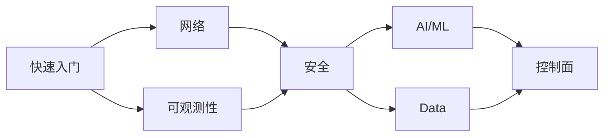

# TKE Workshop

[](https://github.com/tke-workshop/tke-workshop.github.io/actions/workflows/deploy.yml)
[](LICENSE)

> 腾讯云容器服务 TKE 官方最佳实践 Workshop —— 通过动手实践，从入门到精通

**在线访问**: [https://tke-workshop.github.io](https://tke-workshop.github.io)

---

## 为什么需要 TKE Workshop？

传统产品文档解决的是「从 1 到 N」的问题，而 Workshop 解决的是「从 0 到 1」的问题。

```
用户旅程：认知 → 学习 → 试用 → 采购 → 深度使用
                    ↑                      ↑
              Workshop 解决            Docs 解决
              "从 0 到 1"             "从 1 到 N"
```

| 维度 | 产品文档 | Workshop |
|------|----------|----------|
| **目标** | 功能参考 | 场景化学习 |
| **组织方式** | 按功能模块 | 按学习路径 |
| **用户体验** | 被动查阅 | 主动引导 |
| **完成时间** | 不确定 | 每模块 30-60 分钟 |

---

## 核心特点

### 🎯 模块化设计

独立模块，可任意顺序学习，每个模块 30-60 分钟可完成：

| 模块 | 内容 | 适合人群 |
|------|------|----------|
| **快速入门** | 集群创建、kubectl 操作、应用部署 | 新手入门 |
| **网络** | Service、Ingress、网络策略、VPC-CNI | 网络工程师 |
| **可观测性** | 监控告警、日志采集、链路追踪 | SRE/运维 |
| **安全** | RBAC、Pod 安全、镜像安全 | 安全工程师 |
| **AI/ML** | GPU 调度、模型推理、训练任务 | AI 工程师 |
| **Data** | 存储配置、数据处理 | 数据工程师 |
| **控制面** | 集群升级、高可用 | 平台管理员 |

### 🏪 统一示例应用

所有模块使用同一套微服务电商应用，降低理解成本：

```
TKE Demo Store
├── frontend/          # 前端服务
├── api-gateway/       # API 网关
├── user-service/      # 用户服务
├── product-service/   # 商品服务
├── order-service/     # 订单服务
└── recommendation/    # 推荐服务 (AI/ML)
```

### 🤝 社区共建

- 开源协作，欢迎社区贡献
- 每个页面支持一键编辑
- 贡献者自动展示在页面底部

---

## 学习路径



**推荐学习顺序**：

1. **Day 1**: 快速入门（90 分钟）—— 掌握 TKE 基础操作
2. **Day 2**: 网络 + 可观测性（2 小时）—— 理解服务暴露与监控
3. **Day 3**: 安全（1 小时）—— 掌握权限与安全配置
4. **进阶**: AI/ML、Data、控制面 —— 按需学习

---

## 本地开发

### 环境准备

```bash
# 克隆仓库
git clone https://github.com/tke-workshop/tke-workshop.github.io.git
cd tke-workshop.github.io

# 创建虚拟环境
python3 -m venv venv
source venv/bin/activate  # Windows: venv\Scripts\activate

# 安装依赖
pip install -r requirements.txt

# 启动本地预览
mkdocs serve
# 浏览器打开 http://127.0.0.1:8000
```

### 常用命令

```bash
mkdocs serve          # 本地预览（支持热重载）
mkdocs build          # 构建静态站点
mkdocs build --strict # 严格模式构建（CI 使用）
```

---

## 参与贡献

我们欢迎各种形式的贡献！

### 快速贡献

1. 点击文档页面右上角的 ✏️ 编辑按钮
2. 在 GitHub 网页上直接编辑
3. 提交 Pull Request

### 本地贡献

```bash
# Fork 并克隆仓库
git clone git@github.com:YOUR_USERNAME/tke-workshop.github.io.git

# 创建分支
git checkout -b docs/your-feature

# 编辑文档并本地预览
mkdocs serve

# 提交并推送
git add .
git commit -m "docs(模块): 简要描述"
git push origin docs/your-feature

# 在 GitHub 创建 Pull Request
```

### 贡献规范

- **分支命名**: `docs/模块-描述`、`fix/问题描述`、`feat/新功能`
- **Commit 格式**: `<type>(<scope>): <description>`
- **文档风格**: 参考 [CONTRIBUTING.md](CONTRIBUTING.md)

---

## 目录结构

```
tke-workshop.github.io/
├── docs/                    # 文档内容
│   ├── index.md            # 首页
│   ├── basics/             # 快速入门
│   ├── networking/         # 网络
│   ├── observability/      # 可观测性
│   ├── security/           # 安全
│   ├── ai-ml/              # AI/ML
│   ├── data/               # Data
│   ├── control-plane/      # 控制面
│   ├── images/             # 图片资源
│   └── stylesheets/        # 自定义样式
├── .github/
│   ├── workflows/          # CI/CD 配置
│   ├── CODEOWNERS          # 模块负责人
│   └── ISSUE_TEMPLATE/     # Issue 模板
├── mkdocs.yml              # 站点配置
├── requirements.txt        # Python 依赖
└── CONTRIBUTING.md         # 贡献指南
```

---

## 技术栈

| 组件 | 技术选型 | 说明 |
|------|----------|------|
| 静态站点生成 | [MkDocs](https://www.mkdocs.org/) | Python 生态，简单易用 |
| 主题 | [Material for MkDocs](https://squidfunk.github.io/mkdocs-material/) | 美观、功能丰富 |
| 托管 | GitHub Pages | 免费、自动部署 |
| CI/CD | GitHub Actions | 推送即发布 |

---

## 参考项目

本项目参考了业界优秀的 Workshop 实践：

| 项目 | 特点 |
|------|------|
| [AWS EKS Workshop](https://www.eksworkshop.com/) | 模块化设计、统一示例应用、自动化测试 |
| [GKE AI Labs](https://gke-ai-labs.dev/) | AI-First 定位、硬件加速最佳实践 |

---

## 路线图

- [x] **Phase 1**: 框架搭建、CI/CD 配置、基础模块
- [ ] **Phase 2**: 完善核心模块内容、统一示例应用
- [ ] **Phase 3**: AI/ML 专题、社区运营、认证绑定

---

## 联系我们

- 📝 [提交 Issue](https://github.com/tke-workshop/tke-workshop.github.io/issues)
- 📖 [TKE 产品文档](https://cloud.tencent.com/document/product/457)
- 💬 [腾讯云开发者社区](https://cloud.tencent.com/developer)

---

## License

[Apache License 2.0](LICENSE)

---

**Copyright © 2024-2026 Tencent Cloud TKE Team**
