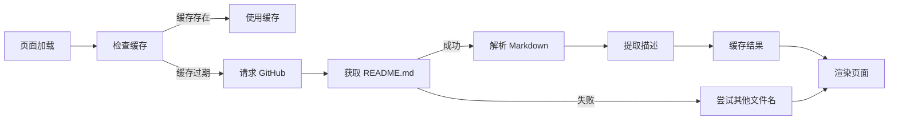

# Cookbook GitHub README 自动集成说明

## 📋 概述

TKE Cookbook Collection 页面现已支持从 GitHub 仓库自动抓取 README 内容作为 Cookbook 的描述信息。

## 🎯 功能特性

### 1. **自动 README 抓取**
- ✅ 每个 Cookbook 必须关联唯一的 GitHub 仓库地址
- ✅ 页面加载时自动从 GitHub 获取 README.md 内容
- ✅ 智能解析 Markdown 格式，提取纯文本描述

### 2. **缓存机制**
- ✅ 5 分钟本地缓存，减少 GitHub API 请求
- ✅ 避免 GitHub API 速率限制
- ✅ 提升页面加载性能

### 3. **加载状态**
- ⏳ **加载中**: 显示动画加载指示器
- ✅ **加载成功**: 显示提取的描述文本
- ⚠️ **加载失败**: 显示错误提示

### 4. **手动刷新**
- 🔄 点击 "Refresh Descriptions" 按钮清除缓存并重新加载

## 📝 配置格式

每个 Cookbook 条目必须包含以下 GitHub 配置:

```javascript
{
    id: 'cookbook-id',
    title: 'Cookbook 标题',
    description: '加载中...', // 将被自动替换
    category: 'cluster',
    language: 'Python',
    resources: [],
    tags: ['tag1', 'tag2'],
    
    // ⭐ GitHub 仓库配置 (必须)
    github: {
        repo: 'owner/repository',      // GitHub 仓库路径
        path: 'path/to/cookbook',      // Cookbook 所在的子目录
        branch: 'main'                 // 分支名 (可选，默认 main)
    },
    
    url: 'https://github.com/owner/repository/blob/main/path/to/script.py',
    services: ['SVC1', 'SVC2']
}
```

## 🔧 技术实现

### README 获取流程



### Markdown 解析规则

自动移除以下内容:
- ❌ YAML Front Matter
- ❌ 标题 (# 开头)
- ❌ 代码块 (\`\`\`)
- ❌ 行内代码 (\`)
- ❌ Markdown 链接 (保留文本)
- ❌ 图片
- ❌ HTML 标签

保留内容:
- ✅ 纯文本段落
- ✅ 前 200 个字符作为描述

## 📊 支持的 README 文件名

按优先级顺序尝试:
1. `README.md` (推荐)
2. `readme.md`
3. `Readme.md`
4. `README.MD`

## 🚀 使用示例

### 示例 1: 基础配置

```javascript
{
    id: 'create-cluster',
    title: '创建 TKE 托管集群',
    description: '加载中...',
    github: {
        repo: 'tke-workshop/tke-workshop.github.io',
        path: 'cookbook/cluster',
        branch: 'main'
    },
    url: 'https://github.com/tke-workshop/tke-workshop.github.io/blob/main/cookbook/cluster/create_cluster.py'
}
```

**对应的 README 路径**:  
`https://raw.githubusercontent.com/tke-workshop/tke-workshop.github.io/main/cookbook/cluster/README.md`

### 示例 2: 不同分支

```javascript
{
    github: {
        repo: 'example/tke-cookbook',
        path: 'gpu/inference',
        branch: 'develop'  // 使用 develop 分支
    }
}
```

## ⚠️ 注意事项

### 1. GitHub API 速率限制
- **未认证**: 60 次/小时
- **已认证**: 5000 次/小时
- **解决方案**: 本地缓存机制 (5 分钟)

### 2. README 文件要求
- ✅ 必须包含有意义的描述文本
- ✅ 建议使用标准 Markdown 格式
- ✅ 描述应在前 200 字符内

### 3. 错误处理
- ⚠️ README 不存在 → 显示 "无法加载描述信息"
- ⚠️ 网络错误 → 显示 "加载失败"
- ⚠️ 配置缺失 → 显示 "配置错误"

## 🔄 手动刷新流程

用户点击 "🔄 Refresh Descriptions" 按钮时:

1. 清除所有缓存
2. 重置所有描述为 "加载中..."
3. 重新渲染页面 (显示加载状态)
4. 并行请求所有 GitHub README
5. 更新描述并重新渲染

## 📈 性能优化

### 并行加载
```javascript
const promises = cookbooks.map(cookbook => fetchGitHubReadme(cookbook.github));
await Promise.all(promises);
```

### 缓存策略
```javascript
const CACHE_DURATION = 5 * 60 * 1000; // 5 分钟
if (cached && Date.now() - cached.timestamp < CACHE_DURATION) {
    return cached.content;
}
```

## 🐛 调试技巧

### 查看控制台日志
```javascript
// 打开浏览器开发者工具 (F12)
// 查看 Console 面板
console.log('README loading status:', cookbook.loaded);
console.error('Failed to fetch README:', error);
```

### 测试特定 Cookbook
```javascript
// 在浏览器 Console 中运行
const cookbook = cookbooks.find(c => c.id === 'create-cluster');
fetchGitHubReadme(cookbook.github).then(console.log);
```

## 📚 相关文档

- [GitHub REST API - Repository Contents](https://docs.github.com/en/rest/repos/contents)
- [GitHub Raw Content URLs](https://docs.github.com/en/repositories/working-with-files/using-files/viewing-a-file#viewing-or-copying-the-raw-file-content)
- [Markdown 语法参考](https://www.markdownguide.org/basic-syntax/)

## 🎉 优势

✅ **实时同步**: 描述始终与 GitHub 仓库保持一致  
✅ **零维护**: 无需在两处维护描述信息  
✅ **用户友好**: 加载状态清晰，错误提示明确  
✅ **性能优化**: 缓存机制减少网络请求  
✅ **可扩展**: 易于添加新的 Cookbook

---

**更新日期**: 2026-01-23  
**版本**: v1.0
