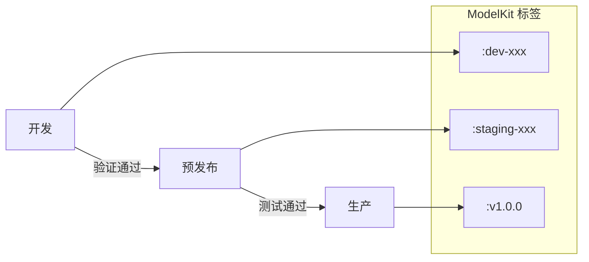

# 最佳实践

## 📚 概述

本文档汇总 KitOps on TKE 的企业级使用最佳实践，帮助团队高效、安全地管理 AI/ML 模型。

## 🎯 文档元信息

- **适用场景**: 企业级 MLOps、模型生命周期管理
- **Agent 友好度**: ⭐⭐⭐⭐⭐

## 📋 核心实践

### 1. 项目结构规范

推荐的 ML 项目目录结构，确保 Kitfile 能够正确打包所有组件：

```
my-ml-project/
├── Kitfile                      # ModelKit 配置文件（必需）
├── VERSION                      # 版本号文件
├── README.md                    # 项目说明
│
├── models/                      # 模型文件目录
│   ├── model.pt                 # PyTorch 模型
│   ├── model.onnx               # ONNX 格式模型
│   ├── config.json              # 模型配置
│   └── tokenizer/               # 分词器（如适用）
│       ├── vocab.txt
│       └── tokenizer_config.json
│
├── data/                        # 数据集目录
│   ├── train.csv                # 训练数据
│   ├── validation.csv           # 验证数据
│   ├── test.csv                 # 测试数据
│   └── schema.yaml              # 数据 schema 定义
│
├── notebooks/                   # Jupyter Notebooks
│   ├── 01_data_exploration.ipynb
│   ├── 02_model_training.ipynb
│   └── 03_evaluation.ipynb
│
├── src/                         # 源代码
│   ├── __init__.py
│   ├── train.py                 # 训练脚本
│   ├── inference.py             # 推理代码
│   ├── preprocess.py            # 数据预处理
│   └── utils.py                 # 工具函数
│
├── prompts/                     # 提示词（LLM 项目）
│   ├── system.md                # 系统提示词
│   └── examples.md              # Few-shot 示例
│
├── docs/                        # 文档
│   ├── model_card.md            # 模型卡片
│   ├── api_reference.md         # API 文档
│   └── deployment_guide.md      # 部署指南
│
├── tests/                       # 测试代码（不打包）
│   ├── test_model.py
│   └── test_inference.py
│
├── requirements.txt             # Python 依赖
└── .gitignore                   # Git 忽略文件
```

#### 对应的 Kitfile 配置

```yaml
manifestVersion: v1.0.0

package:
  name: my-ml-project
  version: 1.0.0
  description: 完整的 ML 项目示例
  authors:
    - ML Team
  license: Apache-2.0

model:
  name: my-model
  path: ./models
  framework: PyTorch
  version: 1.0.0
  description: 训练好的模型及配置

datasets:
  - name: training-data
    path: ./data/train.csv
    description: 训练数据集
  - name: validation-data
    path: ./data/validation.csv
    description: 验证数据集
  - name: data-schema
    path: ./data/schema.yaml
    description: 数据 Schema 定义

code:
  - path: ./src
    description: 推理和训练代码
    license: Apache-2.0
  - path: ./notebooks
    description: 数据探索和训练 Notebooks

docs:
  - path: ./README.md
  - path: ./docs
    description: 项目文档

# LLM 项目添加 prompts
# prompts:
#   - path: ./prompts
#     description: 系统提示词和示例
```

### 2. 版本管理策略

#### 语义化版本规范

遵循 [Semantic Versioning 2.0.0](https://semver.org/)：

```
MAJOR.MINOR.PATCH[-PRERELEASE][+BUILD]

示例：
- 1.0.0          # 首个稳定版本
- 1.1.0          # 添加新特性（向后兼容）
- 1.1.1          # Bug 修复
- 2.0.0          # 重大变更（不向后兼容）
- 2.0.0-rc.1     # 候选发布版本
- 2.0.0-alpha.1  # Alpha 测试版本
```

#### 版本号更新指南

| 变更类型 | 版本变化 | 示例 |
|----------|----------|------|
| 模型架构变更 | MAJOR++ | 1.x.x → 2.0.0 |
| 输入/输出格式变更 | MAJOR++ | 1.x.x → 2.0.0 |
| 新增功能（向后兼容） | MINOR++ | 1.0.x → 1.1.0 |
| 性能优化 | MINOR++ | 1.0.x → 1.1.0 |
| 重新训练（同架构） | PATCH++ | 1.0.0 → 1.0.1 |
| Bug 修复 | PATCH++ | 1.0.0 → 1.0.1 |

#### 自动化版本管理

```bash
# 使用 VERSION 文件管理版本
echo "1.2.0" > VERSION

# CI/CD 中读取版本
VERSION=$(cat VERSION)
kit pack . -t $REGISTRY/$NAMESPACE/$MODEL:v${VERSION}
```

#### Git Tag 与 ModelKit 版本对应

```bash
# 创建版本并打标签
VERSION="1.2.0"
git tag -a v${VERSION} -m "Release v${VERSION}"
git push origin v${VERSION}

# CI/CD 自动打包并推送
kit pack . -t $REGISTRY/$NAMESPACE/$MODEL:v${VERSION}
kit push $REGISTRY/$NAMESPACE/$MODEL:v${VERSION}
```

### 3. 安全最佳实践

#### 敏感信息保护

**不要在 Kitfile 或项目文件中包含：**

- API 密钥和访问令牌
- 数据库连接字符串
- 内部服务地址
- 客户数据或 PII（个人身份信息）

```yaml
# ❌ 错误示例 - 不要包含敏感信息
model:
  parameters:
    api_key: "sk-xxxx..."  # 不要这样做！

# ✅ 正确做法 - 使用环境变量占位
model:
  parameters:
    api_key_env: "OPENAI_API_KEY"  # 在运行时从环境变量读取
```

#### 使用 .kitignore 排除敏感文件

创建 `.kitignore` 文件（类似 `.gitignore`）：

```bash
# .kitignore
# 排除敏感配置
config/secrets.yaml
.env
*.key
*.pem

# 排除测试文件
tests/
test_*.py

# 排除临时文件
__pycache__/
*.pyc
.pytest_cache/

# 排除大型中间文件
checkpoints/
wandb/
mlruns/
```

#### 访问控制

```yaml
# TCR 命名空间访问级别
# 生产模型 - 私有
ml-models-prod:
  access_level: private
  authorized_users:
    - model-deployer@example.com
    - sre-team@example.com

# 开发模型 - 团队可见
ml-models-dev:
  access_level: private
  authorized_groups:
    - ml-engineers
```

### 4. 大模型处理（>10GB）

#### 分层打包策略

对于大型模型，建议分离基础模型和增量权重：

```yaml
# base-model/Kitfile - 基础模型（约 14GB）
manifestVersion: v1.0.0
package:
  name: llama2-7b-base
  version: 1.0.0
model:
  name: llama2-7b-base
  path: ./llama2-7b-hf
  framework: Hugging Face

# fine-tuned/Kitfile - 微调权重（约 200MB）
manifestVersion: v1.0.0
package:
  name: llama2-7b-customer-service
  version: 1.0.0
  description: 基于 llama2-7b-base 的客服微调版本
model:
  name: llama2-7b-lora
  path: ./lora_weights
  framework: Hugging Face
  parameters:
    base_model: "ml-registry.tencentcloudcr.com/ml-models/llama2-7b-base:v1.0.0"
```

#### 部署时合并

```yaml
# Kubernetes 部署 - 分别加载基础模型和 LoRA 权重
initContainers:
  - name: load-base-model
    image: ghcr.io/kitops-ml/kit:latest
    command:
      - sh
      - -c
      - |
        kit unpack $TCR_REGISTRY/ml-models/llama2-7b-base:v1.0.0 \
          --filter=model -d /models/base -o
    volumeMounts:
      - name: models
        mountPath: /models
  
  - name: load-lora-weights
    image: ghcr.io/kitops-ml/kit:latest
    command:
      - sh
      - -c
      - |
        kit unpack $TCR_REGISTRY/ml-models/llama2-7b-customer-service:v1.0.0 \
          --filter=model -d /models/lora -o
    volumeMounts:
      - name: models
        mountPath: /models
```

#### 使用高速存储

```yaml
# 使用 CFS Turbo 或本地 SSD 加速大模型加载
volumes:
  - name: model-cache
    hostPath:
      path: /mnt/nvme/model-cache  # 本地 NVMe SSD
      type: DirectoryOrCreate
```

### 5. 多环境管理

#### 环境隔离策略

```bash
# TCR 命名空间规划
ml-models-dev/        # 开发环境
ml-models-staging/    # 预发布环境
ml-models-prod/       # 生产环境

# 或使用标签区分
ml-models/sentiment:v1.0.0-dev
ml-models/sentiment:v1.0.0-staging
ml-models/sentiment:v1.0.0-prod
```

#### 环境晋升流程



```bash
# 环境晋升脚本示例
#!/bin/bash
MODEL="sentiment-classifier"
VERSION="1.2.0"
REGISTRY="ml-registry-xxxx.tencentcloudcr.com"

# 从 staging 晋升到 prod
kit pull ${REGISTRY}/ml-models-staging/${MODEL}:v${VERSION}-rc1
kit pack -t ${REGISTRY}/ml-models-prod/${MODEL}:v${VERSION}
kit push ${REGISTRY}/ml-models-prod/${MODEL}:v${VERSION}
```

#### 配置管理

```yaml
# config/dev.yaml
model:
  batch_size: 8
  timeout: 60
  replicas: 1

# config/staging.yaml
model:
  batch_size: 16
  timeout: 30
  replicas: 2

# config/prod.yaml
model:
  batch_size: 32
  timeout: 10
  replicas: 5
```

### 6. 故障排查

#### 常见问题及解决方案

##### 问题 1：打包失败 - 文件过大

```bash
# 错误信息
Error: file too large: models/model.bin (15GB)

# 解决方案 1：使用分层打包
# 将大文件单独打包或使用 Git LFS

# 解决方案 2：排除不必要的文件
# 在 .kitignore 中添加排除规则
```

##### 问题 2：推送失败 - 认证错误

```bash
# 错误信息
Error: unauthorized: authentication required

# 解决方案
# 1. 检查凭证是否正确
kit login $TCR_REGISTRY -u $USERNAME -p $PASSWORD

# 2. 检查凭证是否过期
# 3. 检查命名空间权限
```

##### 问题 3：解包失败 - 空间不足

```bash
# 错误信息
Error: no space left on device

# 解决方案
# 1. 清理本地缓存
rm -rf ~/.kitops/cache/*

# 2. 使用更大的 emptyDir
volumes:
  - name: model-volume
    emptyDir:
      sizeLimit: "50Gi"

# 3. 使用外部存储
volumes:
  - name: model-volume
    persistentVolumeClaim:
      claimName: model-pvc
```

##### 问题 4：Init Container 启动超时

```bash
# 错误信息
Init:CrashLoopBackOff

# 解决方案
# 1. 检查网络连接
kubectl exec -it <pod> -c model-loader -- nslookup $TCR_REGISTRY

# 2. 检查凭证 Secret
kubectl get secret tcr-credentials -o yaml

# 3. 增加超时时间
# 4. 检查模型大小和网络带宽
```

#### 调试命令

```bash
# 查看 ModelKit 详情
kit info $REGISTRY/$NAMESPACE/$MODEL:$TAG --format json

# 查看本地缓存
kit list

# 清理本地缓存
kit remove $MODEL_REF

# 验证 Kitfile 语法
kit info .

# 查看打包内容
kit unpack $MODEL_REF --filter=kitfile -d ./inspect
cat ./inspect/Kitfile
```

## 📊 性能优化清单

| 优化项 | 方法 | 预期效果 |
|--------|------|----------|
| 减小打包体积 | 排除测试文件、中间产物 | -30% 体积 |
| 加速下载 | 使用 VPC 内网访问 TCR | -50% 下载时间 |
| 加速解包 | 使用本地 SSD 缓存 | -40% 解包时间 |
| 减少重复下载 | 配置节点级模型缓存 | -90% 重复下载 |
| 优化启动时间 | 选择性加载（--filter） | -60% 启动时间 |

## 📋 检查清单

### 发布前检查

- [ ] Kitfile 语法正确（`kit info .`）
- [ ] 版本号已更新
- [ ] 敏感信息已移除
- [ ] 模型文件完整
- [ ] 文档已更新
- [ ] 测试通过

### 部署前检查

- [ ] TCR 凭证配置正确
- [ ] 命名空间存在
- [ ] 网络访问正常
- [ ] 存储空间充足
- [ ] 资源配额满足

## 🔗 相关资源

- [KitOps 官方文档](https://kitops.org/docs/)
- [Kitfile 编写指南](kitfile-guide.md)
- [TCR 集成指南](tcr-integration.md)
- [TKE 部署指南](tke-deployment.md)
- [CI/CD 集成指南](cicd-integration.md)
- [返回 KitOps on TKE](index.md)
