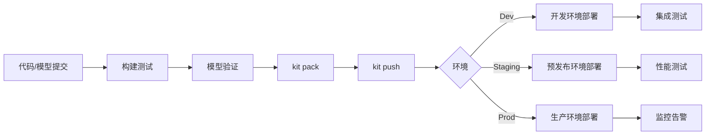

# CI/CD 集成指南

## 📚 概述

本文档介绍如何将 KitOps 集成到 CI/CD 流水线中，实现模型的自动打包、测试和部署。通过自动化流水线，可以确保模型版本的一致性和可追溯性。

## 🎯 文档元信息

- **适用平台**: GitHub Actions、GitLab CI、腾讯云 CODING、蓝盾流水线
- **适用场景**: MLOps、模型持续集成/部署
- **Agent 友好度**: ⭐⭐⭐⭐⭐

## 📋 CI/CD 流程概览



## 🔧 GitHub Actions 集成

### 使用官方 Action

KitOps 提供了官方的 GitHub Action：[setup-kit-cli](https://github.com/marketplace/actions/setup-kit-cli)

#### 基本配置

```yaml
# .github/workflows/model-ci.yml
name: Model CI/CD

on:
  push:
    branches: [main, develop]
    paths:
      - 'models/**'
      - 'data/**'
      - 'Kitfile'
  pull_request:
    branches: [main]
    paths:
      - 'models/**'
      - 'data/**'
      - 'Kitfile'

env:
  TCR_REGISTRY: ml-registry-xxxx.tencentcloudcr.com
  MODEL_NAMESPACE: ml-models

jobs:
  build-and-test:
    runs-on: ubuntu-latest
    steps:
      - name: Checkout repository
        uses: actions/checkout@v4
        with:
          lfs: true  # 如果使用 Git LFS 存储大文件
      
      - name: Setup Kit CLI
        uses: jozu-ai/gh-kit-setup@v1.0.0
        with:
          version: latest  # 或指定版本如 v1.11.0
      
      - name: Verify Kit installation
        run: kit version
      
      - name: Validate Kitfile
        run: kit info .
      
      - name: Run model tests
        run: |
          # 运行模型验证脚本
          python -m pytest tests/test_model.py -v

  package-and-push:
    needs: build-and-test
    runs-on: ubuntu-latest
    if: github.ref == 'refs/heads/main'
    
    steps:
      - name: Checkout repository
        uses: actions/checkout@v4
        with:
          lfs: true
      
      - name: Setup Kit CLI
        uses: jozu-ai/gh-kit-setup@v1.0.0
      
      - name: Login to TCR
        run: |
          kit login ${{ env.TCR_REGISTRY }} \
            -u ${{ secrets.TCR_USERNAME }} \
            -p ${{ secrets.TCR_PASSWORD }}
      
      - name: Build version tag
        id: version
        run: |
          # 基于 Git 信息生成版本号
          VERSION=$(cat VERSION || echo "0.0.0")
          SHORT_SHA=$(git rev-parse --short HEAD)
          echo "version=${VERSION}" >> $GITHUB_OUTPUT
          echo "tag=${VERSION}-${SHORT_SHA}" >> $GITHUB_OUTPUT
      
      - name: Pack ModelKit
        run: |
          kit pack . \
            -t ${{ env.TCR_REGISTRY }}/${{ env.MODEL_NAMESPACE }}/my-model:${{ steps.version.outputs.tag }} \
            -t ${{ env.TCR_REGISTRY }}/${{ env.MODEL_NAMESPACE }}/my-model:latest
      
      - name: Push ModelKit
        run: |
          kit push ${{ env.TCR_REGISTRY }}/${{ env.MODEL_NAMESPACE }}/my-model:${{ steps.version.outputs.tag }}
          kit push ${{ env.TCR_REGISTRY }}/${{ env.MODEL_NAMESPACE }}/my-model:latest
      
      - name: Output ModelKit info
        run: |
          echo "### ModelKit Published 🚀" >> $GITHUB_STEP_SUMMARY
          echo "" >> $GITHUB_STEP_SUMMARY
          echo "- **Registry**: ${{ env.TCR_REGISTRY }}" >> $GITHUB_STEP_SUMMARY
          echo "- **Image**: ${{ env.MODEL_NAMESPACE }}/my-model" >> $GITHUB_STEP_SUMMARY
          echo "- **Tag**: ${{ steps.version.outputs.tag }}" >> $GITHUB_STEP_SUMMARY
```

#### 完整的多阶段流水线

```yaml
# .github/workflows/model-pipeline.yml
name: Model Pipeline

on:
  push:
    branches: [main]
  workflow_dispatch:
    inputs:
      deploy_env:
        description: 'Deployment environment'
        required: true
        default: 'staging'
        type: choice
        options:
          - dev
          - staging
          - production

env:
  TCR_REGISTRY: ml-registry-xxxx.tencentcloudcr.com
  MODEL_NAMESPACE: ml-models
  MODEL_NAME: sentiment-classifier

jobs:
  # 阶段 1: 验证
  validate:
    runs-on: ubuntu-latest
    outputs:
      version: ${{ steps.version.outputs.version }}
    steps:
      - uses: actions/checkout@v4
      - uses: jozu-ai/gh-kit-setup@v1.0.0
      
      - name: Validate Kitfile syntax
        run: kit info . --format json
      
      - name: Generate version
        id: version
        run: |
          VERSION=$(date +%Y%m%d)-$(git rev-parse --short HEAD)
          echo "version=$VERSION" >> $GITHUB_OUTPUT

  # 阶段 2: 测试
  test:
    needs: validate
    runs-on: ubuntu-latest
    steps:
      - uses: actions/checkout@v4
      
      - name: Setup Python
        uses: actions/setup-python@v5
        with:
          python-version: '3.10'
      
      - name: Install dependencies
        run: pip install -r requirements.txt
      
      - name: Run unit tests
        run: pytest tests/unit/ -v --junitxml=test-results.xml
      
      - name: Run model validation
        run: python scripts/validate_model.py

  # 阶段 3: 打包
  package:
    needs: [validate, test]
    runs-on: ubuntu-latest
    steps:
      - uses: actions/checkout@v4
        with:
          lfs: true
      
      - uses: jozu-ai/gh-kit-setup@v1.0.0
      
      - name: Login to TCR
        run: |
          kit login ${{ env.TCR_REGISTRY }} \
            -u ${{ secrets.TCR_USERNAME }} \
            -p ${{ secrets.TCR_PASSWORD }}
      
      - name: Pack and Push
        run: |
          VERSION=${{ needs.validate.outputs.version }}
          IMAGE=${{ env.TCR_REGISTRY }}/${{ env.MODEL_NAMESPACE }}/${{ env.MODEL_NAME }}
          
          kit pack . -t ${IMAGE}:${VERSION}
          kit push ${IMAGE}:${VERSION}
          
          # 同时更新 latest 标签
          kit pack . -t ${IMAGE}:latest
          kit push ${IMAGE}:latest

  # 阶段 4: 部署到 Dev
  deploy-dev:
    needs: package
    runs-on: ubuntu-latest
    environment: development
    steps:
      - name: Deploy to Dev cluster
        run: |
          echo "Deploying to development environment..."
          # 更新 Kubernetes Deployment
          # kubectl set image deployment/model-inference ...

  # 阶段 5: 部署到 Staging
  deploy-staging:
    needs: deploy-dev
    runs-on: ubuntu-latest
    environment: staging
    if: github.event.inputs.deploy_env != 'dev'
    steps:
      - name: Deploy to Staging
        run: |
          echo "Deploying to staging environment..."

  # 阶段 6: 部署到 Production
  deploy-production:
    needs: deploy-staging
    runs-on: ubuntu-latest
    environment: production
    if: github.event.inputs.deploy_env == 'production'
    steps:
      - name: Deploy to Production
        run: |
          echo "Deploying to production environment..."
```

## 🦊 GitLab CI 集成

### 基本配置

```yaml
# .gitlab-ci.yml
stages:
  - validate
  - test
  - package
  - deploy

variables:
  TCR_REGISTRY: ml-registry-xxxx.tencentcloudcr.com
  MODEL_NAMESPACE: ml-models
  MODEL_NAME: my-model

# 全局配置
default:
  image: ubuntu:22.04
  before_script:
    # 安装 Kit CLI
    - curl -fsSL https://get.kitops.org | sh
    - kit version

# 验证阶段
validate:
  stage: validate
  script:
    - kit info .
  rules:
    - changes:
        - Kitfile
        - models/**/*
        - data/**/*

# 测试阶段
test:
  stage: test
  image: python:3.10
  script:
    - pip install -r requirements.txt
    - pytest tests/ -v
  rules:
    - changes:
        - "**/*.py"
        - requirements.txt

# 打包阶段
package:
  stage: package
  script:
    - kit login $TCR_REGISTRY -u $TCR_USERNAME -p $TCR_PASSWORD
    - |
      VERSION="${CI_COMMIT_SHORT_SHA}"
      IMAGE="${TCR_REGISTRY}/${MODEL_NAMESPACE}/${MODEL_NAME}"
      
      kit pack . -t ${IMAGE}:${VERSION}
      kit push ${IMAGE}:${VERSION}
      
      if [ "$CI_COMMIT_BRANCH" == "main" ]; then
        kit pack . -t ${IMAGE}:latest
        kit push ${IMAGE}:latest
      fi
  rules:
    - if: $CI_COMMIT_BRANCH == "main"
    - if: $CI_COMMIT_BRANCH == "develop"
  artifacts:
    reports:
      dotenv: deploy.env

# 部署到开发环境
deploy:dev:
  stage: deploy
  environment:
    name: development
    url: https://dev.example.com
  script:
    - echo "Deploying to dev environment"
    - |
      # 使用 kubectl 或其他部署工具
      # kubectl set image deployment/model-inference ...
  rules:
    - if: $CI_COMMIT_BRANCH == "develop"

# 部署到生产环境
deploy:prod:
  stage: deploy
  environment:
    name: production
    url: https://api.example.com
  script:
    - echo "Deploying to production environment"
  rules:
    - if: $CI_COMMIT_BRANCH == "main"
  when: manual  # 需要手动触发
```

### 使用 GitLab Container Registry

```yaml
# 使用 GitLab 内置的容器镜像仓库
package:
  stage: package
  script:
    - kit login $CI_REGISTRY -u $CI_REGISTRY_USER -p $CI_REGISTRY_PASSWORD
    - |
      IMAGE="${CI_REGISTRY_IMAGE}/model"
      kit pack . -t ${IMAGE}:${CI_COMMIT_SHORT_SHA}
      kit push ${IMAGE}:${CI_COMMIT_SHORT_SHA}
```

## 🔵 腾讯云 CODING 集成

### Jenkinsfile 配置

```groovy
// Jenkinsfile
pipeline {
    agent {
        docker {
            image 'ubuntu:22.04'
        }
    }
    
    environment {
        TCR_REGISTRY = 'ml-registry-xxxx.tencentcloudcr.com'
        MODEL_NAMESPACE = 'ml-models'
        MODEL_NAME = 'my-model'
        TCR_CREDENTIALS = credentials('tcr-credentials')
    }
    
    stages {
        stage('Setup') {
            steps {
                sh '''
                    curl -fsSL https://get.kitops.org | sh
                    kit version
                '''
            }
        }
        
        stage('Validate') {
            steps {
                sh 'kit info .'
            }
        }
        
        stage('Test') {
            steps {
                sh '''
                    pip install -r requirements.txt
                    pytest tests/ -v
                '''
            }
        }
        
        stage('Package') {
            steps {
                sh '''
                    kit login $TCR_REGISTRY -u $TCR_CREDENTIALS_USR -p $TCR_CREDENTIALS_PSW
                    
                    VERSION="${GIT_COMMIT:0:7}"
                    IMAGE="${TCR_REGISTRY}/${MODEL_NAMESPACE}/${MODEL_NAME}"
                    
                    kit pack . -t ${IMAGE}:${VERSION}
                    kit push ${IMAGE}:${VERSION}
                '''
            }
        }
        
        stage('Deploy') {
            when {
                branch 'main'
            }
            steps {
                sh '''
                    echo "Deploying to production..."
                    # 部署逻辑
                '''
            }
        }
    }
    
    post {
        success {
            echo 'Pipeline completed successfully!'
        }
        failure {
            echo 'Pipeline failed!'
        }
    }
}
```

## 🛡️ 蓝盾流水线集成

### YAML 流水线配置

```yaml
# .ci/pipeline.yml
version: v2.0

stages:
  - name: "构建测试"
    jobs:
      - name: "验证和测试"
        runs-on: 
          pool-name: docker
          container:
            image: python:3.10
        steps:
          - checkout: self
          
          - script: |
              curl -fsSL https://get.kitops.org | sh
              kit version
            name: "安装 Kit CLI"
          
          - script: kit info .
            name: "验证 Kitfile"
          
          - script: |
              pip install -r requirements.txt
              pytest tests/ -v
            name: "运行测试"

  - name: "打包推送"
    jobs:
      - name: "构建 ModelKit"
        runs-on:
          pool-name: docker
          container:
            image: ubuntu:22.04
        steps:
          - checkout: self
          
          - script: curl -fsSL https://get.kitops.org | sh
            name: "安装 Kit CLI"
          
          - script: |
              kit login ${TCR_REGISTRY} -u ${TCR_USERNAME} -p ${TCR_PASSWORD}
              
              VERSION="$(date +%Y%m%d)-${BK_CI_BUILD_ID}"
              IMAGE="${TCR_REGISTRY}/${MODEL_NAMESPACE}/${MODEL_NAME}"
              
              kit pack . -t ${IMAGE}:${VERSION}
              kit push ${IMAGE}:${VERSION}
            name: "打包并推送"
            env:
              TCR_REGISTRY: ml-registry-xxxx.tencentcloudcr.com
              MODEL_NAMESPACE: ml-models
              MODEL_NAME: my-model

  - name: "部署"
    jobs:
      - name: "部署到 TKE"
        runs-on:
          pool-name: docker
        steps:
          - script: |
              echo "部署到 TKE 集群..."
              # 使用 kubectl 或 helm 部署
            name: "执行部署"
```

## 📊 自动化测试策略

### 模型验证测试

```yaml
# 在 CI 中运行模型验证
test-model:
  stage: test
  script:
    - |
      # 解包模型进行测试
      kit unpack . --filter=model -d ./test-model
      
      # 运行模型验证脚本
      python scripts/validate_model.py \
        --model-path ./test-model \
        --test-data ./test_data.csv \
        --metrics accuracy,f1,auc \
        --threshold 0.85
```

### 性能基准测试

```yaml
benchmark:
  stage: test
  script:
    - |
      # 运行推理性能测试
      python scripts/benchmark.py \
        --model-path ./models \
        --batch-sizes 1,8,32,64 \
        --iterations 1000 \
        --output benchmark_results.json
  artifacts:
    paths:
      - benchmark_results.json
```

### 集成测试

```yaml
integration-test:
  stage: test
  services:
    - name: model-server
      image: ${TCR_REGISTRY}/${MODEL_NAMESPACE}/${MODEL_NAME}:${CI_COMMIT_SHORT_SHA}
  script:
    - |
      # 等待服务启动
      sleep 30
      
      # 运行集成测试
      pytest tests/integration/ -v \
        --server-url http://model-server:8080
```

## 🔐 Secret 管理

### GitHub Secrets 配置

在 GitHub 仓库设置中添加以下 Secrets：

| Secret 名称 | 说明 |
|-------------|------|
| `TCR_USERNAME` | TCR 用户名 |
| `TCR_PASSWORD` | TCR 密码 |
| `KUBECONFIG` | Kubernetes 配置（Base64 编码） |

### 使用 Vault 管理敏感信息

```yaml
# GitHub Actions 集成 HashiCorp Vault
jobs:
  package:
    steps:
      - name: Import secrets from Vault
        uses: hashicorp/vault-action@v2
        with:
          url: https://vault.example.com
          method: jwt
          role: github-actions
          secrets: |
            secret/data/tcr username | TCR_USERNAME ;
            secret/data/tcr password | TCR_PASSWORD
      
      - name: Login to TCR
        run: kit login $TCR_REGISTRY -u $TCR_USERNAME -p $TCR_PASSWORD
```

## 📈 监控和通知

### 发送通知

```yaml
# 发送企业微信通知
notify:
  stage: .post
  script:
    - |
      curl -X POST "https://qyapi.weixin.qq.com/cgi-bin/webhook/send?key=${WECHAT_KEY}" \
        -H "Content-Type: application/json" \
        -d '{
          "msgtype": "markdown",
          "markdown": {
            "content": "## ModelKit 发布通知\n\n- **模型**: '${MODEL_NAME}'\n- **版本**: '${VERSION}'\n- **状态**: ✅ 发布成功\n- **时间**: '$(date)'"
          }
        }'
  when: on_success
```

## 🔗 相关资源

- [KitOps CI/CD 官方文档](https://kitops.org/docs/integrations/cicd/)
- [GitHub Actions: setup-kit-cli](https://github.com/marketplace/actions/setup-kit-cli)
- [TCR 集成指南](tcr-integration.md)
- [TKE 部署指南](tke-deployment.md)
- [返回 KitOps on TKE](index.md)
