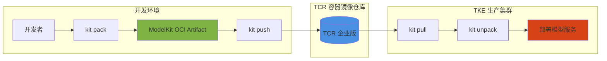

# KitOps on TKE

## 📚 概述

[KitOps](https://kitops.org/) 是一个开源工具，用于将 AI/ML 模型的所有相关资源（模型权重、数据集、代码、配置、文档）打包成标准化的 **OCI Artifact**，存储在容器镜像仓库中。本指南介绍如何在腾讯云 TKE 上使用 KitOps 实现模型的版本化管理和跨环境复现。

## 🎯 学习目标

通过本模块，你将学会：

- [x] 理解 KitOps 和 ModelKit 的核心概念
- [x] 使用 Kitfile 定义 AI/ML 项目结构
- [x] 将 ModelKit 推送到腾讯云容器镜像服务 (TCR)
- [x] 在 TKE 集群中一键解包和部署模型
- [x] 实现开发环境到生产环境的无缝迁移

## 🏗️ 工作流程架构

KitOps on TKE 的典型工作流程：



### 核心概念

| 概念 | 说明 |
|------|------|
| **ModelKit** | OCI 兼容的 AI/ML 项目打包格式，包含模型、数据、代码等所有资源 |
| **Kitfile** | YAML 配置文件，定义 ModelKit 的内容和元数据 |
| **TCR** | 腾讯云容器镜像服务，用于存储和分发 ModelKit |
| **OCI Artifact** | 开放容器标准工件，可存储在任何 OCI 兼容的镜像仓库 |

## 📖 章节列表

| 章节 | 内容 | 难度 | 时间 |
|------|------|------|------|
| [快速开始](quickstart.md) | 10 分钟体验 KitOps 工作流 | ⭐ | 10 分钟 |
| [Kitfile 编写](kitfile-guide.md) | 编写标准的 Kitfile 配置 | ⭐⭐ | 15 分钟 |
| [TCR 集成](tcr-integration.md) | 配置 TCR 企业版存储 ModelKit | ⭐⭐ | 15 分钟 |
| [TKE 部署](tke-deployment.md) | 在 TKE 中解包和部署模型 | ⭐⭐⭐ | 20 分钟 |
| [CI/CD 集成](cicd-integration.md) | 自动化打包和部署流程 | ⭐⭐⭐ | 25 分钟 |
| [最佳实践](best-practices.md) | 企业级使用最佳实践 | ⭐⭐⭐⭐ | 20 分钟 |

## 🚀 快速开始

### 前置条件

- 腾讯云账号及 TCR 企业版实例
- TKE 集群（Kubernetes 1.20+）
- 本地安装 Kit CLI
- kubectl 已配置并可访问集群

### 安装 Kit CLI

=== "macOS (Homebrew)"
    ```bash
    brew install kitops-ml/kitops/kit
    ```

=== "Linux"
    ```bash
    curl -fsSL https://get.kitops.org | sh
    ```

=== "Windows"
    ```powershell
    # 使用 Scoop
    scoop bucket add kitops https://github.com/kitops-ml/scoop-kitops.git
    scoop install kit
    ```

### 验证安装

```bash
kit version
# 输出: kit version 1.x.x
```

### 端到端示例

#### 1. 创建示例项目

```bash
mkdir my-ml-project && cd my-ml-project

# 创建目录结构
mkdir -p models data notebooks

# 模拟模型文件
echo "model weights placeholder" > models/model.bin

# 模拟数据集
echo "id,feature1,feature2,label" > data/train.csv
echo "1,0.5,0.3,1" >> data/train.csv

# 模拟代码
echo "# Training notebook" > notebooks/train.ipynb
```

#### 2. 编写 Kitfile

```yaml
# Kitfile
manifestVersion: v1.0.0

package:
  name: my-sentiment-model
  version: 1.0.0
  description: 情感分析模型 - 基于 BERT 微调
  authors:
    - TKE Workshop Team
  license: Apache-2.0

model:
  name: sentiment-classifier
  path: ./models/model.bin
  framework: PyTorch
  description: BERT-based sentiment classifier
  version: 1.0.0

datasets:
  - name: training-data
    path: ./data/train.csv
    description: 训练数据集

code:
  - path: ./notebooks
    description: 训练和推理代码
```

#### 3. 打包为 ModelKit

```bash
# 打包并标记
kit pack . -t ccr.ccs.tencentyun.com/your-namespace/sentiment-model:v1.0.0

# 查看本地 ModelKit
kit list
```

#### 4. 推送到 TCR

```bash
# 登录 TCR
kit login ccr.ccs.tencentyun.com -u <用户名> -p <密码>

# 推送 ModelKit
kit push ccr.ccs.tencentyun.com/your-namespace/sentiment-model:v1.0.0
```

#### 5. 在 TKE 中拉取和解包

```bash
# 在 TKE 节点或 Pod 中执行
kit pull ccr.ccs.tencentyun.com/your-namespace/sentiment-model:v1.0.0

# 解包到指定目录
kit unpack ccr.ccs.tencentyun.com/your-namespace/sentiment-model:v1.0.0 \
  -d /workspace/model

# 验证内容
ls -la /workspace/model
# models/  data/  notebooks/  Kitfile
```

## 💡 使用场景

### 1. 模型开发到生产的无缝迁移

数据科学家在开发环境完成模型训练后，通过 KitOps 打包：

- 模型权重和配置
- 验证数据集
- 推理代码和依赖

DevOps 团队在生产 TKE 集群中一键解包部署，无需"它在我机器上能跑"的问题。

### 2. 模型版本管理

利用 OCI 镜像仓库的版本管理能力：

- 每个版本都有唯一的 digest
- 支持标签管理（latest, v1.0.0, prod 等）
- 支持回滚到任意历史版本

### 3. 多环境一致性

确保开发、测试、生产环境的一致性：

- 相同的 ModelKit 在任何环境解包后完全一致
- 避免环境差异导致的推理结果不一致
- 支持审计和可追溯性

### 4. CI/CD 自动化

与 GitHub Actions、GitLab CI 等集成：

- 代码提交自动触发模型打包
- 自动推送到 TCR
- 自动部署到 TKE 测试/生产集群

## 📊 TCR + TKE 优势

| 特性 | 说明 |
|------|------|
| **安全性** | TCR 企业版支持 VPC 内网访问，数据不出云 |
| **高可用** | 多可用区部署，99.95% SLA |
| **加速拉取** | TKE 与 TCR 同地域内网互通，拉取速度快 |
| **权限控制** | 与腾讯云 CAM 集成，细粒度权限管理 |
| **镜像扫描** | 支持漏洞扫描和安全签名 |
| **全球同步** | 支持跨地域同步，满足多地部署需求 |

!!! tip "成本优化"
    使用 TCR 企业版基础版即可满足大部分 ModelKit 存储需求。对于大型模型（>10GB），建议开启压缩选项。

## 🔗 相关资源

### 官方资源

- [KitOps 官网](https://kitops.org/)
- [KitOps GitHub](https://github.com/kitops-ml/kitops)
- [KitOps CLI 文档](https://kitops.org/docs/cli/cli-reference/)
- [Kitfile 规范](https://kitops.org/docs/kitfile/kf-overview/)

### 腾讯云资源

- [TCR 产品文档](https://cloud.tencent.com/document/product/1141)
- [TKE 产品文档](https://cloud.tencent.com/document/product/457)
- [TCR 企业版快速入门](https://cloud.tencent.com/document/product/1141/39287)

### TKE Workshop 相关

- [Training on TKE](../training/index.md)
- [Inference on TKE](../inference/index.md)
- [OPEA on TKE](../opea/index.md)

## 📝 更新日志

- **2026-03-06**: 初始版本发布
  - KitOps + TCR + TKE 集成指南
  - 端到端示例
  - 最佳实践

---

## 下一步

准备好开始了吗？

[:octicons-arrow-right-24: 快速开始指南](quickstart.md)

或者深入了解 Kitfile 编写：

[:octicons-arrow-right-24: Kitfile 编写指南](kitfile-guide.md)
