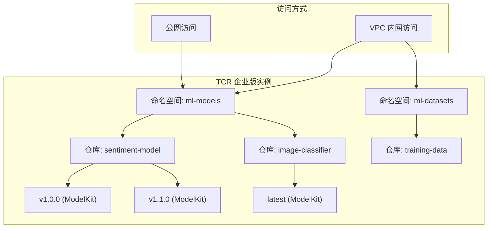

# TCR 集成指南

## 📚 概述

腾讯云容器镜像服务 (Tencent Container Registry, TCR) 是存储和分发 ModelKit 的理想选择。TCR 完全兼容 OCI (Open Container Initiative) 标准，可以无缝托管 KitOps 打包的 ModelKit。

本文档介绍如何配置 TCR 企业版与 KitOps 的集成。

## 🎯 文档元信息

- **适用产品**: TCR 企业版 / TCR 个人版
- **适用场景**: AI/ML 模型管理、MLOps 流水线
- **Agent 友好度**: ⭐⭐⭐⭐⭐

## 📋 前置条件

- [x] 腾讯云账号
- [x] 已安装 Kit CLI
- [x] TCR 企业版实例（推荐）或个人版

## 🏗️ TCR 架构说明



## 🛠️ 配置步骤

### 1. 创建 TCR 企业版实例

#### 通过控制台创建

1. 登录 [容器镜像服务控制台](https://console.cloud.tencent.com/tcr)
2. 选择左侧导航栏的 **实例管理**
3. 点击 **新建**，配置以下参数：

| 参数 | 说明 | 建议值 |
|------|------|--------|
| 实例名称 | 全局唯一的实例标识 | `ml-registry` |
| 实例地域 | 选择与 TKE 集群相同的地域 | 按需选择 |
| 实例规格 | 按需求选择规格 | 基础版/标准版 |
| 存储后端 | 使用 COS 存储 | 自动创建 COS Bucket |

4. 点击 **确认** 完成创建

#### 通过 CLI 创建

```bash
# 使用腾讯云 CLI 创建 TCR 实例
tccli tcr CreateInstance \
  --RegistryName ml-registry \
  --RegistryType basic \
  --TagSpecification.0.ResourceType instance \
  --TagSpecification.0.Tags.0.Key env \
  --TagSpecification.0.Tags.0.Value production
```

### 2. 创建命名空间

命名空间用于组织和隔离不同项目的 ModelKit。

#### 通过控制台创建

1. 在 TCR 控制台选择 **命名空间**
2. 点击 **新建**，配置参数：

| 参数 | 说明 | 建议值 |
|------|------|--------|
| 命名空间名称 | 命名空间标识 | `ml-models` |
| 访问级别 | 公开或私有 | 私有（推荐） |

```bash
# 建议的命名空间规划
ml-models/          # 生产环境模型
ml-models-staging/  # 预发布环境模型
ml-models-dev/      # 开发环境模型
ml-datasets/        # 共享数据集
```

### 3. 配置访问凭证

#### 获取长期访问凭证

1. 在 TCR 控制台选择 **访问凭证**
2. 点击 **新建**，创建长期访问凭证
3. 记录用户名和密码

!!! warning "安全提示"
    长期凭证应妥善保管，建议：
    
    - 使用 Kubernetes Secret 存储
    - 定期轮换凭证
    - 生产环境使用临时凭证

#### 使用 Kit CLI 登录

```bash
# 登录 TCR 实例
kit login ml-registry-xxxx.tencentcloudcr.com \
  -u <用户名> \
  -p <密码>

# 验证登录状态
kit version
```

#### 配置环境变量（CI/CD 推荐）

```bash
# 设置环境变量
export TCR_REGISTRY=ml-registry-xxxx.tencentcloudcr.com
export TCR_USERNAME=<用户名>
export TCR_PASSWORD=<密码>

# 登录
echo $TCR_PASSWORD | kit login $TCR_REGISTRY -u $TCR_USERNAME --password-stdin
```

### 4. 配置内网访问

为了提高安全性和降低流量成本，建议配置 VPC 内网访问。

#### 创建内网访问链路

1. 在 TCR 控制台选择 **内网访问**
2. 点击 **新建**，配置参数：

| 参数 | 说明 |
|------|------|
| 关联 VPC | 选择 TKE 集群所在的 VPC |
| 关联子网 | 选择合适的子网 |

3. 获取内网访问地址，格式如：`ml-registry-vpc.tencentcloudcr.com`

#### 配置 VPC 内 DNS 解析

TCR 会自动在关联的 VPC 中配置私有 DNS 解析，TKE 集群中的 Pod 可以直接使用内网地址访问。

```bash
# 在 TKE 节点或 Pod 中验证内网解析
nslookup ml-registry-xxxx.tencentcloudcr.com

# 应该解析到内网 IP（如 10.x.x.x）
```

### 5. 与 TKE 集群集成

#### 配置 ImagePullSecret

```bash
# 创建 Secret 用于拉取 ModelKit
kubectl create secret docker-registry tcr-secret \
  --docker-server=ml-registry-xxxx.tencentcloudcr.com \
  --docker-username=<用户名> \
  --docker-password=<密码> \
  -n <命名空间>
```

#### 在 Pod 中使用

```yaml
apiVersion: v1
kind: Pod
metadata:
  name: model-inference
spec:
  imagePullSecrets:
    - name: tcr-secret
  initContainers:
    - name: model-loader
      image: ghcr.io/kitops-ml/kit:latest
      env:
        - name: TCR_PASSWORD
          valueFrom:
            secretKeyRef:
              name: tcr-secret
              key: .dockerconfigjson
      # ... 其他配置
```

## 📦 推送 ModelKit 到 TCR

### 基本推送流程

```bash
# 1. 打包 ModelKit
kit pack . -t ml-registry-xxxx.tencentcloudcr.com/ml-models/my-model:v1.0.0

# 2. 推送到 TCR
kit push ml-registry-xxxx.tencentcloudcr.com/ml-models/my-model:v1.0.0

# 3. 验证推送成功
kit info ml-registry-xxxx.tencentcloudcr.com/ml-models/my-model:v1.0.0
```

### 多标签管理

```bash
# 打包并推送多个标签
kit pack . -t $TCR_REGISTRY/ml-models/sentiment:v1.2.0
kit pack . -t $TCR_REGISTRY/ml-models/sentiment:latest

kit push $TCR_REGISTRY/ml-models/sentiment:v1.2.0
kit push $TCR_REGISTRY/ml-models/sentiment:latest
```

## 📥 从 TCR 拉取 ModelKit

### 拉取到本地

```bash
# 拉取 ModelKit
kit pull ml-registry-xxxx.tencentcloudcr.com/ml-models/my-model:v1.0.0

# 解包到指定目录
kit unpack ml-registry-xxxx.tencentcloudcr.com/ml-models/my-model:v1.0.0 -d ./model-files
```

### 选择性拉取

```bash
# 仅拉取模型文件
kit unpack $TCR_REGISTRY/ml-models/my-model:v1.0.0 \
  --filter=model \
  -d ./model-only

# 拉取模型和特定数据集
kit unpack $TCR_REGISTRY/ml-models/my-model:v1.0.0 \
  --filter=model \
  --filter=datasets:validation \
  -d ./model-with-val
```

## 📊 最佳实践

### 命名规范

```bash
# 推荐的命名格式
<registry>/<namespace>/<model-name>:<version>

# 示例
ml-registry.tencentcloudcr.com/ml-models/bert-chinese:v1.2.0
ml-registry.tencentcloudcr.com/ml-models/bert-chinese:latest
ml-registry.tencentcloudcr.com/ml-models-staging/bert-chinese:v1.3.0-rc1
```

### 标签管理策略

| 标签类型 | 格式 | 用途 |
|----------|------|------|
| 语义化版本 | `v1.2.3` | 正式发布版本 |
| 预发布版本 | `v1.3.0-rc1` | 候选发布版本 |
| 构建标签 | `build-abc123` | CI/CD 构建产物 |
| latest | `latest` | 最新稳定版（谨慎使用） |
| 日期标签 | `20240315` | 日常构建版本 |

```bash
# 语义化版本发布流程
# 1. 开发阶段
kit push $TCR/ml-models/model:v1.2.0-dev.1
kit push $TCR/ml-models/model:v1.2.0-dev.2

# 2. RC 阶段
kit push $TCR/ml-models/model:v1.2.0-rc.1

# 3. 正式发布
kit push $TCR/ml-models/model:v1.2.0
kit push $TCR/ml-models/model:latest
```

### 生命周期策略

配置 TCR 的镜像保留策略，自动清理过期的 ModelKit：

1. 在 TCR 控制台选择 **版本保留**
2. 配置保留规则：

| 规则 | 建议配置 |
|------|----------|
| 保留最新 N 个版本 | 保留最新 10 个版本 |
| 保留最近 N 天的版本 | 保留最近 90 天 |
| 排除规则 | 排除 `v*` 格式的正式版本标签 |

### 跨地域同步

对于多地域部署场景，配置 TCR 的镜像同步功能：

1. 在 TCR 控制台选择 **同步复制**
2. 配置同步规则：

```yaml
# 同步规则示例
源实例: ml-registry-gz (广州)
目标实例: ml-registry-sh (上海)
同步规则:
  - 命名空间: ml-models
    仓库: sentiment-model
    标签过滤: v*  # 只同步正式版本
```

## 🔐 安全最佳实践

### 1. 使用临时凭证

```bash
# 获取临时凭证（有效期 1 小时）
TEMP_TOKEN=$(tccli tcr GetTempToken --output text)

# 使用临时凭证登录
kit login $TCR_REGISTRY -u temp -p $TEMP_TOKEN
```

### 2. 配置网络访问控制

在 TCR 控制台配置访问白名单：

- 仅允许 TKE 集群所在 VPC 访问
- 配置公网访问 IP 白名单（CI/CD 服务器）

### 3. 启用镜像安全扫描

TCR 企业版支持自动安全扫描，可以检测 ModelKit 中的：

- 已知漏洞
- 敏感信息泄露
- 配置安全问题

## 🔧 故障排查

### 常见问题

#### 推送失败：unauthorized

```bash
# 错误信息
Error: unauthorized: authentication required

# 解决方案
# 1. 检查凭证是否正确
kit login $TCR_REGISTRY -u $USERNAME -p $PASSWORD

# 2. 检查命名空间是否存在
# 3. 检查用户是否有推送权限
```

#### 拉取失败：not found

```bash
# 错误信息
Error: manifest unknown: manifest unknown

# 解决方案
# 1. 检查镜像地址和标签是否正确
kit info $TCR_REGISTRY/namespace/repo:tag

# 2. 检查是否有拉取权限
```

#### 内网访问失败

```bash
# 诊断步骤
# 1. 检查 VPC 内网访问是否已创建
# 2. 检查 DNS 解析
nslookup ml-registry-xxxx.tencentcloudcr.com

# 3. 检查安全组规则是否放通 443 端口
```

## 🔗 相关资源

- [TCR 产品文档](https://cloud.tencent.com/document/product/1141)
- [TCR OCI 制品管理](https://cloud.tencent.com/document/product/1141/63918)
- [TCR 企业版定价](https://cloud.tencent.com/document/product/1141/40540)
- [返回 KitOps on TKE](index.md)
- [TKE 部署指南](tke-deployment.md)
