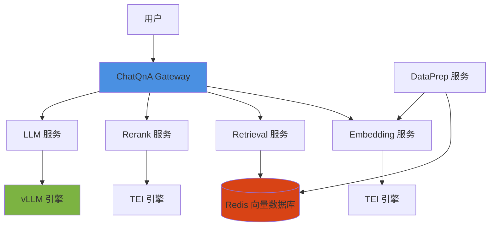

# OPEA on TKE

## 📚 概述

OPEA (Open Platform for Enterprise AI) 是一个开源的企业级 AI 平台，提供构建生成式 AI 应用所需的组件和微服务。本指南介绍如何在腾讯云 TKE 上部署和运行 OPEA 组件。

## 🎯 学习目标

通过本模块，你将学会：

- [x] 了解 OPEA 架构和核心组件
- [x] 在 TKE 上部署 ChatQnA 应用
- [x] 配置和管理 OPEA 微服务
- [x] 使用自动化脚本快速部署
- [x] 监控和排查 OPEA 应用问题

## 🏗️ OPEA 架构

OPEA 采用微服务架构，主要组件包括：



### 核心组件说明

| 组件 | 用途 | 镜像 |
|------|------|------|
| **Gateway** | API 网关，协调所有微服务 | `opea/chatqna:latest` |
| **Embedding** | 文本向量化 | `opea/embedding:latest` |
| **Retrieval** | 向量检索 | `opea/retriever:latest` |
| **Reranking** | 结果重排序 | `opea/reranking:latest` |
| **LLM** | 大语言模型推理 | `opea/vllm:latest` |
| **DataPrep** | 数据预处理和导入 | `opea/dataprep:latest` |
| **Redis Stack** | 向量数据库 | `redis/redis-stack:7.2.0-v9` |

## 📖 章节列表

| 章节 | 内容 | 难度 | 时间 |
|------|------|------|------|
| [快速开始](quickstart.md) | 5 分钟部署 ChatQnA | ⭐ | 10 分钟 |
| [ChatQnA 部署](chatqna-deployment.md) | 完整的 ChatQnA 部署指南 | ⭐⭐ | 30 分钟 |
| [架构详解](architecture.md) | OPEA 架构和组件说明 | ⭐⭐⭐ | 20 分钟 |
| [自动化部署](automation.md) | 使用 Cookbook 脚本自动化部署 | ⭐⭐ | 20 分钟 |
| [生产实践](production.md) | 生产环境部署最佳实践 | ⭐⭐⭐⭐ | 40 分钟 |
| [故障排查](troubleshooting.md) | 常见问题和解决方法 | ⭐⭐⭐ | 15 分钟 |

## 🚀 快速开始

### 前置条件

- TKE 集群（Kubernetes 1.24+）
- 至少 3 个节点，每个节点 4 核 8GB+
- kubectl 已配置并可访问集群
- （可选）GPU 节点用于 LLM 推理

### 一键部署

使用我们提供的自动化脚本快速部署：

```bash
# 克隆项目
git clone https://github.com/your-org/ai-on-tke.git
cd ai-on-tke

# 配置腾讯云凭证
cp config/config.example.yaml config/config.yaml
# 编辑 config.yaml 填入 SecretId 和 SecretKey

# 一键部署（包含集群创建）
python cookbook/scenarios/chatqna_e2e.py \
  --cluster-name opea-demo \
  --region ap-guangzhou \
  --node-count 3 \
  --wait
```

### 手动部署

如果已有 TKE 集群：

```bash
# 应用 Kubernetes manifests
kubectl apply -f manifests/chatqna/namespace.yaml
kubectl apply -f manifests/chatqna/configmap.yaml
kubectl apply -f manifests/chatqna/

# 等待所有 Pod 就绪
kubectl wait --for=condition=ready pod -l app=chatqna -n opea-system --timeout=600s

# 获取 Gateway 访问地址
kubectl get svc chatqna-gateway -n opea-system
```

### 测试部署

```bash
# 获取 Gateway 外部 IP
GATEWAY_IP=$(kubectl get svc chatqna-gateway -n opea-system -o jsonpath='{.status.loadBalancer.ingress[0].ip}')

# 测试 ChatQnA API
curl -X POST http://${GATEWAY_IP}:8888/v1/chatqna \
  -H "Content-Type: application/json" \
  -d '{
    "messages": "What is Kubernetes?",
    "max_tokens": 100
  }'
```

## 💡 使用场景

### 1. 企业知识库问答

构建基于企业内部文档的智能问答系统：

- 导入公司文档、手册、wiki
- 员工通过自然语言查询信息
- 自动检索相关内容并生成答案

### 2. 客户支持助手

部署智能客服系统：

- 接入客户咨询
- 自动查询产品知识库
- 生成准确的回答和解决方案

### 3. 开发者文档助手

帮助开发者快速查找技术文档：

- 索引 API 文档、教程、最佳实践
- 代码示例检索
- 自动生成使用说明

## 📊 性能指标

基于标准 TKE 集群（3 节点，每节点 8 核 16GB）的性能参考：

| 指标 | 值 | 备注 |
|------|-----|------|
| **部署时间** | ~15 分钟 | 包含镜像拉取 |
| **查询延迟** | ~2-5 秒 | CPU 推理，单查询 |
| **并发处理** | ~10 QPS | CPU 推理 |
| **向量检索** | <100ms | Redis Stack |
| **资源占用** | ~20 核 40GB | 全部组件 |

!!! tip "性能优化"
    使用 GPU 节点可以显著提升 LLM 推理性能（10x+）。详见[生产实践](production.md)章节。

## 🔗 相关资源

### 官方资源

- [OPEA 官方网站](https://opea-project.github.io/)
- [OPEA GitHub](https://github.com/opea-project)
- [GenAI Components](https://github.com/opea-project/GenAIComps)
- [GenAI Examples](https://github.com/opea-project/GenAIExamples)

### TKE 相关

- [TKE GPU 调度](../gpu-scheduling.md)
- [TKE 超级节点](../04-gpu-pod-best-practices.md)
- [TKE 模型推理](../model-inference.md)

### 社区

- [OPEA 社区讨论](https://github.com/opea-project/community)
- [TKE Workshop GitHub](https://github.com/tke-workshop/tke-workshop.github.io)

## 🤝 贡献指南

我们欢迎社区贡献！如果你想：

- 报告 bug 或问题
- 提出新功能建议
- 贡献文档或代码
- 分享使用经验

请访问：

- **Issue**: [GitHub Issues](https://github.com/tke-workshop/tke-workshop.github.io/issues)
- **Pull Request**: [贡献指南](../../CONTRIBUTING.md)
- **讨论**: [GitHub Discussions](https://github.com/tke-workshop/tke-workshop.github.io/discussions)

## 📝 更新日志

- **2024-03-03**: 初始版本发布
  - ChatQnA 完整部署指南
  - 自动化脚本支持
  - OPEA v1.5 镜像支持

---

## 下一步

准备好开始了吗？

[:octicons-arrow-right-24: 快速开始部署 ChatQnA](quickstart.md)

或者深入了解架构：

[:octicons-arrow-right-24: OPEA 架构详解](architecture.md)
