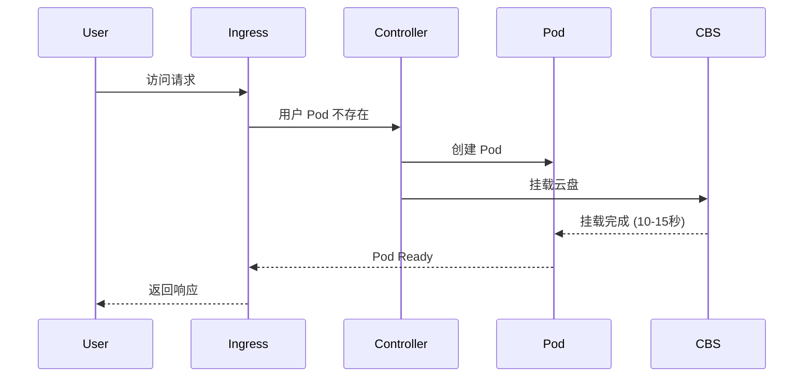

# 弹性管理

## 概述

OpenClaw 采用超卖 + 弹性管理策略，大幅降低资源成本，同时保证用户体验。

## 超卖策略

### 配置建议

| 资源 | Request | Limit | 超卖比 |
|------|---------|-------|--------|
| **CPU** | 0.2C | 1C | 4-5:1 |
| **内存** | 800MB | 2GB | 2-3:1 |

### Pod 资源配置

```yaml
resources:
  requests:
    cpu: "200m"      # 0.2C
    memory: "800Mi"  # 800MB
  limits:
    cpu: "1"         # 1C
    memory: "2Gi"    # 2GB
```

### 节点容量计算

基于 48C192G 标准节点：

```
可运行 Pod 数 = min(
  48C / 0.2C = 240,
  192G / 800M = 240
) ≈ 200-300 Pod（考虑系统预留）
```

## 弹性管理

### 用户状态

| 状态 | 资源占用 | 触发条件 | 恢复时间 |
|------|---------|---------|---------|
| **活跃运行** | CPU + 内存 + 存储 | 用户活跃 | - |
| **卸载** | 仅存储（云盘保留） | 30 天不活跃 | 10-15 秒 |
| **完全删除** | 释放所有资源 | 用户注销 | - |

### 卸载策略

```yaml
# 伪代码：卸载控制器
apiVersion: openclaw.io/v1
kind: UnloadPolicy
metadata:
  name: default-unload
spec:
  inactivityThreshold: 30d    # 30 天不活跃
  diskRetentionPeriod: 7d     # 云盘保留 7 天
  unloadAction: ScaleToZero   # 缩容到 0
```

### 加载流程



## 资源优化

### 实际资源占用

由于用户活跃度不均，实际资源占用约为理论值的 20-30%：

```
理论资源 = 100万 Pod × 1C2G = 100万C 200万G
实际资源 = 100万 Pod × 0.2C0.8G × 30% = 6万C 24万G
```

### 成本节省

- 超卖：降低 4-5 倍
- 卸载：再降低 70%
- 综合：**降低约 15-20 倍**

## 监控指标

### 关键指标

| 指标 | 说明 | 告警阈值 |
|------|------|---------|
| `pod_restart_count` | Pod 重启次数 | > 3/小时 |
| `pod_load_latency` | 加载延迟 | > 20秒 |
| `node_cpu_usage` | 节点 CPU 使用率 | > 80% |
| `node_memory_usage` | 节点内存使用率 | > 85% |

### Prometheus 配置

```yaml
groups:
- name: openclaw-alerts
  rules:
  - alert: HighPodLoadLatency
    expr: histogram_quantile(0.99, pod_load_latency_bucket) > 20
    for: 5m
    labels:
      severity: warning
    annotations:
      summary: "Pod 加载延迟过高"
```

## 相关文档

- [存储方案](storage.md)
- [生产实践](production.md)
