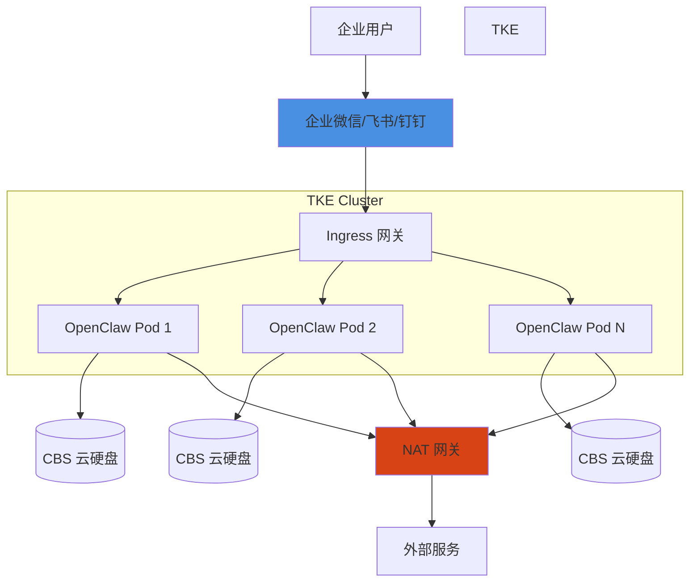

# OpenClaw on TKE

## 📚 概述

OpenClaw 是一个企业级 AI 助手平台，支持为每个用户提供独立的 AI 助手实例。本指南介绍如何在腾讯云 TKE 上部署和运行百万级 OpenClaw 实例。

## 🎯 学习目标

通过本模块，你将学会：

- [x] 了解百万级 AI 助手实例的架构挑战
- [x] 设计高密度 Pod 部署方案（超卖 + 弹性管理）
- [x] 选择合适的网络方案（GlobalRouter + NAT）
- [x] 配置存储方案（CBS 云硬盘）
- [x] 实现安全隔离（普通容器 / 调度亲和性 / Kata Containers）
- [x] 对比自管集群与 TKE Serverless 方案

## 🏗️ 整体架构

OpenClaw on TKE 采用多集群架构，支持百万级用户：

### 核心组件说明

| 组件 | 用途 | 规格 |
|------|------|------|
| **Ingress** | 子域名路由，用户访问入口 | Nginx/Traefik |
| **OpenClaw Pod** | 用户独立 AI 助手实例 | 1C2G（超卖后） |
| **CBS 云硬盘** | 用户数据持久化存储 | 20GB/用户 |
| **NAT 网关** | 出口流量管控和审计 | 按流量计费 |
| **GlobalRouter** | 集群内网络，不消耗 VPC IP | TKE 内置 |

## 📖 章节列表

| 章节 | 内容 | 难度 | 时间 |
|------|------|------|------|
| [架构方案](architecture.md) | 百万级 AI 助手架构设计 | ⭐⭐⭐ | 30 分钟 |
| [快速开始](quickstart.md) | 部署第一个 OpenClaw 集群 | ⭐⭐ | 20 分钟 |
| [网络方案](networking.md) | GlobalRouter + NAT 详解 | ⭐⭐⭐ | 15 分钟 |
| [存储方案](storage.md) | CBS 云硬盘配置和优化 | ⭐⭐⭐ | 15 分钟 |
| [安全隔离](security.md) | 三种安全隔离方案对比 | ⭐⭐⭐⭐ | 20 分钟 |
| [弹性管理](elasticity.md) | 超卖策略和卸载机制 | ⭐⭐⭐ | 15 分钟 |
| [生产实践](production.md) | 生产环境部署最佳实践 | ⭐⭐⭐⭐ | 30 分钟 |

## 🚀 快速开始

### 前置条件

- TKE 集群（Kubernetes 1.20+）
- 至少 3 个节点（48C192G 推荐）
- kubectl 已配置并可访问集群
- GlobalRouter 网络模式

### 核心挑战

在开始之前，了解我们要解决的核心问题：

1. **资源规模**: 100 万用户 = 100 万个 Pod，单集群 5-10 万 Pod
2. **成本压力**: 高超卖 + 弹性管理，大幅降低资源成本
3. **启动速度**: 用户卸载后重新加载需在 15 秒内完成
4. **网络限制**: VPC IP 资源有限，无法为每个 Pod 分配独立 IP
5. **存储性能**: CBS 挂载限制（单节点限制、挂载速度）
6. **安全隔离**: 跨企业数据隔离，防止容器逃逸

### 方案选择

| 方案 | 适用场景 | 隔离强度 | 成本 |
|------|---------|---------|------|
| **自管 TKE 集群**（推荐） | 需要灵活控制、成本敏感 | ⭐⭐⭐ | 可控 |
| **TKE Serverless** | 强隔离需求、免运维 | ⭐⭐⭐⭐⭐ | 较高 |

详细对比请参考：[架构方案](architecture.md)

## 💡 使用场景

### 1. 企业协作 AI 助手

为企业微信、飞书、钉钉提供独立 AI 助手：

- 每个用户独立实例，数据完全隔离
- 与企业内部系统深度集成
- 支持自定义模型和知识库

### 2. SaaS 多租户 AI 服务

为 SaaS 平台提供多租户 AI 能力：

- 租户级别的资源隔离
- 灵活的超卖和弹性策略
- 按用量计费

### 3. 政企高安全场景

满足金融、政务等高安全要求：

- Kata Containers 虚拟机级别隔离
- 完整的审计日志
- 网络流量管控

## 📊 规模参考

基于标准 TKE 集群配置的规模参考：

| 指标 | 单集群 | 多集群（100万用户） |
|------|--------|-------------------|
| **节点数** | 150-200 台 | 12-20 个集群 |
| **节点规格** | 48C192G | - |
| **Pod 数** | 5-8 万 | 100 万 |
| **超卖比** | CPU 4-5:1, 内存 2-3:1 | - |
| **启动时间** | 10-15 秒 | - |

!!! tip "规模建议"
    建议从单集群 5000 用户开始试点，验证后再扩展到多集群架构。

## 🔗 相关资源

### TKE 相关

- [TKE GPU 调度](../gpu-scheduling.md)
- [TKE 超级节点](../04-gpu-pod-best-practices.md)
- [TKE 模型推理](../model-inference.md)
- [OPEA on TKE](../opea/index.md)

### 最佳实践

- [成本优化](../../best-practices/cost-optimization/index.md)
- [可扩展性](../../best-practices/scalability/index.md)
- [安全最佳实践](../../best-practices/security/index.md)

## 📝 更新日志

- **2026-03-05**: 重构为子章节结构
  - 拆分架构方案、网络、存储、安全等独立文档
  - 调整超卖比建议（CPU 4-5:1，内存 2-3:1）
  - 移除客户案例，保留技术经验

---

## 下一步

准备好开始了吗？

[:octicons-arrow-right-24: 查看完整架构方案](architecture.md)

或者快速开始部署：

[:octicons-arrow-right-24: 快速开始指南](quickstart.md)
