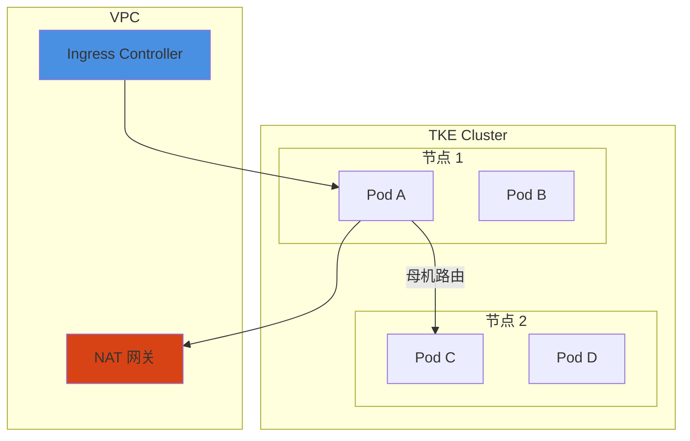

# 网络方案

## 概述

OpenClaw on TKE 采用 GlobalRouter + NAT 网关的网络架构，支持百万级 Pod 而不消耗 VPC IP 配额。

## GlobalRouter 网络模式

### 原理



- **GlobalRouter 网段**: 集群内私有网段（如 172.16.0.0/16），不消耗 VPC IP
- **母机路由**: 在宿主机层面实现 Pod 间通信
- **集群外不可达**: Pod IP 仅在集群内有效

### 优势

- ✅ 不受 VPC IP 配额限制
- ✅ 支持百万级 Pod
- ✅ 网络策略灵活

### 配置

创建集群时选择 GlobalRouter 网络模式：

```bash
# 使用 TKE API 创建集群
# ClusterCIDR: 172.16.0.0/16 (GlobalRouter 网段)
```

## NAT 网关配置

### 用途

- 统一出口流量管控
- 流日志审计
- 安全策略实施

### 配置步骤

1. 创建 NAT 网关
2. 配置路由表
3. 启用流日志

## Ingress 配置

### 子域名路由

为每个用户分配独立子域名：

```yaml
apiVersion: networking.k8s.io/v1
kind: Ingress
metadata:
  name: openclaw-user-a
spec:
  rules:
  - host: user-a.openclaw.example.com
    http:
      paths:
      - path: /
        pathType: Prefix
        backend:
          service:
            name: openclaw-user-a
            port:
              number: 8080
```

### 性能考虑

- ⚠️ Ingress 支持 10 万级子域名需压测
- 建议使用 Nginx Ingress 或 Traefik

## 相关文档

- [存储方案](storage.md)
- [安全隔离](security.md)
