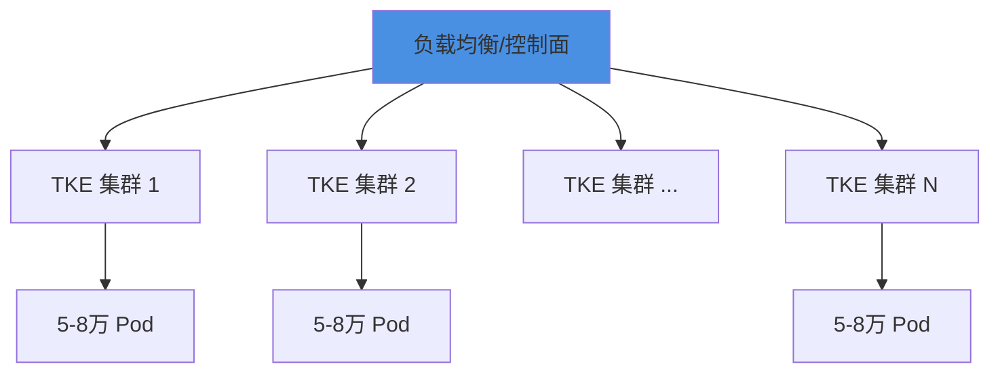

# 生产实践

## 概述

本文档介绍 OpenClaw on TKE 生产环境部署的最佳实践和推荐策略。

## 集群规模设计

### 单集群规模

| 指标 | 推荐值 | 说明 |
|------|--------|------|
| **节点数** | 150-200 台 | 48C192G 标准节点 |
| **Pod 数** | 5-8 万 | 超卖后可达 10 万 |
| **承载用户** | 5-8 万 | 活跃用户数 |

### 多集群架构（100 万用户）



- **集群数量**: 12-20 个
- **负载均衡**: 通过上层调度平台分配用户到不同集群
- **跨集群管理**: 统一配置下发、监控告警、日志采集

## 推荐策略

### 阶段 1：技术验证

**目标**: 验证核心技术可行性

**验证项**:

1. CBS 大规模挂载性能和单节点限制（压测 5000 Pod/节点）
2. Ingress 10 万子域名性能（压测 Nginx/Traefik）
3. NAT 网关限流/熔断能力
4. Kata Containers 性能和成本对比

**输出**: 技术可行性报告 + 风险清单

---

### 阶段 2：小规模试点

**目标**: 验证业务场景和用户体验

**规模**: 5000 用户（1 个 TKE 集群）

**方案选择**:

- **推荐**: 自管 TKE 集群 + CBS + GlobalRouter + 方案 A（普通容器）
- **理由**: 技术成熟，快速验证，风险可控

**验证项**:

1. 用户卸载/加载流程（CBS 挂载时间验证）
2. 超卖比调优（CPU 4-5:1, 内存 2-3:1）
3. 企业集成（子域名路由、出口访问）
4. 成本核算（实际 vs 预估）

---

### 阶段 3：规模化部署

**目标**: 支撑 10-50 万用户

**方案选择**:

- **自管 TKE**: 2-5 个集群（根据实际负载调整）
- **安全升级**: 方案 B（调度亲和性）或方案 C（Kata Containers）

**优化项**:

1. 自动化运维（集群管理、监控告警、日志采集）
2. 成本优化（弹性策略调优，降低闲置资源）
3. 多集群调度（上层控制面统一分配用户）

---

### 阶段 4：全量上线

**目标**: 支撑 100 万+ 用户

**方案评估**:

- **自管 TKE**: 如果阶段 3 验证成功，继续扩展到 12-20 个集群
- **TKE Serverless**: 如果网络方案（Global Root）就绪 + 成本可接受，可考虑迁移

**决策因素**:

1. **成本**: 自管 vs Serverless 的综合成本对比（包含运维成本）
2. **运维**: 是否有足够团队支撑自管集群运维
3. **安全**: 是否需要虚拟机级别隔离

## 运维最佳实践

### 监控告警

```yaml
# 关键监控指标
- Pod 启动延迟
- CBS 挂载成功率
- 节点资源使用率
- Ingress 请求延迟
- NAT 网关流量
```

### 日志采集

```yaml
# 推荐日志方案
- 应用日志: 采集到 CLS
- 审计日志: 流日志 + API Server 审计
- 访问日志: Ingress 日志
```

### 备份恢复

```yaml
# CBS 数据备份
- 定期快照: 每日
- 保留策略: 7 天
- 跨地域复制: 可选
```

## 经验总结

- **启动速度**: 15 秒内可接受，10 秒为较好体验
- **超卖比**: CPU 4-5:1 较为稳妥，内存 2-3:1 较保守，需根据实际负载调优
- **存储**: CBS 需要考虑单节点挂载限制和并发挂载性能，通过集群扩展节点数应对
- **安全**: 调度亲和性 + 网络策略可满足大部分场景，Kata 用于高安全要求

## 相关文档

- [架构方案](architecture.md)
- [安全隔离](security.md)
- [弹性管理](elasticity.md)
