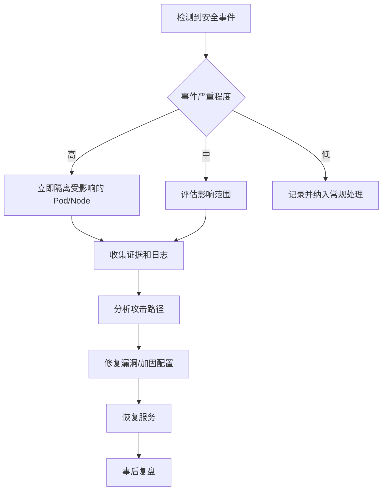

# 强化 TKE 集群安全性

## 文档元信息

- **适用版本**：TKE 1.20+
- **难度级别**：中级
- **阅读时间**：30 分钟
- **最后更新**：2026-03-11

## 概述

本文档提供了全面的 TKE 集群安全强化指南，涵盖从集群创建到日常运维的各个环节。通过实施这些最佳实践，你可以显著降低集群被攻击的风险，保护工作负载和数据安全。

本指南参考了业界标准（如 CIS Kubernetes Benchmark）和腾讯云 TKE 的特性，结合实际生产经验总结而成。

!!! tip "安全是持续的过程"
    集群安全不是一次性的配置，而是需要持续监控、评估和改进的过程。建议定期审查本文档中的建议，并根据最新的安全威胁进行调整。

## 安全强化清单总览

在深入详细内容之前，以下是快速参考的安全强化清单：

| 类别 | 措施 | 优先级 | 复杂度 |
|------|------|--------|--------|
| **访问控制** | 使用专用服务账号而非默认账号 | 🔴 高 | 中 |
| | 启用 RBAC 并遵循最小权限原则 | 🔴 高 | 中 |
| | 禁用或限制匿名访问 | 🔴 高 | 低 |
| | 使用群组管理而非个人授权 | 🟡 中 | 低 |
| **网络安全** | 使用私有节点（无公网 IP） | 🔴 高 | 低 |
| | 配置 Network Policy 限制 Pod 间通信 | 🔴 高 | 中 |
| | 启用 API Server 访问控制 | 🔴 高 | 低 |
| | 配置安全组最小化开放端口 | 🟡 中 | 中 |
| **工作负载安全** | 使用非特权容器运行工作负载 | 🔴 高 | 低 |
| | 配置 Pod 安全标准 | 🔴 高 | 中 |
| | 使用只读根文件系统 | 🟡 中 | 中 |
| | 限制容器 capabilities | 🟡 中 | 中 |
| **数据保护** | 使用 Secret Manager 管理敏感数据 | 🔴 高 | 中 |
| | 启用 etcd 数据加密 | 🔴 高 | 低 |
| | 配置存储加密 | 🟡 中 | 低 |
| **集群管理** | 启用审计日志 | 🔴 高 | 低 |
| | 配置自动升级或定期手动升级 | 🔴 高 | 低 |
| | 使用 Container-Optimized OS 镜像 | 🟡 中 | 低 |

---

## 1. 身份认证与访问控制

### 1.1 使用专用服务账号

**问题**：默认情况下，TKE 节点使用的服务角色可能拥有过多权限，这增加了凭证泄露后的风险。

**最佳实践**：

=== "创建专用服务角色"

    1. 在 [CAM 控制台](https://console.cloud.tencent.com/cam/role) 创建专用于 TKE 的服务角色
    2. 仅授予运行系统任务所需的最小权限
    3. 在创建节点池时指定该角色

    ```json
    {
        "version": "2.0",
        "statement": [
            {
                "effect": "allow",
                "action": [
                    "cvm:DescribeInstances",
                    "vpc:DescribeSubnets",
                    "clb:DescribeLoadBalancers"
                ],
                "resource": ["*"]
            }
        ]
    }
    ```

=== "使用 Workload Identity"

    对于需要访问腾讯云 API 的工作负载，推荐使用 TKE 的 OIDC 方案将 ServiceAccount 与 CAM 角色关联：

    ```yaml
    apiVersion: v1
    kind: ServiceAccount
    metadata:
      name: my-app-sa
      namespace: production
      annotations:
        # 关联 CAM 角色 ARN
        eks.tke.cloud.tencent.com/role-arn: "qcs::cam::uin/100000000001:role/TKE-WorkloadRole"
    ```

### 1.2 配置 Kubernetes RBAC

**问题**：RBAC 配置不当可能导致权限过大，攻击者获取一个凭证后可以访问整个集群。

**最佳实践**：

#### 遵循最小权限原则

```yaml
# 错误示例：授予过多权限
apiVersion: rbac.authorization.k8s.io/v1
kind: ClusterRoleBinding
metadata:
  name: dev-team-binding
subjects:
- kind: Group
  name: dev-team
  apiGroup: rbac.authorization.k8s.io
roleRef:
  kind: ClusterRole
  name: cluster-admin  # ❌ 不要直接授予 cluster-admin
  apiGroup: rbac.authorization.k8s.io
```

```yaml
# 正确示例：按需授权
apiVersion: rbac.authorization.k8s.io/v1
kind: Role
metadata:
  name: dev-team-role
  namespace: dev-namespace
rules:
- apiGroups: ["", "apps"]
  resources: ["pods", "deployments", "services"]
  verbs: ["get", "list", "watch", "create", "update", "delete"]
- apiGroups: [""]
  resources: ["secrets"]
  verbs: ["get", "list"]  # ✅ 只允许读取 Secret，不允许创建或修改
---
apiVersion: rbac.authorization.k8s.io/v1
kind: RoleBinding
metadata:
  name: dev-team-binding
  namespace: dev-namespace
subjects:
- kind: Group
  name: dev-team
  apiGroup: rbac.authorization.k8s.io
roleRef:
  kind: Role
  name: dev-team-role
  apiGroup: rbac.authorization.k8s.io
```

#### 使用群组而非个人授权

```yaml
# 推荐：通过群组管理权限
apiVersion: rbac.authorization.k8s.io/v1
kind: ClusterRoleBinding
metadata:
  name: sre-team-binding
subjects:
- kind: Group
  name: "sre-team@company.com"  # ✅ 使用群组
  apiGroup: rbac.authorization.k8s.io
roleRef:
  kind: ClusterRole
  name: sre-cluster-role
  apiGroup: rbac.authorization.k8s.io
```

#### 限制 ServiceAccount 权限

```yaml
# 限制默认 ServiceAccount 的权限
apiVersion: v1
kind: ServiceAccount
metadata:
  name: default
  namespace: production
automountServiceAccountToken: false  # ✅ 禁止自动挂载 token
```

### 1.3 限制匿名访问和 API 发现

**问题**：默认情况下，Kubernetes 允许对某些端点的匿名访问，这可能泄露集群信息。

**最佳实践**：

在 TKE 控制台中配置 API Server 参数：

```yaml
# kube-apiserver 配置（TKE 托管集群通过控制台配置）
apiServer:
  extraArgs:
    # 禁用匿名访问（保留健康检查端点）
    anonymous-auth: "false"
    # 启用审计日志
    audit-log-path: "/var/log/kubernetes/audit.log"
```

对于需要保留部分匿名访问的场景，使用 RBAC 精确控制：

```yaml
apiVersion: rbac.authorization.k8s.io/v1
kind: ClusterRole
metadata:
  name: anonymous-discovery
rules:
- nonResourceURLs: ["/healthz", "/readyz", "/livez"]
  verbs: ["get"]
# 不包含 /api, /apis 等发现端点
```

### 1.4 TKE CAM 与 RBAC 集成

TKE 支持将腾讯云 CAM 账号体系与 Kubernetes RBAC 集成：

```yaml
# 在 TKE 控制台配置 RBAC 授权
# 或使用 kubectl 配置

apiVersion: rbac.authorization.k8s.io/v1
kind: ClusterRoleBinding
metadata:
  name: cam-admin-binding
subjects:
- kind: User
  name: "100000000001"  # CAM 用户 UIN
  apiGroup: rbac.authorization.k8s.io
roleRef:
  kind: ClusterRole
  name: tke:admin  # TKE 预设管理员角色
  apiGroup: rbac.authorization.k8s.io
```

TKE 预设角色说明：

| 角色名称 | 权限说明 |
|---------|---------|
| `tke:admin` | 集群管理员，拥有所有资源的完全控制权 |
| `tke:ops` | 运维人员，可以管理节点、查看所有资源 |
| `tke:dev` | 开发人员，可以在指定命名空间内部署应用 |
| `tke:viewer` | 只读用户，只能查看资源 |

---

## 2. 网络安全

### 2.1 使用私有节点

**问题**：节点拥有公网 IP 会增加被直接攻击的风险。

**最佳实践**：

```hcl
# 创建集群时配置私有节点
resource "tencentcloud_kubernetes_cluster" "cluster" {
  cluster_name = "secure-cluster"
  
  # 使用私有子网
  vpc_id     = tencentcloud_vpc.main.id
  subnet_ids = [tencentcloud_subnet.private.id]
  
  # 节点不分配公网 IP
  worker_config {
    availability_zone          = "ap-guangzhou-3"
    subnet_id                  = tencentcloud_subnet.private.id
    internet_max_bandwidth_out = 0  # ✅ 不分配公网带宽
  }
}
```

对于需要访问外网的场景，使用 NAT 网关：

```
┌─────────────────────────────────────────────────────┐
│                        VPC                          │
│  ┌─────────────┐    ┌─────────────────────────────┐│
│  │  NAT 网关   │◄───│  私有子网（TKE 节点）        ││
│  │ (弹性公网IP)│    │  10.0.1.0/24                 ││
│  └──────┬──────┘    │  - 无公网 IP                 ││
│         │           │  - 通过 NAT 访问外网         ││
│         ▼           └─────────────────────────────┘│
│    ┌─────────┐                                      │
│    │  互联网  │                                      │
│    └─────────┘                                      │
└─────────────────────────────────────────────────────┘
```

### 2.2 配置 API Server 访问控制

**问题**：API Server 暴露在公网会成为攻击目标。

**最佳实践**：

=== "内网访问模式"

    ```yaml
    # 创建集群时选择"内网访问"
    # 只能通过 VPC 内网访问 API Server
    
    # 配置安全组规则
    入站规则:
      - 协议: TCP
        端口: 443
        来源: 10.0.0.0/8  # ✅ 仅允许 VPC 内网访问
    ```

=== "公网访问 + IP 白名单"

    ```yaml
    # 如必须启用公网访问，配置 IP 白名单
    
    # TKE 控制台 -> 集群 -> 基本信息 -> 外网访问
    外网访问配置:
      访问白名单:
        - 203.0.113.10/32  # 办公网络出口 IP
        - 203.0.113.20/32  # VPN 出口 IP
    ```

### 2.3 使用 Network Policy 限制 Pod 间通信

**问题**：默认情况下，同一集群内的所有 Pod 可以相互通信，攻击者突破一个 Pod 后可以横向移动。

**最佳实践**：

#### 默认拒绝所有流量

```yaml
# 默认拒绝命名空间内所有入站流量
apiVersion: networking.k8s.io/v1
kind: NetworkPolicy
metadata:
  name: default-deny-all
  namespace: production
spec:
  podSelector: {}  # 选择所有 Pod
  policyTypes:
  - Ingress
  - Egress
```

#### 按需放行必要流量

```yaml
# 允许 frontend 访问 backend
apiVersion: networking.k8s.io/v1
kind: NetworkPolicy
metadata:
  name: allow-frontend-to-backend
  namespace: production
spec:
  podSelector:
    matchLabels:
      app: backend
  policyTypes:
  - Ingress
  ingress:
  - from:
    - podSelector:
        matchLabels:
          app: frontend
    ports:
    - protocol: TCP
      port: 8080
```

#### 允许 DNS 解析

```yaml
# 允许所有 Pod 访问 DNS（必须配置，否则服务发现失效）
apiVersion: networking.k8s.io/v1
kind: NetworkPolicy
metadata:
  name: allow-dns
  namespace: production
spec:
  podSelector: {}
  policyTypes:
  - Egress
  egress:
  - to:
    - namespaceSelector:
        matchLabels:
          kubernetes.io/metadata.name: kube-system
      podSelector:
        matchLabels:
          k8s-app: kube-dns
    ports:
    - protocol: UDP
      port: 53
    - protocol: TCP
      port: 53
```

#### 多租户隔离示例

```yaml
# 租户 A 只能访问自己命名空间内的服务
apiVersion: networking.k8s.io/v1
kind: NetworkPolicy
metadata:
  name: tenant-isolation
  namespace: tenant-a
spec:
  podSelector: {}
  policyTypes:
  - Ingress
  - Egress
  ingress:
  - from:
    - namespaceSelector:
        matchLabels:
          tenant: a  # ✅ 只允许同租户流量
  egress:
  - to:
    - namespaceSelector:
        matchLabels:
          tenant: a
  - to:  # 允许访问 DNS
    - namespaceSelector:
        matchLabels:
          kubernetes.io/metadata.name: kube-system
```

### 2.4 TKE 增强网络策略（eNP）

TKE 提供了增强型 NetworkPolicy (eNP)，相比原生 NetworkPolicy 具有更好的性能：

| 特性 | 原生 NetworkPolicy | TKE eNP |
|------|-------------------|---------|
| 实现方式 | iptables | eBPF |
| 大规模性能 | 规则增多时性能下降 | 保持稳定 |
| 策略生效速度 | 较慢 | 毫秒级 |
| 支持 FQDN | 不支持 | 支持 |

启用 eNP：

```yaml
# 在 TKE 控制台启用增强网络策略
# 集群 -> 组件管理 -> 安装 cilium 组件

# 使用 Cilium NetworkPolicy（支持 L7 过滤）
apiVersion: cilium.io/v2
kind: CiliumNetworkPolicy
metadata:
  name: allow-http-only
  namespace: production
spec:
  endpointSelector:
    matchLabels:
      app: api-server
  ingress:
  - fromEndpoints:
    - matchLabels:
        app: frontend
    toPorts:
    - ports:
      - port: "8080"
        protocol: TCP
      rules:
        http:
        - method: "GET"  # ✅ L7 层过滤，只允许 GET 请求
          path: "/api/.*"
```

### 2.5 安全组配置

```yaml
# 节点安全组规则示例
入站规则:
  # 允许集群内部通信
  - 协议: ALL
    端口: ALL
    来源: 10.0.0.0/8  # Pod CIDR 和 Service CIDR
  
  # 允许健康检查
  - 协议: TCP
    端口: 10250,10255
    来源: 安全组 sg-xxxxxxxx  # 仅允许 Master 安全组
  
  # 允许 NodePort 服务（如果需要）
  - 协议: TCP
    端口: 30000-32767
    来源: CLB 安全组

出站规则:
  # 允许访问 TKE 管理 API
  - 协议: TCP
    端口: 443
    目的: 腾讯云内网 CIDR
  
  # 允许访问 DNS
  - 协议: UDP
    端口: 53
    目的: 0.0.0.0/0
```

---

## 3. 工作负载安全

### 3.1 使用非特权容器

**问题**：特权容器几乎拥有与主机相同的权限，是容器逃逸的主要途径。

**最佳实践**：

```yaml
apiVersion: apps/v1
kind: Deployment
metadata:
  name: secure-app
spec:
  template:
    spec:
      securityContext:
        runAsNonRoot: true  # ✅ 强制以非 root 用户运行
        runAsUser: 10000    # 指定非 root UID
        runAsGroup: 10000
        fsGroup: 10000
        seccompProfile:
          type: RuntimeDefault  # ✅ 启用默认 seccomp 配置
      containers:
      - name: app
        image: myapp:v1
        securityContext:
          privileged: false            # ✅ 禁止特权模式
          allowPrivilegeEscalation: false  # ✅ 禁止提权
          readOnlyRootFilesystem: true     # ✅ 只读根文件系统
          capabilities:
            drop:
            - ALL                       # ✅ 移除所有 capabilities
            add:
            - NET_BIND_SERVICE          # 按需添加必要的 capability
        resources:
          limits:
            cpu: "500m"
            memory: "256Mi"
          requests:
            cpu: "100m"
            memory: "128Mi"
```

### 3.2 配置 Pod 安全标准

Kubernetes 1.25+ 推荐使用 Pod Security Admission（PSA）替代已废弃的 PodSecurityPolicy。

#### Pod 安全标准级别

| 级别 | 说明 | 适用场景 |
|------|------|----------|
| `privileged` | 不受限制 | 系统组件、特殊需求 |
| `baseline` | 基本安全限制 | 大多数应用 |
| `restricted` | 严格限制 | 高安全要求场景 |

#### 配置命名空间级别的 PSA

```yaml
# 为生产命名空间启用严格模式
apiVersion: v1
kind: Namespace
metadata:
  name: production
  labels:
    # 强制执行 restricted 策略
    pod-security.kubernetes.io/enforce: restricted
    pod-security.kubernetes.io/enforce-version: latest
    
    # 以 baseline 级别审计
    pod-security.kubernetes.io/audit: baseline
    pod-security.kubernetes.io/audit-version: latest
    
    # 以 baseline 级别警告
    pod-security.kubernetes.io/warn: baseline
    pod-security.kubernetes.io/warn-version: latest
```

#### 分级别的 Pod 配置示例

=== "Baseline 级别"

    ```yaml
    apiVersion: v1
    kind: Pod
    metadata:
      name: baseline-pod
    spec:
      containers:
      - name: app
        image: nginx
        securityContext:
          # Baseline 要求
          privileged: false
          # 允许 hostPath、hostNetwork 等受限功能
    ```

=== "Restricted 级别"

    ```yaml
    apiVersion: v1
    kind: Pod
    metadata:
      name: restricted-pod
    spec:
      securityContext:
        runAsNonRoot: true
        runAsUser: 10000
        seccompProfile:
          type: RuntimeDefault
      containers:
      - name: app
        image: nginx
        securityContext:
          allowPrivilegeEscalation: false
          capabilities:
            drop:
            - ALL
          readOnlyRootFilesystem: true
    ```

### 3.3 使用安全容器（gVisor/Kata）

对于运行不可信代码的场景，建议使用安全容器提供额外的隔离层：

```yaml
# 使用 TKE 沙箱容器（基于 gVisor）
apiVersion: v1
kind: Pod
metadata:
  name: sandbox-pod
spec:
  runtimeClassName: gvisor  # ✅ 指定沙箱运行时
  containers:
  - name: untrusted-app
    image: untrusted-image:v1
```

```
普通容器:
┌─────────────────────────────────────┐
│           应用进程                   │
│              │                       │
│              ▼                       │
│         Linux 内核 (共享)            │
└─────────────────────────────────────┘

沙箱容器 (gVisor):
┌─────────────────────────────────────┐
│           应用进程                   │
│              │                       │
│              ▼                       │
│      gVisor (用户空间内核)           │
│              │                       │
│              ▼                       │
│         Linux 内核 (宿主机)          │
└─────────────────────────────────────┘
```

### 3.4 限制容器 Capabilities

```yaml
# 常见危险 Capabilities 及其风险
# CAP_SYS_ADMIN: 允许大量系统管理操作，几乎等同于 root
# CAP_NET_ADMIN: 可修改网络配置，可能用于中间人攻击
# CAP_SYS_PTRACE: 可 debug 其他进程，可能读取敏感信息

# 推荐配置
securityContext:
  capabilities:
    drop:
    - ALL  # 先移除所有
    add:
    # 仅按需添加：
    - NET_BIND_SERVICE  # 允许绑定 1024 以下端口
    # - CHOWN            # 如需修改文件所有者
    # - SETUID           # 如需切换用户（谨慎使用）
```

### 3.5 使用专用节点镜像

TKE 提供了针对容器工作负载优化的节点镜像：

| 镜像类型 | 说明 | 安全特性 |
|----------|------|----------|
| TencentOS Server | 腾讯自研 Linux | 内置安全加固，定期安全更新 |
| Ubuntu LTS | 社区 Ubuntu | 广泛使用，社区支持好 |
| Container-Optimized | 容器优化镜像 | 最小化安装，减少攻击面 |

```yaml
# 推荐使用 TencentOS 或容器优化镜像
nodePool:
  osName: "tlinux3.1x86_64"  # TencentOS Server 3.1
  # 或
  osName: "cos-x86_64"       # Container-Optimized OS
```

---

## 4. 敏感数据保护

### 4.1 Secret 管理最佳实践

**优先级排序**（从最推荐到最不推荐）：

#### 方案 1：使用外部 Secret 管理服务（最推荐）

```yaml
# 使用腾讯云 SSM（Secrets Manager）
# 安装 External Secrets Operator
apiVersion: external-secrets.io/v1beta1
kind: ExternalSecret
metadata:
  name: app-secrets
  namespace: production
spec:
  refreshInterval: 1h
  secretStoreRef:
    name: tencent-ssm
    kind: ClusterSecretStore
  target:
    name: app-secrets
    creationPolicy: Owner
  data:
  - secretKey: db-password
    remoteRef:
      key: production/database/password  # SSM 中的密钥路径
```

#### 方案 2：使用 CSI Secret Store

```yaml
# 通过 CSI 驱动挂载 Secret
apiVersion: secrets-store.csi.x8s.io/v1
kind: SecretProviderClass
metadata:
  name: tencent-ssm-provider
spec:
  provider: tencent
  parameters:
    objects: |
      - objectName: "production/database/password"
        objectType: "secret"
        objectAlias: "db-password"
---
apiVersion: v1
kind: Pod
metadata:
  name: app-with-secrets
spec:
  containers:
  - name: app
    image: myapp:v1
    volumeMounts:
    - name: secrets-store
      mountPath: "/mnt/secrets"
      readOnly: true
  volumes:
  - name: secrets-store
    csi:
      driver: secrets-store.csi.k8s.io
      readOnly: true
      volumeAttributes:
        secretProviderClass: tencent-ssm-provider
```

#### 方案 3：使用 Kubernetes Secret（不推荐用于高敏感数据）

```yaml
# 如必须使用 Kubernetes Secret，启用加密
apiVersion: v1
kind: Secret
metadata:
  name: db-credentials
  namespace: production
type: Opaque
data:
  password: cGFzc3dvcmQxMjM=  # base64 编码（注意：这不是加密！）
```

### 4.2 启用 etcd 静态加密

TKE 托管集群默认启用 etcd 加密。对于独立部署的集群：

```yaml
# encryption-config.yaml
apiVersion: apiserver.config.k8s.io/v1
kind: EncryptionConfiguration
resources:
- resources:
  - secrets
  - configmaps
  providers:
  - aescbc:
      keys:
      - name: key1
        secret: <base64-encoded-32-byte-key>
  - identity: {}  # 允许读取未加密的旧数据
```

### 4.3 限制 Secret 访问

```yaml
# RBAC 限制 Secret 访问
apiVersion: rbac.authorization.k8s.io/v1
kind: Role
metadata:
  name: app-secret-reader
  namespace: production
rules:
- apiGroups: [""]
  resources: ["secrets"]
  resourceNames: ["app-secrets"]  # ✅ 仅允许访问特定 Secret
  verbs: ["get"]
# 不允许 list，防止枚举所有 Secret
```

---

## 5. 集群管理与运维

### 5.1 启用审计日志

审计日志是安全事件调查和合规性审计的关键依据。

#### TKE 审计日志配置

```yaml
# 通过 TKE 控制台启用审计日志
# 集群 -> 日志 -> 审计日志 -> 开启

# 审计日志将存储到 CLS（日志服务）
# 支持的审计级别：
# - None: 不记录
# - Metadata: 记录请求元数据
# - Request: 记录元数据和请求体
# - RequestResponse: 记录元数据、请求体和响应体
```

#### 自定义审计策略

```yaml
# audit-policy.yaml
apiVersion: audit.k8s.io/v1
kind: Policy
rules:
# 不记录健康检查
- level: None
  nonResourceURLs:
  - /healthz*
  - /readyz*
  - /livez*

# 记录 Secret 的所有操作（高敏感）
- level: RequestResponse
  resources:
  - group: ""
    resources: ["secrets"]

# 记录 Pod 执行命令（高风险操作）
- level: RequestResponse
  resources:
  - group: ""
    resources: ["pods/exec", "pods/attach"]

# 记录认证相关事件
- level: Metadata
  resources:
  - group: "authentication.k8s.io"
    resources: ["tokenreviews"]

# 其他资源记录 Metadata
- level: Metadata
  resources:
  - group: ""
  - group: "apps"
  - group: "networking.k8s.io"
```

#### 关键审计事件监控

```sql
-- CLS 审计日志查询示例

-- 查找所有 Secret 访问
* | SELECT * WHERE objectRef.resource = 'secrets'

-- 查找特权 Pod 创建
* | SELECT * WHERE 
    objectRef.resource = 'pods' AND 
    verb = 'create' AND 
    requestObject LIKE '%privileged%true%'

-- 查找 exec 到 Pod 的操作
* | SELECT * WHERE objectRef.subresource = 'exec'

-- 查找失败的认证尝试
* | SELECT * WHERE responseStatus.code >= 400
```

### 5.2 定期升级集群

及时升级是获取安全补丁的关键。

#### TKE 升级策略

```yaml
# 推荐配置
升级策略:
  控制面升级: 自动（补丁版本）
  节点升级: 手动或滚动升级
  升级窗口: 业务低峰期
  升级顺序:
    1. 非生产环境
    2. 生产环境（灰度节点池）
    3. 生产环境（全量）
```

#### 节点滚动升级

```bash
# 使用 TKE 控制台进行滚动升级
# 或使用 kubectl

# 1. 驱逐节点上的 Pod
kubectl drain <node-name> --ignore-daemonsets --delete-emptydir-data

# 2. 升级节点（通过控制台或 API）

# 3. 恢复节点调度
kubectl uncordon <node-name>
```

### 5.3 安全公告订阅

```yaml
# 配置安全公告通知
通知渠道:
  - 邮件: security@company.com
  - 企业微信机器人: https://qyapi.weixin.qq.com/xxx
  - 短信: +86-1xxxxxxxxxx

订阅内容:
  - Kubernetes CVE 公告
  - TKE 安全更新
  - 镜像漏洞告警
```

### 5.4 使用 kube-bench 进行安全基线检测

[kube-bench](https://github.com/aquasecurity/kube-bench) 是基于 CIS Kubernetes Benchmark 的安全检测工具：

```bash
# 在集群中运行 kube-bench
kubectl apply -f https://raw.githubusercontent.com/aquasecurity/kube-bench/main/job.yaml

# 查看检测结果
kubectl logs -l app=kube-bench

# 示例输出
[INFO] 1 Master Node Security Configuration
[PASS] 1.1.1 Ensure that the API server pod specification file permissions are set to 644
[FAIL] 1.1.2 Ensure that the API server pod specification file ownership is set to root:root
[WARN] 1.1.3 ...
```

---

## 6. 策略即代码

### 6.1 使用 OPA Gatekeeper 实施策略

#### 安装 Gatekeeper

```bash
# 通过 TKE 应用市场安装
# 或使用 Helm
helm repo add gatekeeper https://open-policy-agent.github.io/gatekeeper/charts
helm install gatekeeper/gatekeeper --name-template=gatekeeper \
  --namespace gatekeeper-system --create-namespace
```

#### 常用安全策略模板

##### 禁止特权容器

```yaml
apiVersion: templates.gatekeeper.sh/v1
kind: ConstraintTemplate
metadata:
  name: k8spspprivilegedcontainer
spec:
  crd:
    spec:
      names:
        kind: K8sPSPPrivilegedContainer
  targets:
  - target: admission.k8s.gatekeeper.sh
    rego: |
      package k8spspprivileged

      violation[{"msg": msg, "details": {}}] {
        c := input_containers[_]
        c.securityContext.privileged == true
        msg := sprintf("Privileged container is not allowed: %v", [c.name])
      }

      input_containers[c] {
        c := input.review.object.spec.containers[_]
      }
      input_containers[c] {
        c := input.review.object.spec.initContainers[_]
      }
---
apiVersion: constraints.gatekeeper.sh/v1beta1
kind: K8sPSPPrivilegedContainer
metadata:
  name: deny-privileged-containers
spec:
  match:
    kinds:
    - apiGroups: [""]
      kinds: ["Pod"]
    excludedNamespaces:
    - kube-system  # 系统组件可能需要特权
```

##### 要求容器以非 root 运行

```yaml
apiVersion: templates.gatekeeper.sh/v1
kind: ConstraintTemplate
metadata:
  name: k8srequirerunasnonroot
spec:
  crd:
    spec:
      names:
        kind: K8sRequireRunAsNonRoot
  targets:
  - target: admission.k8s.gatekeeper.sh
    rego: |
      package k8srequirerunasnonroot

      violation[{"msg": msg}] {
        not input.review.object.spec.securityContext.runAsNonRoot
        not all_containers_run_as_nonroot
        msg := "Containers must run as non-root user"
      }

      all_containers_run_as_nonroot {
        container := input.review.object.spec.containers[_]
        container.securityContext.runAsNonRoot == true
      }
```

##### 禁止使用 latest 标签

```yaml
apiVersion: templates.gatekeeper.sh/v1
kind: ConstraintTemplate
metadata:
  name: k8sdisallowedtags
spec:
  crd:
    spec:
      names:
        kind: K8sDisallowedTags
      validation:
        openAPIV3Schema:
          type: object
          properties:
            tags:
              type: array
              items:
                type: string
  targets:
  - target: admission.k8s.gatekeeper.sh
    rego: |
      package k8sdisallowedtags

      violation[{"msg": msg}] {
        container := input.review.object.spec.containers[_]
        tag := [contains(container.image, ":latest"), 
                not contains(container.image, ":")]
        tag[_]
        msg := sprintf("Container %v uses disallowed tag", [container.name])
      }
---
apiVersion: constraints.gatekeeper.sh/v1beta1
kind: K8sDisallowedTags
metadata:
  name: no-latest-tag
spec:
  match:
    kinds:
    - apiGroups: [""]
      kinds: ["Pod"]
  parameters:
    tags: ["latest"]
```

##### 限制资源请求和限制

```yaml
apiVersion: templates.gatekeeper.sh/v1
kind: ConstraintTemplate
metadata:
  name: k8srequiredresources
spec:
  crd:
    spec:
      names:
        kind: K8sRequiredResources
  targets:
  - target: admission.k8s.gatekeeper.sh
    rego: |
      package k8srequiredresources

      violation[{"msg": msg}] {
        container := input.review.object.spec.containers[_]
        not container.resources.limits.cpu
        msg := sprintf("Container %v must have CPU limits", [container.name])
      }

      violation[{"msg": msg}] {
        container := input.review.object.spec.containers[_]
        not container.resources.limits.memory
        msg := sprintf("Container %v must have memory limits", [container.name])
      }
```

### 6.2 策略执行模式

```yaml
# Gatekeeper 支持三种执行模式
apiVersion: constraints.gatekeeper.sh/v1beta1
kind: K8sPSPPrivilegedContainer
metadata:
  name: deny-privileged-containers
spec:
  enforcementAction: deny  # deny | dryrun | warn
  match:
    kinds:
    - apiGroups: [""]
      kinds: ["Pod"]
```

| 模式 | 行为 | 使用场景 |
|------|------|----------|
| `deny` | 阻止违规资源创建 | 生产环境强制执行 |
| `dryrun` | 仅记录违规，不阻止 | 策略测试、渐进式推广 |
| `warn` | 允许创建但显示警告 | 过渡期、开发环境 |

---

## 7. 安全监控与响应

### 7.1 配置安全告警

```yaml
# 使用 TKE + CLS 配置安全告警

# 示例：特权 Pod 创建告警
告警规则:
  名称: 特权 Pod 创建告警
  查询: * | SELECT * WHERE verb='create' AND objectRef.resource='pods' 
        AND requestObject LIKE '%privileged%true%'
  触发条件: 查询结果数 > 0
  告警级别: 严重
  通知渠道:
    - 企业微信
    - 短信

# 示例：敏感操作告警
告警规则:
  名称: Secret 删除告警
  查询: * | SELECT * WHERE verb='delete' AND objectRef.resource='secrets'
  触发条件: 查询结果数 > 0
  告警级别: 严重
```

### 7.2 入侵检测

使用腾讯云容器安全服务进行运行时入侵检测：

```yaml
# 容器安全服务检测能力
检测项目:
  - 容器逃逸行为检测
  - 异常进程检测
  - 反弹 Shell 检测
  - 恶意文件检测
  - 异常网络连接
  - 挖矿程序检测
  - 特权容器检测

# 配置防护策略
防护策略:
  容器逃逸:
    检测: 开启
    拦截: 开启
  反弹Shell:
    检测: 开启
    拦截: 开启（生产环境）/ 告警（测试环境）
```

### 7.3 安全事件响应流程



#### 快速隔离响应

```bash
# 1. 隔离受影响的 Pod（通过 NetworkPolicy）
kubectl apply -f - <<EOF
apiVersion: networking.k8s.io/v1
kind: NetworkPolicy
metadata:
  name: emergency-isolate
  namespace: production
spec:
  podSelector:
    matchLabels:
      app: compromised-app
  policyTypes:
  - Ingress
  - Egress
  # 空规则 = 拒绝所有流量
EOF

# 2. 驱逐受影响节点上的所有 Pod
kubectl drain <compromised-node> --force --ignore-daemonsets

# 3. 收集证据
kubectl logs <pod-name> > /tmp/incident-logs.txt
kubectl describe pod <pod-name> > /tmp/pod-description.txt

# 4. 保存容器进行取证
# （需要 SSH 到节点）
docker commit <container-id> evidence:$(date +%Y%m%d)
```

---

## 8. 安全强化检查清单

### 8.1 集群创建时

- [ ] 使用私有子网部署节点
- [ ] 配置 API Server 访问白名单
- [ ] 创建专用服务角色
- [ ] 启用审计日志
- [ ] 选择 Container-Optimized 镜像

### 8.2 日常运维

- [ ] 定期审查 RBAC 配置
- [ ] 检查是否有特权容器
- [ ] 验证 NetworkPolicy 生效
- [ ] 检查 Secret 使用情况
- [ ] 检查是否有 latest 镜像标签

### 8.3 定期安全评估

- [ ] 运行 kube-bench 安全基线检测
- [ ] 镜像漏洞扫描
- [ ] 审计日志分析
- [ ] 渗透测试（年度）
- [ ] 灾难恢复演练

---

## 常见问题

### Q: 启用 NetworkPolicy 后 Pod 无法访问 DNS？

**A:** 必须显式允许 DNS 流量：

```yaml
egress:
- to:
  - namespaceSelector:
      matchLabels:
        kubernetes.io/metadata.name: kube-system
    podSelector:
      matchLabels:
        k8s-app: kube-dns
  ports:
  - protocol: UDP
    port: 53
```

### Q: 如何迁移到非 root 容器？

**A:** 分步骤进行：
1. 确认应用不依赖 root 权限
2. 修改 Dockerfile 添加非 root 用户
3. 确保文件权限正确
4. 测试环境验证
5. 生产环境灰度发布

```dockerfile
# 示例 Dockerfile
FROM nginx:1.21
# 创建非 root 用户
RUN groupadd -r appgroup && useradd -r -g appgroup appuser
# 修改文件所有权
RUN chown -R appuser:appgroup /var/cache/nginx /var/log/nginx
USER appuser
```

### Q: Gatekeeper 策略会影响现有工作负载吗？

**A:** 不会。Gatekeeper 只对**新创建**的资源进行校验。现有资源不受影响，但你可以使用审计模式检测违规资源：

```bash
# 查看违规报告
kubectl get K8sPSPPrivilegedContainer -o yaml
# 查看 status.violations 字段
```

---

## 参考资料

- [CIS Kubernetes Benchmark](https://www.cisecurity.org/benchmark/kubernetes)
- [TKE 安全概述](https://cloud.tencent.com/document/product/457/63225)
- [Kubernetes Pod 安全标准](https://kubernetes.io/docs/concepts/security/pod-security-standards/)
- [OWASP Kubernetes 安全清单](https://cheatsheetseries.owasp.org/cheatsheets/Kubernetes_Security_Cheat_Sheet.html)
- [GKE 集群安全强化指南](https://cloud.google.com/kubernetes-engine/docs/how-to/hardening-your-cluster)
