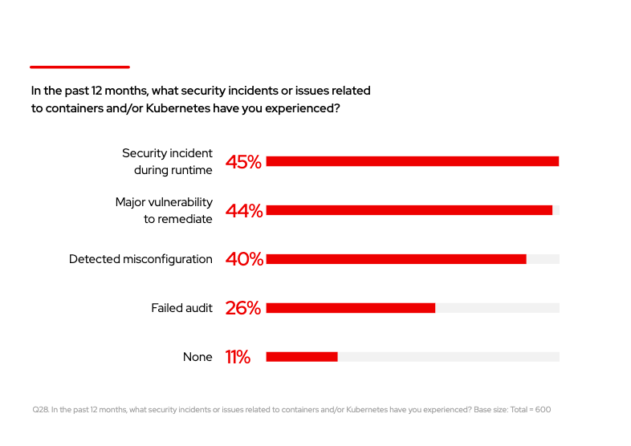
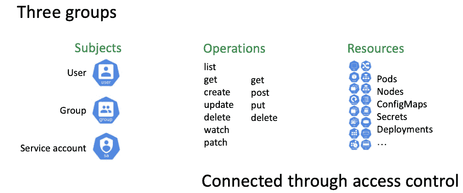
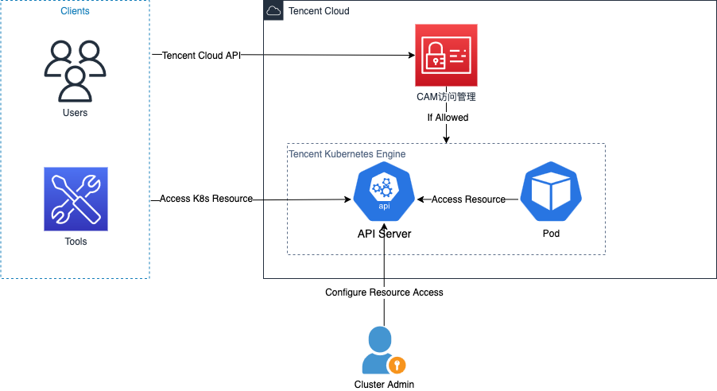
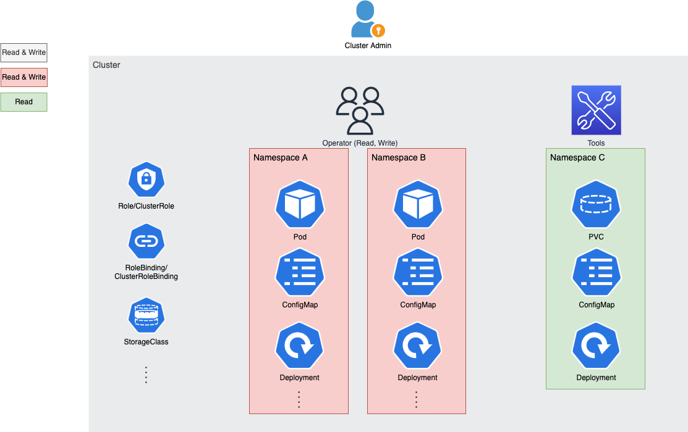
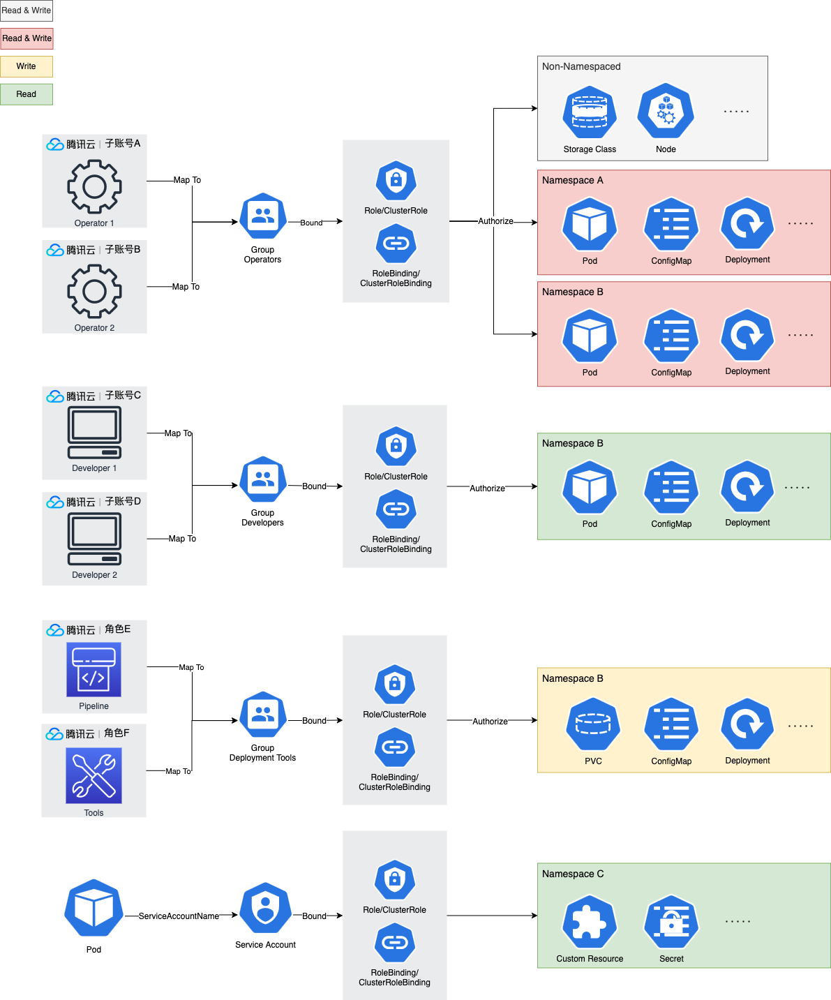
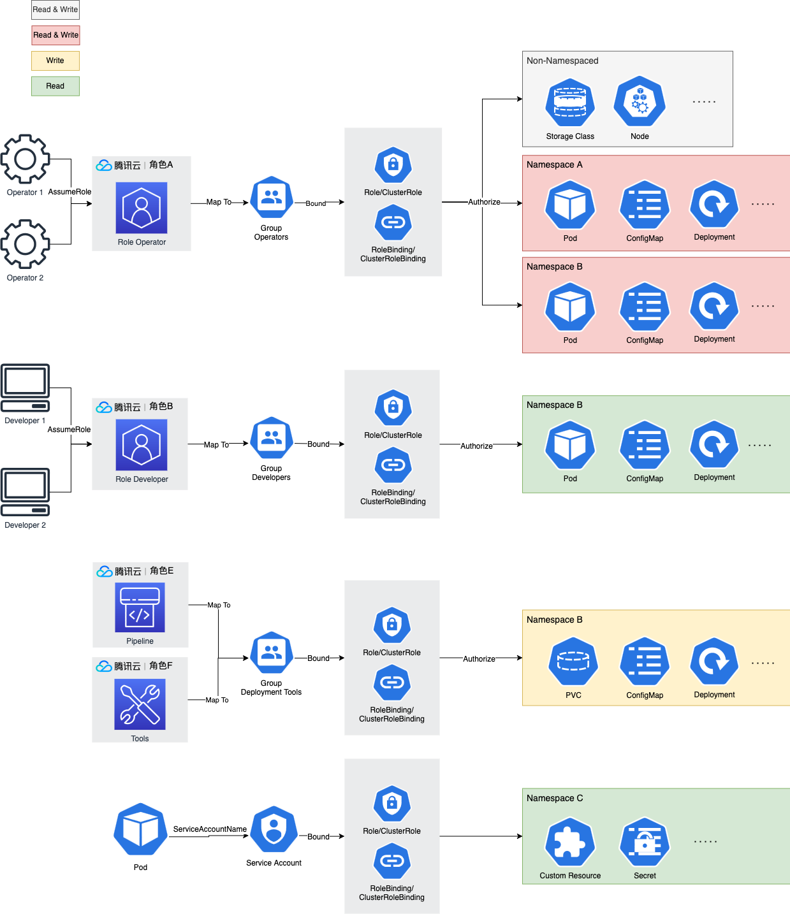
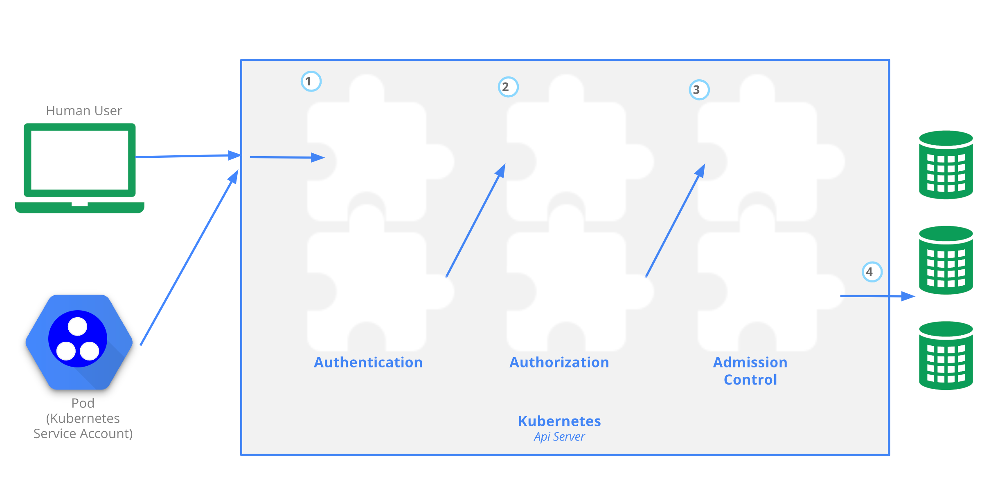
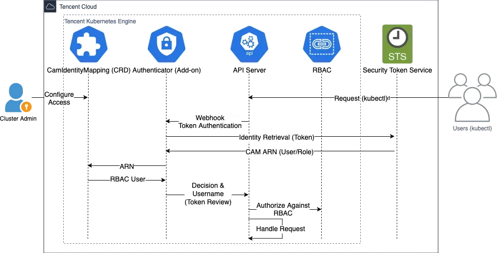

# TKE 集群访问权限管理最佳实践

## 为什么需要访问权限管理?

随着公司业务发展，K8s 集群承载了业务的大部分服务，一旦被攻破，用户数据、资产安全都会受到威胁，因此集群安全问题变得愈发突出。

根据 RedHat 2024 *The state of Kubernetes security report* 的调查中，**40% 的安全问题与 K8s 的错误配置相关**。



就像 CNCF（Cloud Native Computing Foundation）*These Kubernetes mistakes will make you an easy target for hackers* 这篇博客中所言，**坚固的身份认证机制和最小化 RBAC 权限是一切其他集群防御手段的安全基石**。忽视它们是最常见、最致命的错误。

比如，我们并不希望工具和管理员一样，拥有资源在任何 namespace 下的资源操作权限，导致工具错误的删除掉 `kube-system` namespace 下的工作负载。

再比如，我们不希望企业内研发同运维一样，可以随时随地的向集群中部署任何工作负载，亦或是删除任意服务导致现网服务无法访问。

更有最基本的，我们不希望没有通过身份认证的任意请求，可以随意操作集群内的资源。

因此多种工具和人在访问集群时，需要谨慎配置其访问权限，从而避免出现安全风险。

## TKE 集群权限管理的独特复杂性

### 两层权限模型

TKE 集群本身作为一种腾讯云资源，其云资源信息（如集群名称、所属地域等）由 CAM 控制，各种腾讯云 API 接口是否可以访问由 CAM 决定。但是，TKE 集群内的 K8s 资源不由 CAM 控制访问，而由 K8s API Server 通过身份认证和 K8s RBAC 权限来决定。

而集群内访问云资源时，又可以通过将 API Server 作为 OIDC 协议中的 Identity Provider，通过 Service Account Token 调用腾讯云 API 接口换取腾讯云临时密钥，从而访问腾讯云上其他资源的 API。

### 多样的身份认证方式

TKE 集群目前支持多种认证方式，如：

1. X.509 客户端证书
2. 动态 Token
3. Service Account Token

集群使用者需要在不同场景选择适合的身份认证方式。

### 精细的资源粒度管理

#### 1. 资源类型与 API 组复杂性

Kubernetes 资源涉及 API 组（如 `apps/v1`）、资源类型（如 `Deployment`）、操作动词（如 `get`、`create`）的三维组合。例如，仅管理 Pod 就需配置 `apiGroups: [""]`（Core API 组）和 `resources: ["pods"]`。这需要用户对每种资源的作用有清晰的了解，且对每种操作的含义有清醒的认识。

#### 2. 命名空间隔离机制

命名空间是 Kubernetes 的核心隔离单元，权限需按命名空间划分。例如：

- 开发团队 A 只能访问 `namespace: dev-a`
- 运维团队需跨命名空间操作

这种逻辑隔离要求权限策略与业务架构深度耦合。

## 核心理念

本文将带你了解 TKE 在集群访问管理上的最佳实践，将带你围绕 **"仅允许可信身份访问、密钥动态轮转、权限最小化"** 的理念，根据不同使用场景做出最优权限配置。

## 常见的需要访问权限管理的场景

### 公司内人员权限组织

公司内有多种角色需要访问集群，每种角色有自己的职责，不希望其进行职责范围外的操作。比如开发、运维、测试。开发可能具备 Pod、Deployment、Service 等资源的只读权限，运维可能具备多种资源的读写权限。

### 集群内组件权限组织

集群内组件比如 CRD Controller、Operator 等经常会需要操作集群内某些资源，因此其权限也需要管理，比如限制其仅能操作所在 namespace 下的资源，从而防止在某个组件受到攻击沦陷后，影响范围扩大。

## 概念解释

### 什么是腾讯云 API 访问权限？

腾讯云 API 的访问权限由 CAM（Cloud Access Management）控制，其管理用户或角色是否可以调用特定的 API。通过为每一个用户/角色单独分配访问凭证，供其访问腾讯云资源。

### 什么是 TKE 集群访问权限？

有别于腾讯云 API 访问权限控制云上资源，TKE 集群内 K8s 资源（Pod、Deployment）不受 CAM 控制。其使用独立的 K8s 身份认证和资源授权手段，集群内的 K8s 资源依赖于用户通过对 TKE 集群的身份认证方式的访问凭证（如客户端证书）和 RBAC 资源授权的配置，从而决定用户是否可以访问 K8s 资源，而非通过 CAM 的 Secret ID/Secret Key 和云 API 权限配置来达成访问控制。



## 集群访问权限配置建议

### 访问集群示意图



当需要操作 K8s 资源时，我们通过直接访问 TKE 集群 API Server 来完成，因此需要通过 API Server 的身份认证和资源鉴权。当需要调用 TKE 集群云 API 时，我们直接访问腾讯云而非通过 K8s API Server，因此需要腾讯云 CAM 访问管理来进行鉴权。

不同的人、工具、服务访问 TKE 集群时需要分配不同的身份认证方式和资源权限，且需要遵循**权限最小化原则**，仅授予其必要的最小权限。

### 管理员

需要拥有配置任意身份访问任意集群内资源的能力，管理人/工具等集群内资源的访问权限，同时在必要时吊销访问权限。其也承担着定期审查访问权限，确保没有过期或可疑的访问权限配置的职责。这一角色通常是集群维度的，控制着整个集群的访问权限。

### 其他角色或集群内组件

仅按照该角色或组件所需要的操作资源的最小权限来进行配置，确保其不会进行期望以外的资源操作。

比如**开发角色**，我们可以仅为此角色赋予特定 namespace 的资源的只读（`get`、`list`、`watch`）权限。

再比如**运维角色**，通常赋予其 Service、Deployment、Pod、ConfigMap 等资源的读写（`get`、`list`、`watch`、`create`、`update`、`patch`、`delete`）权限，对集群上服务进行部署、配置、升级等运维操作。但并不参与访问权限管理。



#### 小规模场景（≤ 100 人）

如需要访问集群人数 ≤ 100 人，可以为每人建立单独的腾讯云子帐户，并为相同企业内角色的腾讯云子帐户映射至同一 K8s RBAC group，并限制 RBAC group 的集群内权限至最小所需权限。

可以将具有相同企业角色（开发、运维、测试等）的腾讯云子帐户映射至相同的 K8s RBAC group，并为 RBAC group 配置企业角色相应的 K8s 内资源权限以简化 RBAC 管理，从而无需为每一个人单独配置 RBAC 权限。



#### 大规模场景（> 100 人）

若需要访问集群的人数 > 100 人，或需要经常动态增减可以访问集群的人，建议为每种企业内角色（如开发、运维、测试等）配置一个单独的 CAM 角色，然后为 CAM 角色配置相应的映射至 K8s RBAC username/groups 并限制 RBAC username/groups 的集群内权限至最小所需权限。

!!! note "注意"
    此时，不同 CAM 角色映射到的 RBAC username/groups 应不同。

从而无需为每一个企业人员单独配置集群内 CAM 角色至 K8s RBAC username/groups 的映射关系，仅需控制每个子账号是否有扮演此 CAM 角色的权限即可。



### TKE 支持的身份认证方式

TKE 支持通过以下身份认证方式访问：

1. X.509 客户端证书
2. 动态 Token
3. Service Account Token

以下是针对不同场景具体的 TKE 集群访问权限配置指引。

## 管理员（首次访问集群）

首次访问集群时，建议安装 `tke-authenticator` 从而支持动态 Token 访问集群。安装 `tke-authenticator` 后，由于没有任何 `CAMIdentityMapping` custom resource 存在于集群中，所以任何腾讯云 CAM 身份都无法访问集群。此时，需要先使用具备 `CAMIdentityMapping` create 权限的 X.509 客户端证书，通常为集群管理员的客户端证书，为集群管理员配置 `CAMIdentityMapping`，随后再使用动态 Token 的方式来访问集群。

### 所需要的 CAMIdentityMapping create 权限

```yaml
apiVersion: rbac.authorization.k8s.io/v1
kind: ClusterRole
metadata:
  name: test-user
rules:
  - apiGroups: ["authenticator.tke.cloud.tencent.com"]
    resources:
      - camidentitymappings
    verbs:
      - create
```

建议为集群管理员的腾讯云 CAM 身份配置一份 `CAMIdentityMapping`，并且 `CAMIdentityMapping` 中映射到的 K8s RBAC username/groups 具备以下管理 `CAMIdentityMapping` 的权限，从而允许集群管理员后续也通过动态 Token 的方式配置 `CAMIdentityMapping` 管理集群访问，而非使用 X.509 客户端证书。

### 管理员的腾讯云 CAM 身份的 CAMIdentityMapping 示例

假设为主账号 `123456789012` 下的子账号 `543211234512` 配置管理员权限：

```yaml
apiVersion: authenticator.tke.cloud.tencent.com/v1
kind: CAMIdentityMapping
metadata:
  name: 123456789012-to-my-cluster-admin
spec:
  arn: "qcs::cam::uin/123456789012:uin/543211234512"
  username: my-cluster-admin
```

示例中，腾讯云子账号 `543211234512` 映射到 K8s RBAC username `my-cluster-admin`，`my-cluster-admin` 应至少具备以下权限，从而允许子账号 `543211234512` 读写 `CAMIdentityMapping`：

```yaml
apiVersion: rbac.authorization.k8s.io/v1
kind: ClusterRole
metadata:
  name: cluster-admin
rules:
  - apiGroups: ["authenticator.tke.cloud.tencent.com"]
    resources:
      - camidentitymappings
    verbs:
      - "*"
  # TODO: Add more rules for other resources.
---
apiVersion: rbac.authorization.k8s.io/v1
kind: ClusterRoleBinding
metadata:
  name: my-cluster-admin-binding
roleRef:
  apiGroup: rbac.authorization.k8s.io
  kind: ClusterRole
  name: cluster-admin
subjects:
  - kind: User
    apiGroup: rbac.authorization.k8s.io
    name: my-cluster-admin
```

以上配置完成后，使用子账号腾讯云临时密钥通过 `tke-cam-tool` 生成 kubeconfig，然后使用 `kubectl` 命令以动态 Token 的方式访问集群，验证可以管理 `CAMIdentityMapping`。

随后，管理员应为其他需要访问集群的 CAM 身份继续配置 `CAMIdentityMapping`。

## 其他角色身份认证

建议通过使用动态 Token 的方式来访问集群。使用 `tke-cam-tool` 生成 kubeconfig 文件，随后使用这个 kubeconfig 文件通过 `kubectl` 命令访问集群。

若尚未为集群配置动态 Token 所使用的 `CAMIdentityMapping`（即腾讯云 CAM 身份到集群内 RBAC username 和 groups 的映射关系），则需要先配置映射关系。

!!! warning "权限要求"
    配置映射关系需要 `camidentitymappings` 的 `create` 权限，通常为管理员所拥有。

### 小规模场景（≤ 100 人）

如需要访问集群人数不多于 100 人，可以为每人建立单独的腾讯云子帐户，并为腾讯云子帐户配置相应的 `CAMIdentityMapping`，映射至 K8s RBAC username/groups 并限制 RBAC username/groups 的集群内权限至最小所需权限，可以将具有相同企业角色（开发、运维、测试等）的腾讯云子帐户映射至相同的 K8s RBAC group，并为 RBAC group 配置企业角色相应的 K8s 内资源权限以简化 RBAC 管理。

#### 示例：为运维配置 Pod 读写权限

假设为主账号 `123456789012` 下的 UIN 为 `54321` 的运维所拥有的腾讯云子账号配置 Pod 读写权限：

首先配置 `CAMIdentityMapping`，将腾讯云子账号 `54321` 映射至 K8s RBAC group `operator`：

```yaml
apiVersion: authenticator.tke.cloud.tencent.com/v1
kind: CAMIdentityMapping
metadata:
  name: jackie-chen
spec:
  arn: "qcs::cam::uin/123456789012:uin/54321"
  username: jackie-chen-54321
  groups:
    - operator
```

接下来为 K8s RBAC group `operator` 配置 Pod 读写权限：

```yaml
apiVersion: rbac.authorization.k8s.io/v1
kind: Role
metadata:
  namespace: default
  name: pod-readwriter
rules:
  - apiGroups: [""] # "" indicates the core API group
    resources: ["pods"]
    verbs: ["get", "watch", "list", "create", "update", "post", "put", "patch", "delete"]
---
apiVersion: rbac.authorization.k8s.io/v1
kind: RoleBinding
metadata:
  name: readwrite-pods
  namespace: default
subjects:
  - kind: Group
    apiGroup: rbac.authorization.k8s.io
    name: operator
roleRef:
  kind: Role
  name: pod-readwriter
  apiGroup: rbac.authorization.k8s.io
```

### 大规模场景（> 100 人）

若需要访问集群的人数多于 100 人，或需要经常动态增减可以访问集群的人，建议为每种企业内角色（如开发、运维、测试等）配置一个单独的 CAM 角色，然后为 CAM 角色配置相应的 `CAMIdentityMapping`，映射至 K8s RBAC username/groups 并限制 RBAC username/groups 的集群内权限至最小所需权限。

!!! note "注意"
    此时，不同 CAM 角色映射到的 RBAC username/groups 应不同。

#### 示例：为 CAM 角色配置 Pod 只读权限

假设为主账号 `123456789012` 下的 RoleID 为 `12345678` 的 CAM 角色配置 `CAMIdentityMapping`：

```yaml
apiVersion: authenticator.tke.cloud.tencent.com/v1
kind: CAMIdentityMapping
metadata:
  name: dep1-developer-mapping
spec:
  arn: "qcs::cam::uin/123456789012:role/12345678"
  username: dep1-developer
```

接下来为 K8s RBAC username `dep1-developer` 配置 Pod 只读权限：

```yaml
apiVersion: rbac.authorization.k8s.io/v1
kind: Role
metadata:
  namespace: default
  name: pod-reader
rules:
  - apiGroups: [""] # "" indicates the core API group
    resources: ["pods"]
    verbs: ["get", "watch", "list"]
---
apiVersion: rbac.authorization.k8s.io/v1
kind: RoleBinding
metadata:
  name: read-pods
  namespace: default
subjects:
  - kind: User
    apiGroup: rbac.authorization.k8s.io
    name: dep1-developer
roleRef:
  kind: Role
  name: pod-reader
  apiGroup: rbac.authorization.k8s.io
```

## 集群外工具身份认证

工具访问集群可以通过集成 `tke-cam-tool` 使用动态 Token 的方式访问集群。建议为每种工具配置一个 CAM 角色，然后为 CAM 角色配置相应的 `CAMIdentityMapping`，映射至独立的 K8s RBAC username/groups 并限制 RBAC username/groups 的集群内权限至最小所需权限。

!!! warning "权限要求"
    配置映射关系需要 `camidentitymappings` 的 `create` 权限，通常为管理员所拥有。

### 访问权限校验流程

访问时，权限校验全流程如下：

1. 通过子账号密钥调用 STS 服务 `AssumeRole` 接口获取 CAM 角色临时密钥（可由 kubeconfig 中的 `tke-cam-tool` 自动完成），此子账号密钥可以为正在使用工具的人的子账号密钥。
2. 使用临时密钥生成 Token，并发送至 API Server 随后转送至 `tke-authenticator`（kubeconfig 中的 `tke-cam-tool` 自动完成）
3. `tke-authenticator` 查找 `CAMIdentityMapping`，取得 CAM 角色对应的 K8s RBAC username/groups 并返回至 API Server
4. API Server 检查 K8s RBAC username/groups 是否有用户期望的资源的操作权限

### 权限配置建议

基于以上流程，有以下权限配置建议：

1. 仅为需要访问工具的腾讯云子账号配置获取角色临时密钥的权限，即 STS 服务 `AssumeRole` 接口的权限。
2. 可以使用 `tke-cam-tool` 生成 kubeconfig 文件后，将此静态 kubeconfig 文件和 `tke-cam-tool` 置入流水线中。通过腾讯云 STS 服务 `AssumeRole` 接口为工具生成临时密钥，然后使用这个临时密钥作为 kubeconfig 所需的 CAM 身份临时密钥访问集群。

## 集群内组件身份认证

集群内组件访问集群推荐通过 **Service Account Token** 实现。

### 配置 Service Account

将 Service Account 配置于 Pod 中，如下：

```yaml
apiVersion: v1
kind: Pod
metadata:
  name: nginx
  namespace: default
spec:
  containers:
    - image: nginx
      name: nginx
  serviceAccountName: nginx-sa
```

可以在 `/var/run/secrets/kubernetes.io/serviceaccount/token` 文件下找到 Service Account Token。这个 Token 以 Bearer Token 的方式发送至 API Server，从而完成身份认证。Token 由 kubelet 定期刷新，并保存在这个文件中。

### 配置 RBAC 权限

身份认证完成后，资源授权由 API Server 通过查找这个 Service Account 在集群中的 RBAC 权限来完成，若有权限则允许操作相应资源。以操作 Pod 资源为例：

```yaml
apiVersion: rbac.authorization.k8s.io/v1
kind: Role
metadata:
  namespace: default
  name: pod-reader
rules:
  - apiGroups: [""] # "" indicates the core API group
    resources: ["pods"]
    verbs: ["get", "watch", "list"]
---
apiVersion: rbac.authorization.k8s.io/v1
kind: RoleBinding
metadata:
  name: read-pods
  namespace: default
subjects:
  - kind: ServiceAccount
    name: nginx-sa
    namespace: default
roleRef:
  kind: Role
  name: pod-reader
  apiGroup: rbac.authorization.k8s.io
```

K8s RBAC 权限配置说明见[官方文档](https://kubernetes.io/docs/reference/access-authn-authz/rbac/)。

!!! warning "安全建议"
    为 Service Account 配置 K8s RBAC 权限时，避免在 Role 和 ClusterRole 中使用通配符 `["*"]`。

## 如何决定用户是否有 TKE 集群内资源的访问权限？

TKE 集群的访问权限由两部分组成：**身份认证** 和 **资源授权**。

用户需要首先通过身份认证（Authentication），从而让 K8s 可以验证并获取到用户身份（RBAC username 和 groups）。身份认证如果失败，则拒绝访问。

接下来，通过 RBAC 校验这个身份是否有指定资源的操作权限（Authorization），如果是，则允许访问，反之拒绝。

每一次 TKE 集群的访问（如 `kubectl` 命令）都包含一个操作（如 `create`、`update` 等），以及操作的 K8s 资源（如 Pod、Deployment）。身份认证和资源授权都由 TKE 集群内的 K8s API Server 来完成。



## 身份认证 (Authentication)

目前 TKE 集群的身份认证方式有：

1. X.509 客户端证书
2. 动态 Token
3. Service Account Token

### X.509 客户端证书

X.509 客户端证书由集群 CA 签发，每个腾讯云子账号单独具备客户端证书，证书 Common Name 中包含子账号的 ID。TKE 集群身份认证完成后进行资源授权校验时，会使用这个 Common Name 作为 K8s RBAC 的 username。

### 动态 Token

TKE 集群支持使用动态 token 访问。这个 token 由 TKE 二进制工具 `tke-cam-tool` 动态生成，默认有效期 5 分钟。

通过在 TKE 集群内安装名为 `tke-authenticator` 的 [Kubernetes Webhook Token Authentication](https://kubernetes.io/docs/reference/access-authn-authz/authentication/#webhook-token-authentication) 组件，允许用户以 [腾讯云 CAM](https://cloud.tencent.com/product/cam)（Cloud Access Management）身份访问 Kubernetes 集群。

`tke-cam-tool` 可以使用腾讯云 Secret ID 和 Secret Key 动态生成 token，并以 Bearer Token 的方式发送给集群 API Server。API Server 会将动态 token 发送给 `tke-authenticator` 以决定是否同意访问。

`tke-authenticator` 查找一个 [腾讯云 CAM](https://cloud.tencent.com/product/cam) 身份到 Kubernetes RBAC username 和 groups 的映射，来决定 CAM 身份在 K8s 中的 username 和 groups。

这个映射实际上是通过一个 CRD（Custom Resource Definition）`CAMIdentityMapping` 来实现的，它定义了如何将 CAM 身份映射到 Kubernetes username 和 groups。

#### 详细认证过程



通过 `tke-cam-tool` 生成的 kubeconfig 文件利用了 [k8s.io/client-go 凭据插件](https://kubernetes.io/zh-cn/docs/reference/access-authn-authz/authentication/#input-and-output-formats)的机制，使用 `tke-cam-tool` 作为 token 生成插件，其会将包含 token 的 `ExecCredential` 打印至 stdout 并由 kubectl 解析使用。一个 `ExecCredential` 内的 token 被标记为有效期 4 分钟，但实际有效期为 5 分钟，从而留出 1 分钟缓冲时间让 kubectl 在 token 过期时重新生成 token。

```bash
tke-cam-tool exec-cred kubeconfig --cluster-id cls-xxx --region ap-guangzhou [FLAGS...]
```

#### kubeconfig 示例

```yaml
apiVersion: v1
clusters:
  - cluster:
      certificate-authority-data: BASE64_PEM_ENCODED_CA_CERTIFICATE
      server: API_SERVER_ADDRESS
    name: cls-aaa
contexts:
  - context:
      cluster: cls-aaa
      user: cls-aaa-exec-cred-plugin
    name: cls-aaa-exec-cred-plugin-context
current-context: cls-aaa-exec-cred-plugin-context
kind: Config
preferences: {}
users:
  - name: cls-aaa-exec-cred-plugin
    user:
      exec:
        apiVersion: client.authentication.k8s.io/v1beta1
        args:
          - exec-cred
          - token
          - --cluster-id
          - cls-aaa
          - --role
          - qcs::cam::uin/ROOT_ACCOUNT_ID:role/ROLE_ID
          - --sts-endpoint
          - sts.internal.tencentcloudapi.com
          - --token-sts-host
          - sts.tencentcloudapi.com
        command: tke-cam-tool
        env: null
        interactiveMode: Never
        provideClusterInfo: false
```

#### tke-cam-tool 打印的 ExecCredential 示例

```json
{
  "kind": "ExecCredential",
  "apiVersion": "client.authentication.k8s.io/v1beta1",
  "spec": {
    "interactive": false
  },
  "status": {
    "expirationTimestamp": "2024-10-12T09:18:05Z",
    "token": "k8s-tke-v1.ewogICJjbHVzdGVySWQiOiAiY2xzLSoqKioqIiwKICAiaGVhZGVyIjogewogICAgIkF1dGhvcml6YXRpb24iOiBbCiAgICAgICJUQzMtSE1BQy1TSEEyNTYgQ3JlZGVudGlhbD1BS0lEKioqKiovMjAyNC0wOS0wMy9zdHMvdGMzX3JlcXVlc3QsIFNpZ25lZEhlYWRlcnM9Y29udGVudC10eXBlO2hvc3Q7eC10Yy1hY3Rpb247eC10Yy10a2UtY2x1c3RlcmlkLCBTaWduYXR1cmU9KioqKioiCiAgICBdLAogICAgIkNvbnRlbnQtVHlwZSI6IFsKICAgICAgImFwcGxpY2F0aW9uL2pzb247IGNoYXJzZXQ9dXRmLTgiCiAgICBdLAogICAgIkhvc3QiOiBbCiAgICAgICJzdHMuaW50ZXJuYWwudGVuY2VudGNsb3VkYXBpLmNvbSIKICAgIF0sCiAgICAiWC1UQy1BY3Rpb24iOiBbCiAgICAgICJHZXRDYWxsZXJJZGVudGl0eSIKICAgIF0sCiAgICAiWC1UQy1SZWdpb24iOiBbCiAgICAgICJhcC1ndWFuZ3pob3UiCiAgICBdLAogICAgIlgtVEMtVEtFLUNsdXN0ZXJJRCI6IFsKICAgICAgImNscy0qKioqKiIKICAgIF0sCiAgICAiWC1UQy1UaW1lc3RhbXAiOiBbCiAgICAgICIxNzI1MzMyMjY4IgogICAgXSwKICAgICJYLVRDLVRva2VuIjogWwogICAgICAiKioqKioiCiAgICBdLAogICAgIlgtVEMtVmVyc2lvbiI6IFsKICAgICAgIjIwMTgtMDgtMTMiCiAgICBdCiAgfQp9Cg=="
  }
}
```

生成 kubeconfig 文件后，正常使用 `kubectl` 命令访问集群即可，`tke-cam-tool` 会自动生成动态 token，这个 token 中包含了使用用户的腾讯云 Secret ID/Secret Key 生成的签名信息。

#### Token 结构

token 实际上为 `k8s-tke-v1.` 前缀，和一个 base64 编码的用于请求 [STS GetCallerIdentity](https://cloud.tencent.com/document/product/1312/66098) 接口的一些必要信息：

```json
{
  "clusterId": "cls-*****",
  "header": {
    "Authorization": [
      "TC3-HMAC-SHA256 Credential=AKID*****/2024-09-03/sts/tc3_request, SignedHeaders=content-type;host;x-tc-action;x-tc-tke-clusterid, Signature=*****"
    ],
    "Content-Type": [
      "application/json; charset=utf-8"
    ],
    "Host": [
      "sts.internal.tencentcloudapi.com"
    ],
    "X-TC-Action": [
      "GetCallerIdentity"
    ],
    "X-TC-Region": [
      "ap-guangzhou"
    ],
    "X-TC-TKE-ClusterID": [
      "cls-*****"
    ],
    "X-TC-Timestamp": [
      "1725332268"
    ],
    "X-TC-Token": [
      "*****"
    ],
    "X-TC-Version": [
      "2018-08-13"
    ]
  }
}
```

`tke-authenticator` 会使用这个 token 内的签名信息调用 STS (Security Token Service) 服务的 [GetCallerIdentity](https://cloud.tencent.com/document/product/1312/66098) 接口，这个接口所返回的 ARN (Auth Resource Name) 即为 token 的腾讯云 CAM 身份唯一标识。

然后，`tke-authenticator` 通过查找包含此 ARN 的用户配置的 `CAMIdentityMapping`，来获取此腾讯云 CAM 身份在 K8s 集群内的 username 和 groups。

#### CAMIdentityMapping 示例

```yaml
apiVersion: authenticator.tke.cloud.tencent.com/v1
kind: CAMIdentityMapping
metadata:
  name: test-user
spec:
  arn: "qcs::cam::uin/123456789012:uin/543211234512"
  username: test-user
  groups:
    - "read-group"
    - "write-group"
```

示例中，腾讯云主账号 `123456789012` 下属子账号 `543211234512` 映射到 Kubernetes RBAC username `test-user` 以及 groups `read-group` 和 `write-group`。用户可以通过在集群内配置 Kubernetes RBAC `ClusterRoleBinding` 或 `RoleBinding` 来授权 username 和 group 访问指定资源。

### Service Account Token

Service Account 挂载方式见 [Service Account 官方文档](https://kubernetes.io/docs/tasks/configure-pod-container/configure-service-account/)，其本质为将一个 Token 挂载至容器中，从而允许用户以 Bearer Token 的方式将其发送至 API Server 进行身份认证。

!!! warning "安全建议"
    避免为 `default` ServiceAccount 授予过大权限，应尽量为每个集群内部署的组件授予单独的 ServiceAccount。

## 资源授权 (Authorization)

TKE 集群资源授权目前通过 **Kubernetes RBAC** 机制实现，通过创建 `Role` 和 `ClusterRole` 从而定义资源权限集，通过 `RoleBinding` 和 `ClusterRoleBinding` 指定 username 或 group 拥有哪些资源的权限。

### 对 CAM 用户组进行资源授权

若多个 CAM 用户都需要相同的 K8s 资源权限，则可以安装 `user-group-access-control` 组件来方便的管理。通过在访问管理控制台将这类用户添加到相同的 CAM 用户组，然后在容器服务授权管理页面中，通过 RBAC 策略生成器授权用户组获取指定集群内预设权限集的权限。从而无需每次单独为每个此类用户配置一次 RBAC 资源授权。

!!! note "注意"
    此时访问集群必须使用 X.509 v3 客户端证书，`user-group-access-control` 组件会使用证书 Common Name 中包含的子账号的 ID 来获取其所属的 CAM 用户组列表，并查找其所属的用户组是否有用户正在操作的资源的权限。

!!! warning "权限最小化"
    配置时，需要确保授予的权限为该 CAM 用户所需要的最小权限。

### 对多个 CAM 用户/角色通过专用 CAM 角色进行相同资源授权

若多个 CAM 用户或角色都需要相同的 K8s 资源权限，则可以通过配置动态 Token 身份认证方式的 `CAMIdentityMapping` 将他们映射至相同 K8s RBAC group，然后创建包含这个 RBAC group 的 `RoleBinding` / `ClusterRoleBinding` 从而授权多个 CAM 身份访问资源。

若此类 CAM 用户或角色很多，且需要随时增加和删减，则建议创建一个**专用于访问集群的 CAM 角色**，为此专用角色在 TKE 集群中创建一个 `CAMIdentityMapping`，并在 CAM 中授权这些 CAM 用户和角色扮演这个新创建的专用角色。从而可以根据需要，动态增减可以扮演此专用角色的 CAM 用户或角色，间接达到控制哪些 CAM 用户或角色可以访问指定集群资源的目的。

这些 CAM 用户和角色需要访问集群时，先使用其 Secret ID 和 Secret Key 通过 `AssumeRole` 接口扮演创建的专用角色，获取到专用角色的临时 Secret ID、Secret Key 和 Token。然后使用这组临时密钥生成动态 token，从而可以以专用角色的 CAM 身份访问 TKE 集群。

!!! note "注意"
    这两种配置方式均必须使用动态 Token 作为身份认证方式。

## 其他建议

### 注意证书保护

客户端证书为 **20 年长期证书**，使用时需特别注意保存证书的 Private key。

泄漏时可以登录腾讯云主账号/子账号更新其客户端证书，或使用集群 `tke:admin` 权限的 K8s username 或 group 更新其他子账号的证书。

### 动态 Token 安全建议

#### 尽量使用动态 Token 访问集群

相较于 X.509 客户端证书 20 年有效期，动态 Token 由于是临时密钥，且仅有 **5 分钟有效期**，具有更高的安全性。更适合用于 CI/CD 流水线和更高安全需求的场景。

动态 Token 泄漏时，可以通过**删除 `CAMIdentityMapping`** 的方式来禁止特定腾讯云 CAM 身份访问集群。

动态 Token 让用户得以使用 CAM 身份访问 TKE 集群，这意味着可以使用腾讯云 Secret ID 和 Secret Key 而无需专门获取其他 K8s 集群访问凭证来访问集群。

#### 限制 CAMIdentityMapping 写权限

!!! danger "重要"
    注意配置 `CAMIdentityMapping` 时，拥有 `CAMIdentityMapping` 写权限意味着可以将任意腾讯云 CAM 身份映射至任意 Kubernetes RBAC username 或 group，从而可能获取到集群的 `ClusterRole tke:admin` 权限，建议仅为关键运维人员或管理员配置 `CAMIdentityMapping` 资源写权限。

#### 检查访问集群的 CAM 身份

定期检查 `CAMIdentityMapping` 没有过大授权，确认 CAM 身份映射到的 username 和 group 符合预期。集群审计中可以查看哪些 username 和 group 曾经访问集群。

#### Kubeconfig 内避免使用 insecure-skip-tls-verify

避免在 kubeconfig 内设置 `insecure-skip-tls-verify`，从而避免泄漏访问内容。

### 集群内资源授权权限最小化

应遵循**最小权限化原则**。`RoleBinding` 和 `ClusterRoleBinding` 应仅包含执行特定功能所需的最小权限集合。

除非绝对必要，否则应避免在 `Role` 和 `ClusterRole` 中使用通配符 `["*"]`。

若不明确需要分配哪些权限，可考虑使用 `audit2rbac` 等工具，基于 Kubernetes 审计日志中记录的 API 调用自动生成角色及绑定。

!!! warning "重要"
    请注意，集群内 `ClusterRole tke:admin` 中包含所有资源的权限，不要将其在 `ClusterRoleBinding`/`RoleBinding` 中使用。

并且注意，访问 TKE 集群内 K8s 资源并不需要任何腾讯云 API 权限。

参考 [K8s 官方 RBAC 最佳实践文档](https://kubernetes.io/docs/concepts/security/rbac-good-practices/)。

### 禁止特定 K8s RBAC 身份获得资源授权

!!! danger "安全警告"
    禁止 K8s RBAC username `system:anonymous` 和 group `system:unauthenticated` 获得资源授权。

K8s API Server 默认启动时会设置 `--anonymous-auth=true`，这意味着 API Server 会将没有被任何身份认证方式认证的用户，归类为 username `system:anonymous` 和 group `system:unauthenticated` 进行下一步的资源鉴权。

因此，除非必要，应避免在任何 `RoleBinding` / `ClusterRoleBinding` 中使用这个 username 和 group。
