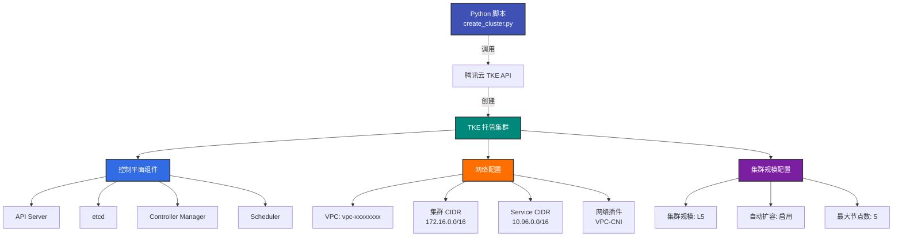

# 创建 TKE 集群

!!! abstract "Cookbook 概述"
    使用腾讯云 Python SDK 创建托管型 TKE 集群的完整示例脚本。支持自定义网络配置、集群规模和 Kubernetes 版本。

---

## 📋 功能特性

<div class="grid cards" markdown>

- :material-cloud-check:{ .lg .middle } **托管型集群**

    ---

    创建腾讯云托管的 Kubernetes 集群，控制平面由腾讯云负责

- :material-network:{ .lg .middle } **VPC 网络**

    ---

    支持自定义 VPC、CIDR 和 Service CIDR 配置

- :material-chart-timeline-variant:{ .lg .middle } **自动扩容**

    ---

    支持集群规模自动扩容 (L5/L20/L50/L100)

- :material-kubernetes:{ .lg .middle } **多版本支持**

    ---

    支持 Kubernetes 1.24.x - 1.28.x 多个版本

</div>

---

## 🏗️ 架构图



**工作流程**:

1. **脚本初始化**: 加载配置文件和 API 密钥
2. **构造请求**: 设置集群基础配置和网络参数
3. **调用 API**: 向腾讯云 TKE API 发送创建请求
4. **异步创建**: 腾讯云后台创建控制平面组件
5. **状态查询**: (可选) 轮询集群状态直到 Running

---

## 🚀 快速开始

### 前置条件

- **Python 3.8+**
- **腾讯云 API 密钥** (SecretId 和 SecretKey)
- **VPC 网络** (已创建的 VPC ID)

### 安装依赖

```bash
# 克隆项目
git clone https://github.com/tke-workshop/tke-workshop.github.io.git
cd tke-workshop.github.io/cookbook

# 安装依赖
pip install -r requirements.txt
```

### 配置 API 密钥

```bash
# 复制配置模板
cp config.example.yaml config.yaml

# 编辑配置
vim config.yaml
```

**config.yaml 示例**:

```yaml
tencent_cloud:
  secret_id: "YOUR_SECRET_ID"
  secret_key: "YOUR_SECRET_KEY"
  region: "ap-guangzhou"

cluster:
  vpc_id: "vpc-xxxxxxxx"  # 替换为你的 VPC ID
```

---

## 💻 使用方法

### 基础用法

```bash
# 创建基础集群 (使用配置文件中的 VPC)
python3 cluster/create_cluster.py \
  --cluster-name my-first-cluster \
  --region ap-guangzhou
```

### 高级用法

```bash
# 创建生产集群 (自定义所有参数)
python3 cluster/create_cluster.py \
  --cluster-name prod-cluster \
  --region ap-guangzhou \
  --k8s-version 1.28.3 \
  --vpc-id vpc-xxxxxxxx \
  --cluster-cidr 172.16.0.0/16 \
  --service-cidr 10.96.0.0/16 \
  --cluster-level L50 \
  --wait \
  --timeout 1800
```

### 参数说明

| 参数 | 必填 | 默认值 | 说明 |
| --- | --- | --- | --- |
| `--cluster-name` | ✅ | - | 集群名称 |
| `--region` | ❌ | `ap-guangzhou` | 地域 |
| `--k8s-version` | ❌ | `1.28.3` | Kubernetes 版本 |
| `--vpc-id` | ❌ | 从配置文件读取 | VPC ID |
| `--cluster-cidr` | ❌ | `172.16.0.0/16` | 集群 Pod CIDR |
| `--service-cidr` | ❌ | `10.96.0.0/16` | Service CIDR |
| `--cluster-level` | ❌ | `L5` | 集群规模 (L5/L20/L50/L100/L200) |
| `--wait` | ❌ | `False` | 等待集群就绪 |
| `--timeout` | ❌ | `1800` | 等待超时时间(秒) |

---

## 📝 完整示例

### 示例 1: 开发集群

```bash
# 创建小规模开发集群
python3 cluster/create_cluster.py \
  --cluster-name dev-cluster \
  --region ap-guangzhou \
  --cluster-level L5 \
  --wait
```

**预期输出**:

```
[2026-01-23 10:00:00] INFO: 正在创建集群: dev-cluster
[2026-01-23 10:00:00] INFO:   - 地域: ap-guangzhou
[2026-01-23 10:00:00] INFO:   - Kubernetes 版本: 1.28.3
[2026-01-23 10:00:00] INFO:   - VPC ID: vpc-xxxxxxxx
[2026-01-23 10:00:00] INFO:   - 集群 CIDR: 172.16.0.0/16
[2026-01-23 10:00:00] INFO:   - Service CIDR: 10.96.0.0/16
[2026-01-23 10:00:00] INFO:   - 集群规模: L5
[2026-01-23 10:00:05] INFO: ✅ 集群创建请求已提交
[2026-01-23 10:00:05] INFO:    集群 ID: cls-abc123def
[2026-01-23 10:00:05] INFO:    RequestId: 12345678-1234-1234-1234-123456789abc
[2026-01-23 10:00:05] INFO: 等待集群就绪: cls-abc123def (超时: 1800s)
[2026-01-23 10:00:15] INFO:   集群状态: Initializing
[2026-01-23 10:01:25] INFO:   集群状态: Running
[2026-01-23 10:01:25] INFO: ✅ 集群已就绪

==================================================
集群创建成功!
集群 ID: cls-abc123def
地域: ap-guangzhou
==================================================

后续步骤:
  1. 获取集群访问凭证:
     tccli tke DescribeClusterKubeconfig --Region ap-guangzhou --ClusterId cls-abc123def
  2. 添加节点到集群:
     python3 ../node/add_node.py --cluster-id cls-abc123def
  3. 查看集群详情:
     tccli tke DescribeClusters --Region ap-guangzhou --ClusterIds '["cls-abc123def"]'
```

### 示例 2: 生产集群

```bash
# 创建大规模生产集群
python3 cluster/create_cluster.py \
  --cluster-name prod-cluster \
  --region ap-shanghai \
  --k8s-version 1.28.3 \
  --vpc-id vpc-prod123 \
  --cluster-cidr 10.0.0.0/16 \
  --service-cidr 172.16.0.0/16 \
  --cluster-level L100 \
  --wait \
  --timeout 3600
```

### 示例 3: 多地域部署

```bash
# 批量创建多地域集群
for region in ap-guangzhou ap-shanghai ap-beijing; do
  python3 cluster/create_cluster.py \
    --cluster-name prod-${region} \
    --region ${region} \
    --cluster-level L50 &
done
wait
echo "所有集群创建完成"
```

---

## 🎓 集群规模说明

| 规模 | 最大节点数 | 适用场景 | 月费用 |
| --- | --- | --- | --- |
| **L5** | 5 | 开发测试 | 免费 |
| **L20** | 20 | 小规模生产 | ¥360 |
| **L50** | 50 | 中等规模生产 | ¥900 |
| **L100** | 100 | 大规模生产 | ¥1800 |
| **L200** | 200 | 超大规模 | ¥3600 |

!!! tip "自动扩容"
    脚本默认启用自动扩容 (`AutoUpgradeClusterLevel = True`)，当节点数接近上限时，集群会自动升级到更高规模。

---

## 📂 项目结构

```
cookbook/cluster/
├── create_cluster.py           # 本脚本
├── delete_cluster.py           # (开发中) 删除集群
└── README.md                   # 脚本说明

cookbook/common/
├── auth.py                     # 认证工具
├── logger.py                   # 日志工具
└── __init__.py
```

---

## 🐛 故障排查

### 问题 1: VPC ID 未配置

**错误信息**:

```
ValueError: 请在 config.yaml 中配置 vpc_id 或通过 --vpc-id 参数指定
```

**解决方案**:

```bash
# 方案1: 在配置文件中指定
vim config.yaml  # 设置 cluster.vpc_id

# 方案2: 通过命令行参数指定
python3 cluster/create_cluster.py \
  --cluster-name my-cluster \
  --vpc-id vpc-xxxxxxxx
```

### 问题 2: API 鉴权失败

**错误信息**:

```
TencentCloudSDKException: [AuthFailure] ...
```

**解决方案**:

1. 检查 `config.yaml` 中的 `secret_id` 和 `secret_key` 是否正确
2. 确认 API 密钥没有过期
3. 检查账号是否有 TKE 创建权限

### 问题 3: VPC 资源不足

**错误信息**:

```
ResourceInsufficient.VpcLimit
```

**解决方案**:

1. 检查 VPC 配额是否充足
2. 使用其他 VPC 或新建 VPC
3. 提交工单申请配额

---

## 🔗 相关链接

- **源代码**: [cookbook/cluster/create_cluster.py](https://github.com/tke-workshop/tke-workshop.github.io/blob/main/cookbook/cluster/create_cluster.py)
- **文档**: [创建集群基础教程](../basics/cluster/01-create-cluster.md)
- **API 文档**: [CreateCluster API](https://cloud.tencent.com/document/api/457/34527)
- **返回 Cookbook 列表**: [Cookbook 集合](index.md)

---

## 🤝 贡献

发现 Bug 或有改进建议? 欢迎提交 Issue 或 Pull Request!

[:material-github: 查看源代码](https://github.com/tke-workshop/tke-workshop.github.io/tree/main/cookbook/cluster){ .md-button .md-button--primary }
[:material-bug: 报告问题](https://github.com/tke-workshop/tke-workshop.github.io/issues){ .md-button }

---

**下一步**: [部署 Nginx 应用](deploy-nginx.md) →
