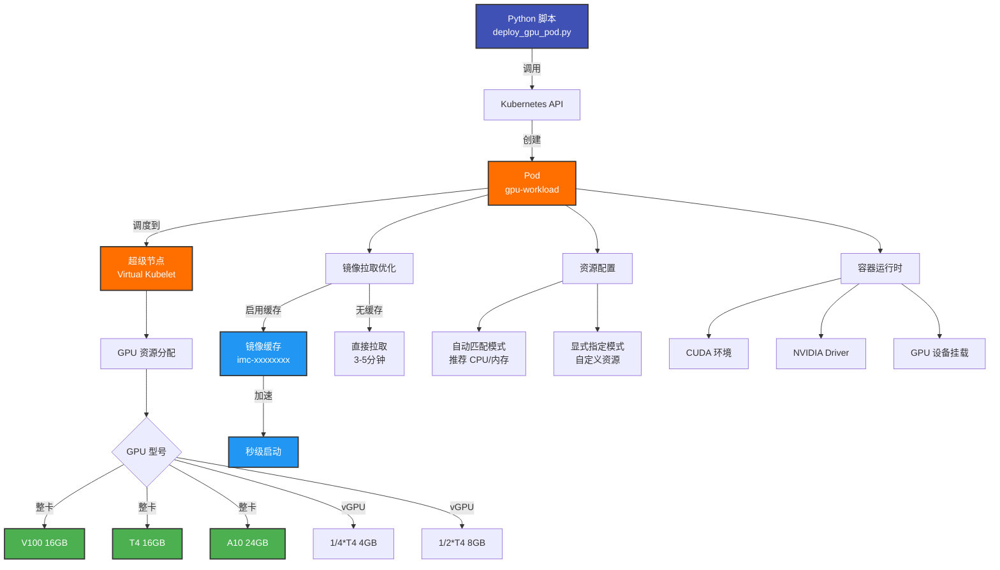

# 部署 GPU Pod

!!! abstract "Cookbook 概述"
    在 TKE 超级节点上部署 GPU Pod 的完整示例。支持多种 GPU 型号(V100/T4/A10/L20/L40)、vGPU 和镜像缓存加速。

---

## 📋 功能特性

<div class="grid cards" markdown>

- :material-chip:{ .lg .middle } **多GPU 支持**

    ---

    支持 V100、T4、A10、L20、L40 和 vGPU (1/4*T4, 1/2*T4)

- :material-flash:{ .lg .middle } **镜像缓存**

    ---

    支持自动创建和使用镜像缓存，秒级启动 Pod

- :material-tune:{ .lg .middle } **资源自动匹配**

    ---

    根据 GPU 型号自动匹配最优 CPU 和内存配置

- :material-layers:{ .lg .middle } **生产就绪**

    ---

    包含健康检查、资源限制和完整错误处理

</div>

---

## 🏗️ 架构图



**工作流程**:

1. **脚本初始化**: 加载 kubeconfig 和参数配置
2. **构造 Pod**: 根据 GPU 型号和资源要求构造 Pod 定义
3. **调度到超级节点**: 通过 nodeSelector 和 tolerations 调度
4. **GPU 资源分配**: 腾讯云后台分配指定的 GPU 资源
5. **镜像拉取**: 使用缓存加速或直接拉取镜像
6. **容器启动**: 挂载 GPU 设备并启动容器

---

## 🚀 快速开始

### 前置条件

- **Python 3.8+**
- **kubectl** (已配置 kubeconfig)
- **TKE 集群** (已启用超级节点)
- **超级节点池** ([创建超级节点池](../basics/supernode/01-create-supernode-pool.md))

### 安装依赖

```bash
cd tke-workshop.github.io/cookbook

# 安装依赖
pip install -r requirements.txt
```

---

## 💻 使用方法

### 基础用法 (自动匹配)

```bash
# 创建 T4 GPU Pod (自动匹配 CPU/内存)
python3 supernode/deploy_gpu_pod.py \
  --name gpu-inference \
  --image pytorch/pytorch:2.0.1-cuda11.7-cudnn8-runtime \
  --gpu-type T4 \
  --gpu-count 1
```

### 显式指定资源

```bash
# 精确控制资源配置
python3 supernode/deploy_gpu_pod.py \
  --name gpu-training \
  --image tensorflow/tensorflow:2.13.0-gpu \
  --gpu-type V100 \
  --gpu-count 1 \
  --cpu 8 \
  --memory 40Gi \
  --no-auto-match
```

### 使用镜像缓存

```bash
# 自动创建镜像缓存
python3 supernode/deploy_gpu_pod.py \
  --name gpu-fast \
  --image pytorch/pytorch:2.0.1-cuda11.7-cudnn8-runtime \
  --gpu-type T4 \
  --use-image-cache \
  --disk-size 200
```

### 参数说明

| 参数 | 必填 | 默认值 | 说明 |
| --- | --- | --- | --- |
| `--name` | ✅ | - | Pod 名称 |
| `--image` | ✅ | - | 容器镜像 |
| `--gpu-type` | ✅ | - | GPU 型号 (V100/T4/A10等) |
| `--gpu-count` | ❌ | `1` | GPU 数量 |
| `--cpu` | ❌ | 自动匹配 | CPU 核数 |
| `--memory` | ❌ | 自动匹配 | 内存大小 |
| `--no-auto-match` | ❌ | `False` | 禁用自动匹配 |
| `--use-image-cache` | ❌ | `False` | 使用镜像缓存 |
| `--image-cache-id` | ❌ | - | 指定镜像缓存 ID |
| `--disk-size` | ❌ | `100` | 磁盘大小(GB) |
| `--command` | ❌ | - | 容器启动命令(JSON) |
| `--env` | ❌ | - | 环境变量(JSON) |
| `--logs` | ❌ | `False` | 查看 Pod 日志 |
| `--delete` | ❌ | `False` | 删除 Pod |

---

## 📝 完整示例

### 示例 1: AI 推理服务

```bash
# 部署大模型推理服务
python3 supernode/deploy_gpu_pod.py \
  --name llm-inference \
  --image vllm/vllm-openai:latest \
  --gpu-type A10*GNV4 \
  --gpu-count 1 \
  --use-image-cache \
  --disk-size 300 \
  --env '{"MODEL_NAME": "meta-llama/Llama-2-7b-hf", "MAX_MODEL_LEN": "4096"}'

# 查看启动日志
kubectl logs llm-inference -f

# 测试 GPU
kubectl exec llm-inference -- nvidia-smi
```

### 示例 2: 模型训练

```bash
# 创建 2卡 V100 训练 Pod
python3 supernode/deploy_gpu_pod.py \
  --name model-training \
  --image tensorflow/tensorflow:2.13.0-gpu \
  --gpu-type V100 \
  --gpu-count 2 \
  --cpu 18 \
  --memory 80Gi \
  --no-auto-match \
  --use-image-cache \
  --disk-size 500

# 监控训练进度
kubectl logs model-training -f

# 查看 GPU 使用率
kubectl exec model-training -- nvidia-smi
```

### 示例 3: vGPU 批处理

```bash
# 使用 1/4 T4 降低成本
for i in {1..5}; do
  python3 supernode/deploy_gpu_pod.py \
    --name gpu-batch-$i \
    --image pytorch/pytorch:2.0.1-cuda11.7-cudnn8-runtime \
    --gpu-type "1/4*T4" \
    --use-image-cache \
    --disk-size 150 &
done
wait

# 查看所有批处理 Pod
kubectl get pods -l scenario=batch-inference
```

### 示例 4: 自定义命令和环境变量

```bash
python3 supernode/deploy_gpu_pod.py \
  --name gpu-custom \
  --image pytorch/pytorch:2.0.1-cuda11.7-cudnn8-runtime \
  --gpu-type T4 \
  --command '["python3", "-m", "http.server", "8080"]' \
  --env '{"MODEL_PATH": "/models/bert", "BATCH_SIZE": "32"}'
```

---

## 📊 支持的 GPU 型号

| GPU 型号 | 显存 | CUDA | 适用场景 | 推荐配置 |
| --- | --- | --- | --- | --- |
| **V100** | 16GB | 11.4 | 高性能训练、大模型推理 | 8核/40GiB |
| **T4** | 16GB | 11.4 | 通用推理、小模型训练 | 8核/32GiB |
| **1/4*T4** | 4GB | 11.0 | 轻量推理、开发测试 | 4核/16GiB |
| **1/2*T4** | 8GB | 11.0 | 中等推理、批处理 | 8核/32GiB |
| **A10*GNV4** | 24GB | 11.4 | AI 推理、图形渲染 | 12核/44GiB |
| **A10*GNV4v** | 24GB | 11.4 | 虚拟化 GPU 工作负载 | 28核/116GiB |
| **L20** | 48GB | 12.7 | 高端图形工作负载 | 48核/192GiB |
| **L40** | 48GB | 12.7 | 高端图形工作负载 | 48核/192GiB |

完整规格表请参考: [GPU Pod 最佳实践文档](../ai-ml/04-gpu-pod-best-practices.md)

---

## ⚡ 性能优化建议

### 1. 使用镜像缓存

```bash
# 推荐磁盘大小配置
- 小镜像 (< 2GB): 50GB
- 中等镜像 (2-5GB): 100GB
- 大镜像 (5-10GB): 200GB
- 超大镜像 (> 10GB): 300GB+
```

### 2. 选择合适的 GPU 型号

```bash
# 轻量推理 → 使用 vGPU
--gpu-type "1/4*T4"  # 节省 75% GPU 成本

# 通用推理 → 使用 T4
--gpu-type T4

# 大模型推理/训练 → 使用 V100/A10
--gpu-type V100
--gpu-type A10*GNV4v
```

### 3. 资源配置最佳实践

```bash
# 开发测试：使用自动匹配
--gpu-type T4  # 系统自动选择合适的 CPU/内存

# 生产环境：使用显式指定
--gpu-type V100 --cpu 8 --memory 40Gi --no-auto-match
```

---

## 📂 项目结构

```
cookbook/supernode/
├── deploy_gpu_pod.py           # 本脚本
├── gpu_pod_examples.yaml       # YAML 配置示例
└── README.md                   # 详细文档

cookbook/common/
├── logger.py                   # 日志工具
└── __init__.py
```

---

## 🐛 故障排查

### 问题 1: Pod 一直 Pending

```bash
# 查看 Pod 事件
kubectl describe pod <pod-name>

# 常见原因:
# - 超级节点池资源不足
# - GPU 型号配置错误
# - 未正确配置 nodeSelector 和 tolerations
```

### 问题 2: GPU 不可用

```bash
# 检查 GPU 是否被识别
kubectl exec <pod-name> -- nvidia-smi

# 检查环境变量
kubectl exec <pod-name> -- env | grep NVIDIA

# 确保设置了以下环境变量:
# NVIDIA_VISIBLE_DEVICES=all
# NVIDIA_DRIVER_CAPABILITIES=compute,utility
```

### 问题 3: 镜像拉取失败

```bash
# 查看详细错误
kubectl describe pod <pod-name>

# 解决方案:
# 1. 检查镜像地址是否正确
# 2. 确认网络连接(可能需要 EIP)
# 3. 私有镜像需要配置 imagePullSecrets
```

### 问题 4: 镜像缓存未生效

```bash
# 查看 Pod 事件,确认是否使用了缓存
kubectl describe pod <pod-name> | grep -i cache

# 检查点:
# 1. 镜像名称和版本是否完全匹配
# 2. 磁盘大小是否与缓存一致
# 3. 镜像缓存状态是否为 Ready
```

---

## 🧪 验证和测试

### 验证 GPU 可用性

```bash
# 1. 查看 Pod 状态
kubectl get pod <pod-name>

# 2. 进入 Pod 并检查 GPU
kubectl exec -it <pod-name> -- nvidia-smi

# 3. 运行 GPU 测试
kubectl exec <pod-name> -- python3 -c "import torch; print(torch.cuda.is_available())"

# 4. 查看 Pod 事件
kubectl describe pod <pod-name>
```

### 性能测试

```bash
# GPU 内存带宽测试
kubectl exec <pod-name> -- nvidia-smi --query-gpu=memory.total,memory.used,memory.free --format=csv

# CUDA 计算测试
kubectl exec <pod-name> -- python3 -c "
import torch
x = torch.rand(5000, 5000).cuda()
y = torch.rand(5000, 5000).cuda()
z = torch.matmul(x, y)
print('GPU compute test passed!')
"
```

---

## 🔗 相关链接

- **源代码**: [cookbook/supernode/deploy_gpu_pod.py](https://github.com/tke-workshop/tke-workshop.github.io/blob/main/cookbook/supernode/deploy_gpu_pod.py)
- **YAML 配置**: [cookbook/supernode/gpu_pod_examples.yaml](https://github.com/tke-workshop/tke-workshop.github.io/blob/main/cookbook/supernode/gpu_pod_examples.yaml)
- **文档**: [GPU Pod 最佳实践](../ai-ml/04-gpu-pod-best-practices.md)
- **创建超级节点池**: [基础教程](../basics/supernode/01-create-supernode-pool.md)
- **镜像缓存文档**: [腾讯云文档](https://cloud.tencent.com/document/product/457/65908)
- **返回 Cookbook 列表**: [Cookbook 集合](index.md)

---

## 🤝 贡献

发现 Bug 或有改进建议? 欢迎提交 Issue 或 Pull Request!

[:material-github: 查看源代码](https://github.com/tke-workshop/tke-workshop.github.io/tree/main/cookbook/supernode){ .md-button .md-button--primary }
[:material-bug: 报告问题](https://github.com/tke-workshop/tke-workshop.github.io/issues){ .md-button }

---

← [部署 Nginx 应用](deploy-nginx.md) | **返回**: [Cookbook 集合](index.md)
