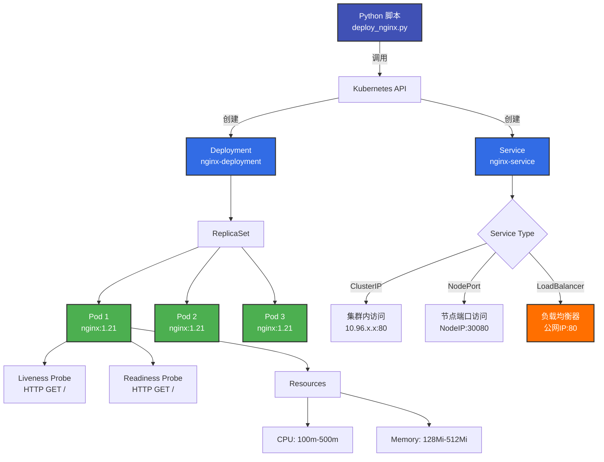

# 部署 Nginx 应用

!!! abstract "Cookbook 概述"
    在 TKE 集群中部署 Nginx Deployment 和 Service 的完整示例。支持自定义副本数、资源配置和 Service 类型。

---

## 📋 功能特性

<div class="grid cards" markdown>

- :material-docker:{ .lg .middle } **Deployment 管理**

    ---

    创建和管理 Nginx Deployment，支持自动滚动更新

- :material-network-outline:{ .lg .middle } **Service 暴露**

    ---

    支持 ClusterIP、NodePort 和 LoadBalancer 三种类型

- :material-heart-pulse:{ .lg .middle } **健康检查**

    ---

    内置 Liveness 和 Readiness 探针配置

- :material-memory:{ .lg .middle } **资源管理**

    ---

    自定义 CPU 和内存 requests/limits

</div>

---

## 🏗️ 架构图



**工作流程**:

1. **加载 Kubeconfig**: 从 `~/.kube/config` 加载集群凭证
2. **构造 Deployment**: 定义 Nginx Deployment 对象
3. **创建 Deployment**: 调用 Kubernetes API 创建
4. **创建 Service**: (可选) 创建 Service 暴露应用
5. **等待就绪**: 轮询 Pod 状态直到所有副本就绪

---

## 🚀 快速开始

### 前置条件

- **Python 3.8+**
- **kubectl** (已配置 kubeconfig)
- **TKE 集群** (已创建并可访问)

### 安装依赖

```bash
cd tke-workshop.github.io/cookbook

# 安装依赖
pip install -r requirements.txt
```

### 配置 Kubeconfig

```bash
# 获取 TKE 集群凭证
tccli tke DescribeClusterKubeconfig \
  --Region ap-guangzhou \
  --ClusterId cls-xxxxxxxx > ~/.kube/config

# 验证连接
kubectl cluster-info
kubectl get nodes
```

---

## 💻 使用方法

### 基础用法

```bash
# 部署基础 Nginx (3副本, ClusterIP)
python3 workload/deploy_nginx.py
```

### 高级用法

```bash
# 部署生产环境 Nginx (5副本 + LoadBalancer)
python3 workload/deploy_nginx.py \
  --namespace production \
  --replicas 5 \
  --image nginx:1.25 \
  --cpu-request 200m \
  --cpu-limit 1000m \
  --memory-request 256Mi \
  --memory-limit 1Gi \
  --expose \
  --service-type LoadBalancer
```

### 参数说明

| 参数 | 必填 | 默认值 | 说明 |
| --- | --- | --- | --- |
| `--namespace` | ❌ | `default` | 命名空间 |
| `--replicas` | ❌ | `3` | 副本数 |
| `--image` | ❌ | `nginx:1.21` | 容器镜像 |
| `--cpu-request` | ❌ | `100m` | CPU 请求 |
| `--memory-request` | ❌ | `128Mi` | 内存请求 |
| `--cpu-limit` | ❌ | `500m` | CPU 限制 |
| `--memory-limit` | ❌ | `512Mi` | 内存限制 |
| `--expose` | ❌ | `False` | 是否创建 Service |
| `--service-type` | ❌ | `ClusterIP` | Service 类型 |

---

## 📝 完整示例

### 示例 1: 开发环境

```bash
# 部署开发环境 Nginx
python3 workload/deploy_nginx.py \
  --namespace dev \
  --replicas 2 \
  --expose \
  --service-type ClusterIP
```

**预期输出**:

```
[2026-01-23 10:00:00] INFO: ✅ 已加载 kubeconfig
[2026-01-23 10:00:00] INFO: 正在创建 Deployment: nginx-deployment
[2026-01-23 10:00:00] INFO:   - 命名空间: dev
[2026-01-23 10:00:00] INFO:   - 副本数: 2
[2026-01-23 10:00:00] INFO:   - 镜像: nginx:1.21
[2026-01-23 10:00:00] INFO:   - 资源: CPU(100m/500m), Memory(128Mi/512Mi)
[2026-01-23 10:00:02] INFO: ✅ Deployment 创建成功
[2026-01-23 10:00:02] INFO:    名称: nginx-deployment
[2026-01-23 10:00:02] INFO:    副本数: 2
[2026-01-23 10:00:02] INFO: 正在创建 Service: nginx-service (type: ClusterIP)
[2026-01-23 10:00:03] INFO: ✅ Service 创建成功
[2026-01-23 10:00:03] INFO:    名称: nginx-service
[2026-01-23 10:00:03] INFO:    类型: ClusterIP
[2026-01-23 10:00:03] INFO:    ClusterIP: 10.96.123.45
[2026-01-23 10:00:03] INFO: 等待 Pod 就绪...
[2026-01-23 10:00:08] INFO:   Pod 就绪: 0/2
[2026-01-23 10:00:13] INFO:   Pod 就绪: 1/2
[2026-01-23 10:00:18] INFO:   Pod 就绪: 2/2
[2026-01-23 10:00:18] INFO: ✅ 所有 Pod 已就绪

==================================================
✅ Nginx 应用部署成功!
==================================================

验证步骤:
  1. 查看 Deployment: kubectl get deployment nginx-deployment -n dev
  2. 查看 Pod: kubectl get pods -l app=nginx -n dev
  3. 查看 Service: kubectl get svc nginx-service -n dev
  4. 测试访问: kubectl port-forward svc/nginx-service 8080:80 -n dev
```

### 示例 2: 生产环境 (LoadBalancer)

```bash
# 部署生产环境 Nginx (公网访问)
python3 workload/deploy_nginx.py \
  --namespace production \
  --replicas 5 \
  --image nginx:1.25 \
  --cpu-request 200m \
  --cpu-limit 1000m \
  --memory-request 256Mi \
  --memory-limit 1Gi \
  --expose \
  --service-type LoadBalancer
```

**验证访问**:

```bash
# 获取 LoadBalancer IP
kubectl get svc nginx-service -n production

# 输出示例:
# NAME            TYPE           CLUSTER-IP     EXTERNAL-IP      PORT(S)        AGE
# nginx-service   LoadBalancer   10.96.123.45   123.45.67.89     80:30080/TCP   1m

# 访问 Nginx
curl http://123.45.67.89
```

### 示例 3: 高性能配置

```bash
# 部署高性能 Nginx (更多资源)
python3 workload/deploy_nginx.py \
  --namespace prod \
  --replicas 10 \
  --image nginx:1.25-alpine \
  --cpu-request 500m \
  --cpu-limit 2000m \
  --memory-request 512Mi \
  --memory-limit 2Gi \
  --expose \
  --service-type LoadBalancer
```

### 示例 4: 使用 YAML 配置

```bash
# 使用预定义的 YAML 配置
kubectl apply -f workload/deploy_nginx.yaml
```

**deploy_nginx.yaml**:

```yaml
apiVersion: apps/v1
kind: Deployment
metadata:
  name: nginx-deployment
  labels:
    app: nginx
spec:
  replicas: 3
  selector:
    matchLabels:
      app: nginx
  template:
    metadata:
      labels:
        app: nginx
    spec:
      containers:
      - name: nginx
        image: nginx:1.21
        ports:
        - containerPort: 80
          name: http
        resources:
          requests:
            cpu: 100m
            memory: 128Mi
          limits:
            cpu: 500m
            memory: 512Mi
        livenessProbe:
          httpGet:
            path: /
            port: 80
          initialDelaySeconds: 30
          periodSeconds: 10
        readinessProbe:
          httpGet:
            path: /
            port: 80
          initialDelaySeconds: 5
          periodSeconds: 5
---
apiVersion: v1
kind: Service
metadata:
  name: nginx-service
  labels:
    app: nginx
spec:
  type: ClusterIP
  selector:
    app: nginx
  ports:
  - name: http
    protocol: TCP
    port: 80
    targetPort: 80
```

---

## 🎓 Service 类型说明

| 类型 | 访问方式 | 适用场景 | 费用 |
| --- | --- | --- | --- |
| **ClusterIP** | 集群内部访问 | 微服务内部通信 | 免费 |
| **NodePort** | `NodeIP:Port` | 开发测试、临时访问 | 免费 |
| **LoadBalancer** | 公网 IP | 生产环境、对外服务 | 按小时计费 |

!!! tip "推荐配置"
    - **开发环境**: 使用 ClusterIP + `kubectl port-forward`
    - **测试环境**: 使用 NodePort
    - **生产环境**: 使用 LoadBalancer

---

## 🔧 健康检查配置

### Liveness Probe (存活探针)

检测容器是否需要重启:

```python
liveness_probe=client.V1Probe(
    http_get=client.V1HTTPGetAction(
        path="/",
        port=80
    ),
    initial_delay_seconds=30,  # 初始延迟30秒
    period_seconds=10           # 每10秒检查一次
)
```

### Readiness Probe (就绪探针)

检测容器是否准备好接收流量:

```python
readiness_probe=client.V1Probe(
    http_get=client.V1HTTPGetAction(
        path="/",
        port=80
    ),
    initial_delay_seconds=5,   # 初始延迟5秒
    period_seconds=5            # 每5秒检查一次
)
```

---

## 📂 项目结构

```
cookbook/workload/
├── deploy_nginx.py             # 本脚本
├── deploy_nginx.yaml           # YAML 配置文件
└── update_deployment.py        # (开发中) 更新 Deployment

cookbook/common/
├── logger.py                   # 日志工具
└── __init__.py
```

---

## 🐛 故障排查

### 问题 1: Kubeconfig 未配置

**错误信息**:

```
ConfigException: Invalid kube-config file
```

**解决方案**:

```bash
# 获取 TKE 集群凭证
tccli tke DescribeClusterKubeconfig \
  --Region ap-guangzhou \
  --ClusterId cls-xxxxxxxx > ~/.kube/config

# 验证连接
kubectl cluster-info
```

### 问题 2: Deployment 已存在

**输出信息**:

```
[WARNING] ⚠️  Deployment 已存在,尝试更新...
[INFO] ✅ Deployment 更新成功
```

脚本会自动更新已存在的 Deployment。

### 问题 3: Pod 一直 Pending

**排查步骤**:

```bash
# 查看 Pod 状态
kubectl get pods -l app=nginx -n <namespace>

# 查看 Pod 事件
kubectl describe pod <pod-name> -n <namespace>

# 常见原因:
# - 节点资源不足
# - 镜像拉取失败
# - 存储卷挂载失败
```

### 问题 4: Service 无法访问

**排查步骤**:

```bash
# 1. 检查 Service
kubectl get svc nginx-service -n <namespace>

# 2. 检查 Endpoints
kubectl get endpoints nginx-service -n <namespace>

# 3. 检查 Pod 标签
kubectl get pods -l app=nginx -n <namespace> --show-labels

# 4. 测试 ClusterIP
kubectl run test-pod --image=busybox --rm -it -- \
  wget -O- http://nginx-service.<namespace>.svc.cluster.local
```

---

## 🧪 验证和测试

### 验证 Deployment

```bash
# 查看 Deployment
kubectl get deployment nginx-deployment -n <namespace>

# 查看副本状态
kubectl rollout status deployment nginx-deployment -n <namespace>

# 查看 Pod
kubectl get pods -l app=nginx -n <namespace> -o wide
```

### 测试访问

=== "ClusterIP"

    ```bash
    # 使用 port-forward
    kubectl port-forward svc/nginx-service 8080:80 -n <namespace>
    
    # 在另一个终端访问
    curl http://localhost:8080
    ```

=== "NodePort"

    ```bash
    # 获取 NodePort
    kubectl get svc nginx-service -n <namespace>
    
    # 访问 (NodeIP:NodePort)
    curl http://<node-ip>:<node-port>
    ```

=== "LoadBalancer"

    ```bash
    # 获取 External IP
    kubectl get svc nginx-service -n <namespace>
    
    # 等待 LoadBalancer 就绪
    kubectl get svc nginx-service -n <namespace> -w
    
    # 访问
    curl http://<external-ip>
    ```

### 压力测试

```bash
# 使用 ab (Apache Bench)
ab -n 1000 -c 10 http://<service-ip>/

# 使用 hey
hey -n 1000 -c 10 http://<service-ip>/

# 观察 Pod 资源使用
kubectl top pods -l app=nginx -n <namespace>
```

---

## 🔗 相关链接

- **源代码**: [cookbook/workload/deploy_nginx.py](https://github.com/tke-workshop/tke-workshop.github.io/blob/main/cookbook/workload/deploy_nginx.py)
- **YAML 配置**: [cookbook/workload/deploy_nginx.yaml](https://github.com/tke-workshop/tke-workshop.github.io/blob/main/cookbook/workload/deploy_nginx.yaml)
- **文档**: [创建 Deployment 基础教程](../basics/workload/01-create-deployment.md)
- **API 文档**: [Kubernetes Deployment API](https://kubernetes.io/docs/reference/kubernetes-api/workload-resources/deployment-v1/)
- **返回 Cookbook 列表**: [Cookbook 集合](index.md)

---

## 🤝 贡献

发现 Bug 或有改进建议? 欢迎提交 Issue 或 Pull Request!

[:material-github: 查看源代码](https://github.com/tke-workshop/tke-workshop.github.io/tree/main/cookbook/workload){ .md-button .md-button--primary }
[:material-bug: 报告问题](https://github.com/tke-workshop/tke-workshop.github.io/issues){ .md-button }

---

← [创建 TKE 集群](create-cluster.md) | **下一步**: [部署 GPU Pod](deploy-gpu-pod.md) →
