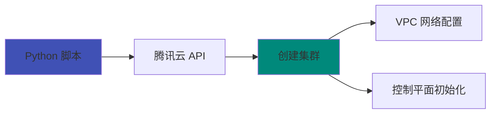
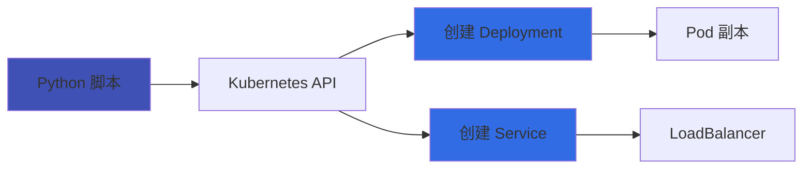
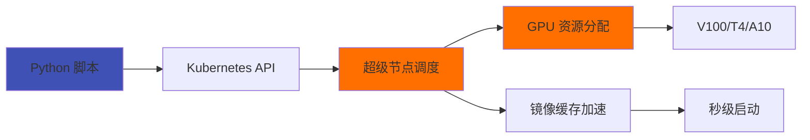

<div class="hero-section">
  <h1>🚀 TKE Cookbook 集合</h1>
  <p style="color: white; font-size: 1.2rem; margin-bottom: 1rem;">可立即执行的 TKE 操作脚本和场景示例</p>
  <div class="cookbook-count">3 Cookbooks</div>
</div>

!!! tip "什么是 Cookbook?"
    Cookbook 提供**可立即执行**的 TKE 操作脚本和场景示例，帮助你快速上手并在实际环境中验证功能。每个 Cookbook 都包含完整的代码、配置和文档。

---

## 🎯 设计理念

<div class="grid cards" markdown>

- :material-play-circle:{ .lg .middle } **一键运行**

    ---

    配置好 API 密钥即可执行，无需复杂配置

- :material-shield-check:{ .lg .middle } **完整错误处理**

    ---

    包含详细的异常捕获和日志输出

- :material-robot:{ .lg .middle } **Agent 友好**

    ---

    结构化输出，易于 AI Agent 理解和调用

- :material-rocket-launch:{ .lg .middle } **生产就绪**

    ---

    可直接应用于生产环境的最佳实践代码

</div>

---

## 🚀 快速开始

### 前置条件

- **Python 3.8+** 或 **Go 1.19+**
- **腾讯云 API 密钥** (SecretId 和 SecretKey)
- **kubectl** (用于 Kubernetes 操作)

### 安装依赖

```bash
# 克隆项目
git clone https://github.com/tke-workshop/tke-workshop.github.io.git
cd tke-workshop.github.io/cookbook

# 安装 Python 依赖
pip install -r requirements.txt

# 配置 API 密钥
cp config.example.yaml config.yaml
vim config.yaml
```

### 配置示例

```yaml
tencent_cloud:
  secret_id: "YOUR_SECRET_ID"
  secret_key: "YOUR_SECRET_KEY"
  region: "ap-guangzhou"

cluster:
  cluster_id: "cls-xxxxxxxx"
  vpc_id: "vpc-xxxxxxxx"
  subnet_id: "subnet-xxxxxxxx"
```

---

## 📚 Cookbook 集合

<div class="filter-buttons" markdown>
<button class="filter-btn active" onclick="filterCookbooks('all')">全部</button>
<button class="filter-btn" onclick="filterCookbooks('cluster')">集群管理</button>
<button class="filter-btn" onclick="filterCookbooks('workload')">工作负载</button>
<button class="filter-btn" onclick="filterCookbooks('supernode')">超级节点</button>
<button class="filter-btn" onclick="filterCookbooks('python')">Python</button>
</div>

---

### 集群管理

<div class="cookbook-grid" markdown>

<div class="cookbook-card" data-category="cluster python" markdown>

#### :material-kubernetes:{ .cookbook-icon } 创建 TKE 集群

使用腾讯云 SDK 创建托管型 TKE 集群的完整示例



**语言**: Python | **难度**: ⭐⭐

<div class="cookbook-actions" markdown>
[:material-file-document: 查看详情](create-cluster.md){ .md-button .md-button--primary }
[:material-github: 查看代码](https://github.com/tke-workshop/tke-workshop.github.io/tree/main/cookbook/cluster){ .md-button }
</div>

</div>

</div>

---

### 工作负载部署

<div class="cookbook-grid" markdown>

<div class="cookbook-card" data-category="workload python" markdown>

#### :material-docker:{ .cookbook-icon } 部署 Nginx 应用

在 TKE 集群中部署 Nginx Deployment 和 Service 的完整流程



**语言**: Python | **难度**: ⭐⭐

<div class="cookbook-actions" markdown>
[:material-file-document: 查看详情](deploy-nginx.md){ .md-button .md-button--primary }
[:material-github: 查看代码](https://github.com/tke-workshop/tke-workshop.github.io/tree/main/cookbook/workload){ .md-button }
</div>

</div>

</div>

---

### 超级节点与 GPU

<div class="cookbook-grid" markdown>

<div class="cookbook-card" data-category="supernode python" markdown>

#### :material-chip:{ .cookbook-icon } 部署 GPU Pod

在超级节点上部署 GPU Pod 的完整示例，支持多种 GPU 型号和镜像缓存



**语言**: Python | **难度**: ⭐⭐⭐

**支持 GPU**: V100, T4, A10, L20, L40, vGPU (1/4*T4, 1/2*T4)

<div class="cookbook-actions" markdown>
[:material-file-document: 查看详情](deploy-gpu-pod.md){ .md-button .md-button--primary }
[:material-github: 查看代码](https://github.com/tke-workshop/tke-workshop.github.io/tree/main/cookbook/supernode){ .md-button }
</div>

</div>

</div>

---

## 📊 按场景分类

| 场景 | Cookbook | 语言 | 难度 | 文档链接 |
| --- | --- | --- | --- | --- |
| **集群生命周期** | 创建 TKE 集群 | Python | ⭐⭐ | [查看](create-cluster.md) |
| **应用部署** | 部署 Nginx 应用 | Python | ⭐⭐ | [查看](deploy-nginx.md) |
| **AI/ML 工作负载** | 部署 GPU Pod | Python | ⭐⭐⭐ | [查看](deploy-gpu-pod.md) |

---

## 🎓 按技术栈分类

=== "Python"

    | Cookbook | 功能 | 难度 |
    | --- | --- | --- |
    | [创建 TKE 集群](create-cluster.md) | 使用 Python SDK 创建集群 | ⭐⭐ |
    | [部署 Nginx](deploy-nginx.md) | 使用 kubernetes-client 部署应用 | ⭐⭐ |
    | [部署 GPU Pod](deploy-gpu-pod.md) | 超级节点 GPU 工作负载 | ⭐⭐⭐ |

=== "Go"

    !!! info "敬请期待"
        Go 版本的 Cookbook 正在开发中...

=== "Shell"

    !!! info "敬请期待"
        Shell 版本的 Cookbook 正在开发中...

---

## 🔧 开发指南

### 添加新 Cookbook

1. **创建脚本目录**

    ```bash
    mkdir -p cookbook/your-feature
    cd cookbook/your-feature
    ```

2. **使用标准模板**

    ```python
    #!/usr/bin/env python3
    """
    脚本名称: 新功能脚本
    功能描述: 实现某个 TKE 功能
    使用方法: python3 new_feature.py --help
    """
    
    import argparse
    import sys
    from common.auth import get_tke_client
    from common.logger import setup_logger
    
    logger = setup_logger(__name__)
    
    def main():
        parser = argparse.ArgumentParser(description='新功能脚本')
        parser.add_argument('--param', required=True, help='参数说明')
        args = parser.parse_args()
        
        try:
            client = get_tke_client()
            # 实现功能逻辑
            logger.info("操作成功")
        except Exception as e:
            logger.error(f"操作失败: {e}")
            sys.exit(1)
    
    if __name__ == '__main__':
        main()
    ```

3. **创建文档页面**

    在 `docs/cookbook/` 目录下创建对应的 Markdown 文档

4. **更新导航**

    在 `mkdocs.yml` 中添加导航链接

### 代码规范

- **Python**: 遵循 PEP 8
- **所有脚本**: 必须包含完整的错误处理和日志
- **文档**: 使用 Markdown 格式，包含架构图和使用示例

---

## 🤝 贡献

欢迎贡献新的 Cookbook 示例！

**贡献要求**:

- ✅ 代码可运行且经过测试
- ✅ 包含完整的文档和注释
- ✅ 遵循项目代码规范
- ✅ 包含错误处理和日志

查看 [贡献指南](../CONTRIBUTING.md) 了解更多信息。

---

## 📖 相关文档

- [TKE 基础教程](../basics/index.md)
- [AI/ML 工作负载](../ai-ml/index.md)
- [最佳实践](../best-practices/index.md)
- [腾讯云 TKE API 文档](https://cloud.tencent.com/document/product/457)

---

<script>
// Cookbook 过滤功能（增强版）
let activeCategory = 'all';

function filterCookbooks(category) {
    activeCategory = category;
    const cards = document.querySelectorAll('.cookbook-card');
    
    cards.forEach((card, index) => {
        const categories = card.getAttribute('data-category');
        const shouldShow = category === 'all' || (categories && categories.includes(category));
        
        if (shouldShow) {
            // 添加淡入动画
            card.style.animation = `fadeInUp 0.6s ease-out ${index * 0.1}s both`;
            card.style.display = 'block';
        } else {
            // 添加淡出动画
            card.style.animation = 'fadeOut 0.3s ease-out';
            setTimeout(() => {
                if (activeCategory === category) {
                    card.style.display = 'none';
                }
            }, 300);
        }
    });
    
    // 更新按钮状态
    const buttons = document.querySelectorAll('.filter-buttons .filter-btn');
    buttons.forEach(btn => {
        btn.classList.remove('active');
    });
    event.target.classList.add('active');
    
    // 更新计数
    updateCount(category);
}

function updateCount(category) {
    const cards = document.querySelectorAll('.cookbook-card');
    let count = 0;
    cards.forEach(card => {
        const categories = card.getAttribute('data-category');
        if (category === 'all' || (categories && categories.includes(category))) {
            count++;
        }
    });
    
    const countElement = document.querySelector('.cookbook-count');
    if (countElement) {
        countElement.textContent = `${count} ${count === 1 ? 'Cookbook' : 'Cookbooks'}`;
    }
}

// 页面加载动画
document.addEventListener('DOMContentLoaded', function() {
    // 初始化计数
    updateCount('all');
    
    // 添加卡片进入动画
    const cards = document.querySelectorAll('.cookbook-card');
    cards.forEach((card, index) => {
        card.style.animation = `fadeInUp 0.6s ease-out ${index * 0.15}s both`;
    });
    
    // 添加滚动视差效果
    window.addEventListener('scroll', function() {
        const scrolled = window.pageYOffset;
        const parallax = document.querySelector('.hero-section');
        if (parallax) {
            parallax.style.transform = `translateY(${scrolled * 0.5}px)`;
        }
    });
});
</script>

<style>
/* ============================================
   全局动画定义
   ============================================ */
@keyframes fadeInUp {
    from {
        opacity: 0;
        transform: translateY(30px);
    }
    to {
        opacity: 1;
        transform: translateY(0);
    }
}

@keyframes fadeOut {
    from {
        opacity: 1;
        transform: scale(1);
    }
    to {
        opacity: 0;
        transform: scale(0.95);
    }
}

@keyframes shimmer {
    0% {
        background-position: -1000px 0;
    }
    100% {
        background-position: 1000px 0;
    }
}

@keyframes float {
    0%, 100% {
        transform: translateY(0px);
    }
    50% {
        transform: translateY(-10px);
    }
}

@keyframes pulse {
    0%, 100% {
        transform: scale(1);
    }
    50% {
        transform: scale(1.05);
    }
}

@keyframes glow {
    0%, 100% {
        box-shadow: 0 0 20px rgba(79, 192, 141, 0.3);
    }
    50% {
        box-shadow: 0 0 30px rgba(79, 192, 141, 0.6);
    }
}

/* ============================================
   Hero Section - 顶部区域
   ============================================ */
.hero-section {
    background: linear-gradient(135deg, #667eea 0%, #764ba2 100%);
    padding: 3rem 2rem;
    border-radius: 1rem;
    margin-bottom: 3rem;
    text-align: center;
    position: relative;
    overflow: hidden;
    box-shadow: 0 20px 60px rgba(102, 126, 234, 0.3);
}

.hero-section::before {
    content: '';
    position: absolute;
    top: -50%;
    left: -50%;
    width: 200%;
    height: 200%;
    background: linear-gradient(
        45deg,
        transparent 30%,
        rgba(255, 255, 255, 0.1) 50%,
        transparent 70%
    );
    animation: shimmer 3s infinite;
}

.hero-section h1 {
    color: white;
    font-size: 2.5rem;
    font-weight: 800;
    margin-bottom: 1rem;
    text-shadow: 0 2px 10px rgba(0, 0, 0, 0.2);
    position: relative;
    z-index: 1;
}

.hero-section .cookbook-count {
    display: inline-block;
    background: rgba(255, 255, 255, 0.2);
    backdrop-filter: blur(10px);
    padding: 0.5rem 1.5rem;
    border-radius: 2rem;
    color: white;
    font-weight: 600;
    font-size: 1.1rem;
    margin-top: 1rem;
    border: 1px solid rgba(255, 255, 255, 0.3);
    position: relative;
    z-index: 1;
}

/* ============================================
   过滤按钮组 - 现代化玻璃态设计
   ============================================ */
.filter-buttons {
    display: flex;
    gap: 1rem;
    margin: 2rem 0;
    flex-wrap: wrap;
    justify-content: center;
    perspective: 1000px;
}

.filter-btn {
    position: relative;
    padding: 0.8rem 2rem;
    font-size: 1rem;
    font-weight: 600;
    border: none;
    border-radius: 2rem;
    cursor: pointer;
    transition: all 0.4s cubic-bezier(0.175, 0.885, 0.32, 1.275);
    background: linear-gradient(135deg, #f5f7fa 0%, #c3cfe2 100%);
    color: #333;
    box-shadow: 0 4px 15px rgba(0, 0, 0, 0.1);
    overflow: hidden;
    transform-style: preserve-3d;
}

.filter-btn::before {
    content: '';
    position: absolute;
    top: 0;
    left: 0;
    width: 100%;
    height: 100%;
    background: linear-gradient(135deg, #667eea 0%, #764ba2 100%);
    opacity: 0;
    transition: opacity 0.4s ease;
    z-index: -1;
}

.filter-btn:hover {
    transform: translateY(-3px) scale(1.05);
    box-shadow: 0 8px 25px rgba(102, 126, 234, 0.4);
}

.filter-btn:hover::before {
    opacity: 1;
}

.filter-btn:hover {
    color: white;
}

.filter-btn.active {
    background: linear-gradient(135deg, #667eea 0%, #764ba2 100%);
    color: white;
    transform: translateY(-2px);
    box-shadow: 0 8px 25px rgba(102, 126, 234, 0.5);
    animation: pulse 2s infinite;
}

.filter-btn.active::before {
    opacity: 1;
}

/* ============================================
   Cookbook 卡片网格 - 响应式布局
   ============================================ */
.cookbook-grid {
    display: grid;
    grid-template-columns: repeat(auto-fill, minmax(380px, 1fr));
    gap: 2rem;
    margin: 2rem 0;
    perspective: 1000px;
}

@media (max-width: 768px) {
    .cookbook-grid {
        grid-template-columns: 1fr;
        gap: 1.5rem;
    }
}

/* ============================================
   Cookbook 卡片 - 玻璃态 + 渐变边框
   ============================================ */
.cookbook-card {
    position: relative;
    background: rgba(255, 255, 255, 0.9);
    backdrop-filter: blur(20px);
    border-radius: 1.5rem;
    padding: 2rem;
    transition: all 0.5s cubic-bezier(0.175, 0.885, 0.32, 1.275);
    overflow: hidden;
    box-shadow: 0 10px 30px rgba(0, 0, 0, 0.1);
    border: 1px solid rgba(255, 255, 255, 0.5);
}

.cookbook-card::before {
    content: '';
    position: absolute;
    top: -2px;
    left: -2px;
    right: -2px;
    bottom: -2px;
    background: linear-gradient(45deg, #667eea, #764ba2, #f093fb, #4facfe);
    border-radius: 1.5rem;
    z-index: -1;
    opacity: 0;
    transition: opacity 0.5s ease;
    background-size: 400% 400%;
    animation: gradient-shift 3s ease infinite;
}

@keyframes gradient-shift {
    0% { background-position: 0% 50%; }
    50% { background-position: 100% 50%; }
    100% { background-position: 0% 50%; }
}

.cookbook-card:hover::before {
    opacity: 1;
}

.cookbook-card:hover {
    transform: translateY(-10px) rotateX(5deg);
    box-shadow: 0 20px 60px rgba(102, 126, 234, 0.3);
}

/* 卡片内部光晕效果 */
.cookbook-card::after {
    content: '';
    position: absolute;
    top: -50%;
    left: -50%;
    width: 200%;
    height: 200%;
    background: radial-gradient(
        circle,
        rgba(255, 255, 255, 0.3) 0%,
        transparent 70%
    );
    opacity: 0;
    transition: opacity 0.5s ease;
    pointer-events: none;
}

.cookbook-card:hover::after {
    opacity: 1;
}

/* ============================================
   卡片标题区域
   ============================================ */
.cookbook-card h4 {
    font-size: 1.5rem;
    font-weight: 700;
    margin-bottom: 1rem;
    background: linear-gradient(135deg, #667eea 0%, #764ba2 100%);
    -webkit-background-clip: text;
    -webkit-text-fill-color: transparent;
    background-clip: text;
    position: relative;
    z-index: 1;
}

.cookbook-icon {
    font-size: 2.5rem;
    vertical-align: middle;
    display: inline-block;
    transition: all 0.4s ease;
    filter: drop-shadow(0 4px 8px rgba(0, 0, 0, 0.1));
}

.cookbook-card:hover .cookbook-icon {
    transform: scale(1.2) rotate(5deg);
    animation: float 2s ease-in-out infinite;
}

/* ============================================
   Mermaid 图表容器
   ============================================ */
.cookbook-card .mermaid {
    background: linear-gradient(135deg, #f5f7fa 0%, #c3cfe2 100%);
    border-radius: 1rem;
    padding: 1.5rem;
    margin: 1.5rem 0;
    box-shadow: inset 0 2px 10px rgba(0, 0, 0, 0.05);
    transition: all 0.3s ease;
}

.cookbook-card:hover .mermaid {
    transform: scale(1.02);
    box-shadow: inset 0 2px 15px rgba(102, 126, 234, 0.1);
}

/* ============================================
   标签徽章
   ============================================ */
.cookbook-card p strong {
    display: inline-block;
    background: linear-gradient(135deg, #667eea 0%, #764ba2 100%);
    color: white;
    padding: 0.3rem 1rem;
    border-radius: 1rem;
    font-size: 0.9rem;
    font-weight: 600;
    margin-right: 0.5rem;
    box-shadow: 0 4px 15px rgba(102, 126, 234, 0.3);
    transition: all 0.3s ease;
}

.cookbook-card:hover p strong {
    transform: scale(1.05);
    box-shadow: 0 6px 20px rgba(102, 126, 234, 0.4);
}

/* ============================================
   动作按钮组
   ============================================ */
.cookbook-actions {
    margin-top: 1.5rem;
    display: flex;
    gap: 1rem;
    position: relative;
    z-index: 1;
}

.cookbook-actions .md-button {
    flex: 1;
    text-align: center;
    border-radius: 1rem;
    padding: 0.8rem 1.5rem;
    font-weight: 600;
    transition: all 0.4s cubic-bezier(0.175, 0.885, 0.32, 1.275);
    border: none;
    box-shadow: 0 4px 15px rgba(0, 0, 0, 0.1);
}

.cookbook-actions .md-button--primary {
    background: linear-gradient(135deg, #667eea 0%, #764ba2 100%);
    color: white;
}

.cookbook-actions .md-button--primary:hover {
    transform: translateY(-3px);
    box-shadow: 0 8px 25px rgba(102, 126, 234, 0.5);
    background: linear-gradient(135deg, #764ba2 0%, #667eea 100%);
}

.cookbook-actions .md-button:not(.md-button--primary) {
    background: white;
    color: #667eea;
    border: 2px solid #667eea;
}

.cookbook-actions .md-button:not(.md-button--primary):hover {
    background: #667eea;
    color: white;
    transform: translateY(-3px);
    box-shadow: 0 8px 25px rgba(102, 126, 234, 0.3);
}

/* ============================================
   响应式设计 - 移动端优化
   ============================================ */
@media (max-width: 768px) {
    .hero-section h1 {
        font-size: 2rem;
    }
    
    .filter-buttons {
        gap: 0.5rem;
    }
    
    .filter-btn {
        padding: 0.6rem 1.2rem;
        font-size: 0.9rem;
    }
    
    .cookbook-card {
        padding: 1.5rem;
    }
    
    .cookbook-card h4 {
        font-size: 1.3rem;
    }
    
    .cookbook-icon {
        font-size: 2rem;
    }
    
    .cookbook-actions {
        flex-direction: column;
        gap: 0.8rem;
    }
}

/* ============================================
   暗色模式适配
   ============================================ */
[data-md-color-scheme="slate"] .cookbook-card {
    background: rgba(30, 30, 46, 0.9);
    border: 1px solid rgba(255, 255, 255, 0.1);
}

[data-md-color-scheme="slate"] .filter-btn {
    background: linear-gradient(135deg, #2d3748 0%, #1a202c 100%);
    color: white;
}

[data-md-color-scheme="slate"] .filter-btn:hover {
    background: linear-gradient(135deg, #667eea 0%, #764ba2 100%);
}

[data-md-color-scheme="slate"] .cookbook-card .mermaid {
    background: linear-gradient(135deg, #2d3748 0%, #1a202c 100%);
}

/* ============================================
   加载状态 - Skeleton 效果
   ============================================ */
.cookbook-card.loading {
    background: linear-gradient(
        90deg,
        rgba(255, 255, 255, 0.1) 25%,
        rgba(255, 255, 255, 0.2) 50%,
        rgba(255, 255, 255, 0.1) 75%
    );
    background-size: 200% 100%;
    animation: shimmer 2s infinite;
}

/* ============================================
   滚动条美化
   ============================================ */
::-webkit-scrollbar {
    width: 10px;
    height: 10px;
}

::-webkit-scrollbar-track {
    background: #f1f1f1;
    border-radius: 10px;
}

::-webkit-scrollbar-thumb {
    background: linear-gradient(135deg, #667eea 0%, #764ba2 100%);
    border-radius: 10px;
}

::-webkit-scrollbar-thumb:hover {
    background: linear-gradient(135deg, #764ba2 0%, #667eea 100%);
}
</style>
