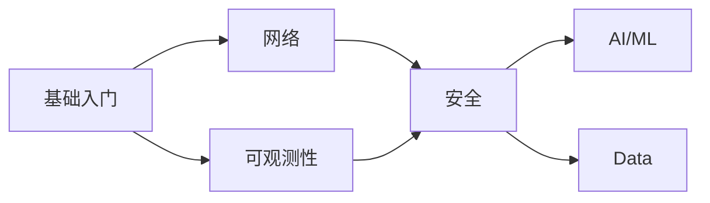

# 欢迎来到 TKE Workshop

-   :material-clock-fast:{ .lg .middle } __快速入门__

    ---

    从零开始，2 小时掌握 TKE 核心操作

    [:octicons-arrow-right-24: 开始学习](basics/index.md)

-   :material-network:{ .lg .middle } __网络__

    ---

    Service、Ingress、网络策略最佳实践

    [:octicons-arrow-right-24: 深入了解](networking/index.md)

-   :material-chart-line:{ .lg .middle } __可观测性__

    ---

    监控、日志、链路追踪一站式方案

    [:octicons-arrow-right-24: 探索更多](observability/index.md)

-   :material-robot:{ .lg .middle } __AI/ML__

    ---

    GPU 调度、模型推理、训练任务

    [:octicons-arrow-right-24: 立即体验](ai-ml/index.md)

## 关于本 Workshop

TKE Workshop 是腾讯云容器服务 TKE 的官方最佳实践指南，通过动手实践帮助您快速掌握 TKE 的核心能力。

### 学习路径

### 如何贡献

我们欢迎社区贡献！点击页面右上角的 :material-pencil: 按钮即可编辑此页面。

详细贡献指南请参考 [CONTRIBUTING.md](https://github.com/TencentCloud/tke-workshop/blob/main/CONTRIBUTING.md)

## 联系我们

- :fontawesome-brands-github: [GitHub Issues](https://github.com/TencentCloud/tke-workshop/issues)
- :material-file-document: [TKE 产品文档](https://cloud.tencent.com/document/product/457)
