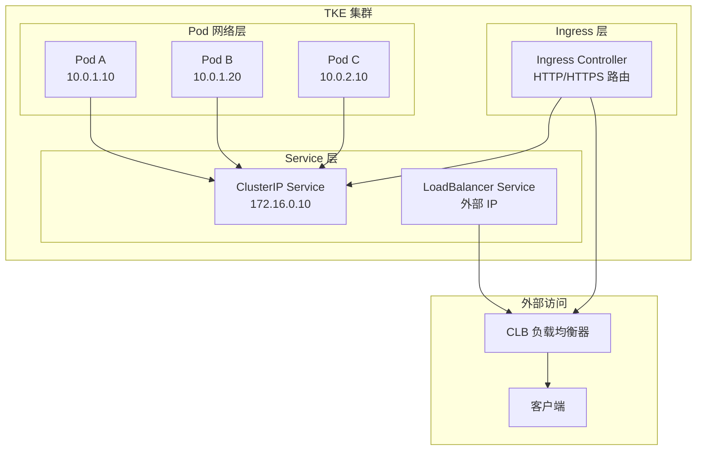

# 网络概述

TKE 网络模块提供了完整的容器网络解决方案，涵盖服务发现、负载均衡、网络隔离、流量管理等核心能力。

---

## 🎯 学习目标

完成本模块后，你将能够：

- ✅ 理解 Kubernetes 网络模型和 TKE 网络架构
- ✅ 配置不同类型的 Service (ClusterIP、NodePort、LoadBalancer)
- ✅ 部署和管理 Ingress Controller
- ✅ 实现网络策略进行流量隔离
- ✅ 使用 VPC-CNI 实现高性能网络
- ✅ 排查常见网络故障

---

## 📚 模块结构

### 1. Service 管理
Service 是 Kubernetes 中实现服务发现和负载均衡的核心抽象。

| 文档 | 描述 | Agent 友好度 |
|------|------|-------------|
| [ClusterIP Service](service/01-clusterip-service.md) | 集群内部服务访问 | ⭐⭐⭐⭐⭐ |
| [NodePort Service](service/02-nodeport-service.md) | 通过节点端口暴露服务 | ⭐⭐⭐⭐⭐ |
| [LoadBalancer Service](service/03-loadbalancer-service.md) | 使用 CLB 负载均衡器 | ⭐⭐⭐⭐⭐ |
| [Headless Service](service/04-headless-service.md) | 无头服务与 StatefulSet | ⭐⭐⭐⭐ |

### 2. Ingress 管理
Ingress 提供 HTTP/HTTPS 路由和 SSL 终止能力。

| 文档 | 描述 | Agent 友好度 |
|------|------|-------------|
| [Nginx Ingress Controller](ingress/01-nginx-ingress.md) | 部署 Nginx Ingress | ⭐⭐⭐⭐⭐ |
| [TKE Ingress](ingress/02-tke-ingress.md) | 使用 TKE 托管 Ingress | ⭐⭐⭐⭐⭐ |
| [HTTPS Ingress](ingress/03-https-ingress.md) | 配置 SSL/TLS 证书 | ⭐⭐⭐⭐ |
| [Ingress 路由规则](ingress/04-ingress-rules.md) | 高级路由配置 | ⭐⭐⭐⭐ |

### 3. Network Policy
Network Policy 实现 Pod 级别的网络隔离和访问控制。

| 文档 | 描述 | Agent 友好度 |
|------|------|-------------|
| [默认拒绝策略](network-policy/01-default-deny.md) | 零信任网络架构 | ⭐⭐⭐⭐⭐ |
| [命名空间隔离](network-policy/02-namespace-isolation.md) | 多租户网络隔离 | ⭐⭐⭐⭐ |
| [Pod 选择器](network-policy/03-pod-selector.md) | 精细化流量控制 | ⭐⭐⭐⭐ |

### 4. VPC-CNI
VPC-CNI 是 TKE 提供的高性能容器网络插件，支持固定 IP、ENI 直通等特性。

| 文档 | 描述 | Agent 友好度 |
|------|------|-------------|
| [启用 VPC-CNI](vpc-cni/01-enable-vpc-cni.md) | 集群启用 VPC-CNI 模式 | ⭐⭐⭐⭐⭐ |
| [固定 IP](vpc-cni/02-static-ip.md) | Pod 使用固定 IP 地址 | ⭐⭐⭐⭐ |
| [ENI 分配策略](vpc-cni/03-eni-allocation.md) | 弹性网卡管理 | ⭐⭐⭐ |

### 5. 故障排查
网络问题是 Kubernetes 最常见的故障类型之一。

| 文档 | 描述 | Agent 友好度 |
|------|------|-------------|
| [DNS 故障排查](troubleshooting/01-dns-issues.md) | CoreDNS 问题诊断 | ⭐⭐⭐⭐⭐ |
| [连通性问题](troubleshooting/02-connectivity-issues.md) | Pod/Service 不可达 | ⭐⭐⭐⭐ |
| [性能调优](troubleshooting/03-performance-tuning.md) | 网络性能优化 | ⭐⭐⭐ |

---

## 🏗️ TKE 网络架构

### 网络模型



### 网络组件

| 组件 | 作用 | TKE 托管 |
|------|------|---------|
| **CNI 插件** | 容器网络接口实现 | ✅ |
| **kube-proxy** | Service 负载均衡 | ✅ |
| **CoreDNS** | 集群 DNS 服务 | ✅ |
| **CLB** | 腾讯云负载均衡器 | ✅ |
| **Ingress Controller** | HTTP 路由控制器 | 可选 |

---

## 🚀 快速开始

### 1. 创建第一个 Service

```yaml
apiVersion: v1
kind: Service
metadata:
  name: nginx-service
spec:
  selector:
    app: nginx
  ports:
    - protocol: TCP
      port: 80
      targetPort: 80
  type: ClusterIP
```

```bash
kubectl apply -f service.yaml
kubectl get svc nginx-service
```

### 2. 创建 LoadBalancer Service

```yaml
apiVersion: v1
kind: Service
metadata:
  name: nginx-lb
spec:
  selector:
    app: nginx
  ports:
    - protocol: TCP
      port: 80
      targetPort: 80
  type: LoadBalancer
```

TKE 会自动创建腾讯云 CLB 实例。

### 3. 创建 Ingress 规则

```yaml
apiVersion: networking.k8s.io/v1
kind: Ingress
metadata:
  name: nginx-ingress
spec:
  rules:
  - host: example.com
    http:
      paths:
      - path: /
        pathType: Prefix
        backend:
          service:
            name: nginx-service
            port:
              number: 80
```

---

## 🎓 学习路径

### 初学者路径 (4-6 小时)
```
1. ClusterIP Service (30 min)
   ↓
2. NodePort Service (30 min)
   ↓
3. LoadBalancer Service (1 hour)
   ↓
4. Nginx Ingress (1 hour)
   ↓
5. 基础故障排查 (1 hour)
```

### 进阶路径 (8-10 小时)
```
初学者路径
   ↓
HTTPS Ingress (1 hour)
   ↓
Network Policy (2 hours)
   ↓
VPC-CNI (2 hours)
   ↓
高级故障排查 (2 hours)
```

### 专家路径 (15+ 小时)
```
进阶路径
   ↓
Service Mesh (4 hours)
   ↓
网络性能优化 (3 hours)
   ↓
企业级网络架构 (4 hours)
```

---

## 📖 相关资源

### 官方文档
- [Kubernetes 网络模型](https://kubernetes.io/docs/concepts/services-networking/)
- [TKE 网络概述](https://cloud.tencent.com/document/product/457/50355)
- [VPC-CNI 介绍](https://cloud.tencent.com/document/product/457/50355)

### 最佳实践
- [网络安全最佳实践](../best-practices/security/network-security.md)
- [可用性最佳实践](../best-practices/availability/index.md)

### Cookbook
- [Service LoadBalancer Cookbook](../cookbook-patterns.html?category=networking)
- [Ingress HTTPS Cookbook](../cookbook-patterns.html?category=networking)

---

## 🎯 实战场景

### 场景 1: 微服务架构
```
API Gateway (Ingress)
    ↓
多个微服务 (ClusterIP Service)
    ↓
后端数据库 (Headless Service)
```

### 场景 2: 蓝绿部署
```
Ingress (流量分配)
    ↓
Service (蓝色版本 90%)
    ↓
Service (绿色版本 10%)
```

### 场景 3: 多租户隔离
```
租户 A (Namespace A)
    ↓ Network Policy
租户 B (Namespace B)
```

---

## 🤖 Agent Prompt 模板

### 创建 LoadBalancer Service
```prompt
请帮我在 TKE 集群中创建一个 LoadBalancer 类型的 Service，要求：
- Service 名称: my-app-lb
- 选择器: app=my-app
- 端口: 80 → 8080
- 协议: TCP
- CLB 子网: subnet-abc123
```

### 配置 Ingress 规则
```prompt
请配置 Ingress 路由规则，要求：
- 域名: api.example.com
- 路径 /v1 → service-v1
- 路径 /v2 → service-v2
- 启用 HTTPS (使用 cert-manager)
```

### 排查网络问题
```prompt
我的 Pod 无法访问 Service，请帮我排查：
1. 检查 Service Endpoint 是否正常
2. 检查 DNS 解析是否正确
3. 检查 Network Policy 是否阻止了流量
4. 提供详细的排查步骤
```

---

## 📝 练习题

### 基础练习
1. 创建一个 ClusterIP Service 暴露 Nginx Pod
2. 修改 Service 类型从 ClusterIP 到 LoadBalancer
3. 配置 NodePort Service 并通过节点 IP 访问

### 进阶练习
1. 部署 Nginx Ingress Controller
2. 配置基于主机名的 Ingress 路由
3. 配置基于路径的 Ingress 路由
4. 为 Ingress 配置 TLS 证书

### 高级练习
1. 实现命名空间级别的网络隔离
2. 配置 Pod 到 Pod 的细粒度 Network Policy
3. 使用 VPC-CNI 为 StatefulSet 分配固定 IP
4. 优化 Service 网络性能

---

## 🔍 常见问题

### Q1: ClusterIP 和 NodePort 的区别？
**A**: 
- **ClusterIP**: 仅集群内部可访问，IP 为虚拟 IP
- **NodePort**: 在每个节点上开放端口，可从集群外访问

### Q2: LoadBalancer 会自动创建 CLB 吗？
**A**: 是的，TKE 会自动创建和管理腾讯云 CLB 实例，无需手动配置。

### Q3: Ingress 和 Service 的关系？
**A**: Ingress 是 HTTP 路由层，后端需要 Service 作为目标。流量路径: Client → CLB → Ingress Controller → Service → Pod

### Q4: 如何选择 VPC-CNI 还是 Global Router？
**A**: 
- **VPC-CNI**: 需要固定 IP、ENI 直通、高性能场景
- **Global Router**: 通用场景，更简单

---

## 📊 性能对比

| 网络方案 | 延迟 | 吞吐量 | 适用场景 |
|----------|------|--------|---------|
| **Global Router** | ~0.2ms | 1-5 Gbps | 通用应用 |
| **VPC-CNI (非 ENI)** | ~0.15ms | 3-8 Gbps | 性能敏感应用 |
| **VPC-CNI (ENI 直通)** | ~0.05ms | 10+ Gbps | 极致性能要求 |

---

## 🎉 下一步

完成本模块后，建议继续学习：

1. [可观测性模块](../observability/index.md) - 监控网络流量和性能
2. [安全模块](../best-practices/security/network-security.md) - 加固网络安全
3. [Service Mesh](../advanced/service-mesh/index.md) - 微服务流量管理

---

**文档维护者**: TKE Workshop Team  
**最后更新**: 2025-01-23  
**Agent 友好度**: ⭐⭐⭐⭐⭐
