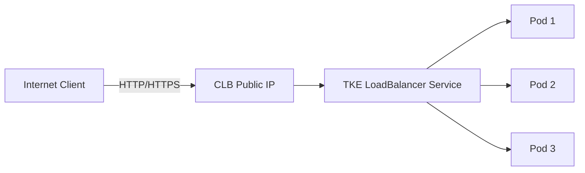

# 创建 LoadBalancer Service

使用 LoadBalancer 类型的 Service 可以通过腾讯云 CLB (Cloud Load Balancer) 将应用暴露到互联网，自动配置负载均衡器并分配外部 IP 地址。

---

## 📋 文档元信息

| 属性 | 值 |
|------|-----|
| **API 版本** | v1 |
| **资源类型** | Service |
| **Agent 友好度** | ⭐⭐⭐⭐⭐ |
| **预计完成时间** | 30 分钟 |
| **难度等级** | 初级 |

---

## 🎯 功能概述

LoadBalancer Service 是最常用的服务暴露方式，适用于需要从互联网访问的应用。TKE 会自动：

1. 创建腾讯云 CLB 实例
2. 配置监听器和后端服务器
3. 分配公网 IP 地址
4. 管理健康检查
5. 处理 Service 生命周期

### 架构流程



---

## ✅ 前置条件

- [x] 已创建 TKE 集群
- [x] 已安装并配置 `kubectl`
- [x] 集群中运行有 Pod (或 Deployment)
- [x] 腾讯云账号有 CLB 创建权限
- [x] VPC 网络配置正确

### 验证前置条件

```bash
# 1. 检查集群连接
kubectl cluster-info

# 2. 检查节点状态
kubectl get nodes

# 3. 检查已有的 Pod
kubectl get pods -A

# 4. 检查 Service 列表
kubectl get svc -A
```

---

## 📊 API 参数表

### Service 核心参数

| 参数 | 必填 | 类型 | 说明 | 示例 |
|------|------|------|------|------|
| `metadata.name` | ✅ | string | Service 名称 | `nginx-lb` |
| `metadata.namespace` | ❌ | string | 命名空间，默认 `default` | `production` |
| `metadata.annotations` | ❌ | map | TKE CLB 配置注解 | 见下表 |
| `spec.type` | ✅ | string | Service 类型，必须为 `LoadBalancer` | `LoadBalancer` |
| `spec.selector` | ✅ | map | Pod 选择器 | `app: nginx` |
| `spec.ports` | ✅ | array | 端口映射列表 | 见下表 |
| `spec.loadBalancerIP` | ❌ | string | 指定 CLB IP (已有 CLB) | `1.2.3.4` |
| `spec.externalTrafficPolicy` | ❌ | string | 流量策略: `Cluster`/`Local` | `Local` |

### Ports 参数

| 参数 | 必填 | 类型 | 说明 | 示例 |
|------|------|------|------|------|
| `name` | ❌ | string | 端口名称 | `http` |
| `protocol` | ✅ | string | 协议: `TCP`/`UDP` | `TCP` |
| `port` | ✅ | int | Service 端口 | `80` |
| `targetPort` | ✅ | int/string | Pod 端口 | `8080` 或 `http` |

### TKE 专用注解 (Annotations)

| 注解 | 说明 | 示例 |
|------|------|------|
| `service.kubernetes.io/qcloud-loadbalancer-internal-subnetid` | 内网 CLB 子网 ID | `subnet-abc123` |
| `service.kubernetes.io/tke-existed-lbid` | 使用已有 CLB | `lb-abc123` |
| `service.kubernetes.io/loadbalance-id` | 绑定指定 CLB | `lb-abc123` |
| `service.kubernetes.io/qcloud-loadbalancer-internet-charge-type` | 计费方式 | `TRAFFIC_POSTPAID_BY_HOUR` |
| `service.kubernetes.io/qcloud-loadbalancer-internet-max-bandwidth-out` | 最大带宽 (Mbps) | `10` |

---

## 🛠️ 操作步骤

### 方法 1: 使用 kubectl (推荐)

#### 步骤 1: 创建 Deployment

首先创建一个 Deployment 作为后端应用：

```yaml title="nginx-deployment.yaml"
apiVersion: apps/v1
kind: Deployment
metadata:
  name: nginx-deployment
  labels:
    app: nginx
spec:
  replicas: 3
  selector:
    matchLabels:
      app: nginx
  template:
    metadata:
      labels:
        app: nginx
    spec:
      containers:
      - name: nginx
        image: nginx:1.25
        ports:
        - containerPort: 80
          name: http
```

```bash
kubectl apply -f nginx-deployment.yaml
```

#### 步骤 2: 创建 LoadBalancer Service

```yaml title="nginx-service-lb.yaml"
apiVersion: v1
kind: Service
metadata:
  name: nginx-lb
  labels:
    app: nginx
spec:
  type: LoadBalancer
  selector:
    app: nginx
  ports:
  - name: http
    protocol: TCP
    port: 80
    targetPort: 80
```

```bash
kubectl apply -f nginx-service-lb.yaml
```

#### 步骤 3: 查看 Service 状态

```bash
# 查看 Service
kubectl get svc nginx-lb

# 输出示例:
# NAME       TYPE           CLUSTER-IP      EXTERNAL-IP      PORT(S)        AGE
# nginx-lb   LoadBalancer   172.16.0.10     xxx.xxx.xxx.xxx  80:30001/TCP   2m

# 详细信息
kubectl describe svc nginx-lb
```

#### 步骤 4: 等待 CLB 创建完成

```bash
# 持续监控直到 EXTERNAL-IP 显示
kubectl get svc nginx-lb -w

# 获取 External IP
EXTERNAL_IP=$(kubectl get svc nginx-lb -o jsonpath='{.status.loadBalancer.ingress[0].ip}')
echo "Service URL: http://$EXTERNAL_IP"
```

### 方法 2: 使用 TKE Python SDK

```python title="create_lb_service.py"
#!/usr/bin/env python3
"""
创建 LoadBalancer Service
"""
from kubernetes import client, config
import time

def create_loadbalancer_service(
    name: str,
    namespace: str = "default",
    selector: dict = None,
    port: int = 80,
    target_port: int = 80
):
    """
    创建 LoadBalancer 类型的 Service
    
    Args:
        name: Service 名称
        namespace: 命名空间
        selector: Pod 选择器
        port: Service 端口
        target_port: Pod 端口
    """
    # 加载 kubeconfig
    config.load_kube_config()
    
    # 创建 API 客户端
    v1 = client.CoreV1Api()
    
    # 构建 Service 对象
    service = client.V1Service(
        api_version="v1",
        kind="Service",
        metadata=client.V1ObjectMeta(
            name=name,
            labels={"app": name}
        ),
        spec=client.V1ServiceSpec(
            type="LoadBalancer",
            selector=selector or {"app": name},
            ports=[
                client.V1ServicePort(
                    name="http",
                    protocol="TCP",
                    port=port,
                    target_port=target_port
                )
            ]
        )
    )
    
    # 创建 Service
    try:
        api_response = v1.create_namespaced_service(
            namespace=namespace,
            body=service
        )
        print(f"✅ Service '{name}' created successfully")
        print(f"   Cluster IP: {api_response.spec.cluster_ip}")
        
        # 等待 External IP 分配
        print("⏳ Waiting for External IP allocation...")
        for i in range(60):
            svc = v1.read_namespaced_service(name, namespace)
            if svc.status.load_balancer.ingress:
                external_ip = svc.status.load_balancer.ingress[0].ip
                print(f"✅ External IP assigned: {external_ip}")
                print(f"🌐 Service URL: http://{external_ip}:{port}")
                return external_ip
            time.sleep(5)
        
        print("⚠️  Timeout waiting for External IP")
        return None
        
    except client.exceptions.ApiException as e:
        print(f"❌ Failed to create Service: {e}")
        return None

if __name__ == "__main__":
    import argparse
    
    parser = argparse.ArgumentParser(description="Create LoadBalancer Service")
    parser.add_argument("--name", required=True, help="Service name")
    parser.add_argument("--namespace", default="default", help="Namespace")
    parser.add_argument("--port", type=int, default=80, help="Service port")
    parser.add_argument("--target-port", type=int, default=80, help="Pod port")
    parser.add_argument("--selector", default="app=nginx", help="Pod selector (key=value)")
    
    args = parser.parse_args()
    
    # 解析 selector
    selector = dict(s.split("=") for s in args.selector.split(","))
    
    create_loadbalancer_service(
        name=args.name,
        namespace=args.namespace,
        selector=selector,
        port=args.port,
        target_port=args.target_port
    )
```

**使用示例**:
```bash
python3 create_lb_service.py \
  --name nginx-lb \
  --namespace default \
  --port 80 \
  --target-port 80 \
  --selector app=nginx
```

### 方法 3: 通过 TKE 控制台

1. 登录 [TKE 控制台](https://console.cloud.tencent.com/tke2)
2. 选择集群 → 服务与路由 → Service
3. 点击"新建"
4. 填写配置:
   - 服务名称: `nginx-lb`
   - 服务访问方式: **提供公网访问 (LoadBalancer)**
   - 端口配置: `80` → `80`
   - 工作负载: 选择 `nginx-deployment`
5. 点击"创建 Service"

---

## ✅ 验证步骤

### 1. 检查 Service 创建状态

```bash
kubectl get svc nginx-lb

# 期望输出:
# NAME       TYPE           CLUSTER-IP      EXTERNAL-IP      PORT(S)        AGE
# nginx-lb   LoadBalancer   172.16.0.10     xxx.xxx.xxx.xxx  80:30001/TCP   2m
```

### 2. 检查 CLB 实例

```bash
# 查看 Service 详情
kubectl describe svc nginx-lb

# 关键信息:
# Type:                     LoadBalancer
# LoadBalancer Ingress:     xxx.xxx.xxx.xxx
# Port:                     http  80/TCP
# TargetPort:               80/TCP
# NodePort:                 http  30001/TCP
# Endpoints:                10.0.1.10:80,10.0.1.11:80,10.0.1.12:80
```

### 3. 检查 Endpoints

```bash
# 确保 Endpoints 不为空
kubectl get endpoints nginx-lb

# 输出示例:
# NAME       ENDPOINTS                           AGE
# nginx-lb   10.0.1.10:80,10.0.1.11:80,10.0.1.12:80   2m
```

### 4. 测试外部访问

```bash
# 获取 External IP
EXTERNAL_IP=$(kubectl get svc nginx-lb -o jsonpath='{.status.loadBalancer.ingress[0].ip}')

# 测试 HTTP 访问
curl http://$EXTERNAL_IP

# 期望输出: Nginx 默认页面
```

### 5. 验证负载均衡

```bash
# 多次请求，观察返回的 Pod 名称
for i in {1..10}; do
  curl -s http://$EXTERNAL_IP | grep "Welcome to nginx"
done
```

### 6. 检查 CLB 控制台

1. 登录 [CLB 控制台](https://console.cloud.tencent.com/clb)
2. 查找自动创建的 CLB 实例 (名称包含集群 ID)
3. 检查:
   - 监听器配置
   - 后端服务器列表
   - 健康检查状态

---

## 🎨 高级配置

### 1. 使用已有的 CLB 实例

如果你已经有 CLB 实例，可以复用它：

```yaml
apiVersion: v1
kind: Service
metadata:
  name: nginx-lb-existing
  annotations:
    service.kubernetes.io/tke-existed-lbid: "lb-abc123"  # 已有 CLB ID
spec:
  type: LoadBalancer
  selector:
    app: nginx
  ports:
  - port: 80
    targetPort: 80
```

### 2. 创建内网 CLB

```yaml
apiVersion: v1
kind: Service
metadata:
  name: nginx-lb-internal
  annotations:
    service.kubernetes.io/qcloud-loadbalancer-internal-subnetid: "subnet-abc123"
spec:
  type: LoadBalancer
  selector:
    app: nginx
  ports:
  - port: 80
    targetPort: 80
```

### 3. 配置带宽和计费方式

```yaml
apiVersion: v1
kind: Service
metadata:
  name: nginx-lb-bandwidth
  annotations:
    service.kubernetes.io/qcloud-loadbalancer-internet-charge-type: "TRAFFIC_POSTPAID_BY_HOUR"
    service.kubernetes.io/qcloud-loadbalancer-internet-max-bandwidth-out: "100"  # 100 Mbps
spec:
  type: LoadBalancer
  selector:
    app: nginx
  ports:
  - port: 80
    targetPort: 80
```

### 4. 保留客户端源 IP

```yaml
apiVersion: v1
kind: Service
metadata:
  name: nginx-lb-source-ip
spec:
  type: LoadBalancer
  externalTrafficPolicy: Local  # 保留源 IP，但会影响负载均衡
  selector:
    app: nginx
  ports:
  - port: 80
    targetPort: 80
```

---

## ⚠️ 异常处理

### 常见错误

| 错误代码 | 原因 | 解决方案 |
|---------|------|---------|
| `Pending External IP` | CLB 创建中或失败 | 等待 5 分钟，检查 TKE Events |
| `No Endpoints` | Pod Selector 不匹配 | 检查 `selector` 和 Pod `labels` |
| `Timeout waiting for CLB` | VPC 配置问题 | 检查 VPC 网络和子网配置 |
| `Permission Denied` | 权限不足 | 授予 CLB 创建权限 |
| `Connection refused` | 端口映射错误 | 检查 `port` 和 `targetPort` |

### 故障排查步骤

#### 1. 检查 Service Events

```bash
kubectl describe svc nginx-lb | grep -A 20 Events

# 常见问题:
# - "EnsureLoadBalancer failed" → CLB 创建失败
# - "CreateLoadBalancer failed" → 权限或配额问题
```

#### 2. 检查 Endpoints

```bash
# 如果 Endpoints 为空，说明 Selector 不匹配
kubectl get endpoints nginx-lb

# 检查 Pod 标签
kubectl get pods --show-labels | grep nginx

# 确保 Pod labels 包含 Service selector
```

#### 3. 检查 CLB 健康检查

```bash
# 在 CLB 控制台检查后端服务器健康状态
# 或使用 API 查询

# 如果健康检查失败，检查:
# 1. Pod 是否正常运行
# 2. 容器端口是否正确
# 3. 应用是否响应健康检查探针
```

#### 4. 网络连通性测试

```bash
# 从集群内测试 Service ClusterIP
kubectl run test-pod --rm -it --image=busybox -- /bin/sh
wget -O- http://nginx-lb.default.svc.cluster.local

# 从集群外测试 External IP
curl -v http://<EXTERNAL-IP>
```

### 解决方案

#### External IP 一直 Pending

```bash
# 1. 检查 TKE Events
kubectl get events --sort-by='.lastTimestamp' | grep nginx-lb

# 2. 检查 CLB 创建日志
kubectl logs -n kube-system -l k8s-app=service-controller

# 3. 手动在控制台创建 CLB，然后使用 tke-existed-lbid 注解
```

#### Endpoints 为空

```bash
# 修正 Selector
kubectl patch svc nginx-lb -p '{"spec":{"selector":{"app":"nginx"}}}'

# 或重新创建 Service
kubectl delete svc nginx-lb
kubectl apply -f nginx-service-lb.yaml
```

---

## 🎯 Agent Prompt 模板

### 创建基础 LoadBalancer Service

```prompt
请在 TKE 集群的 default 命名空间中创建一个 LoadBalancer Service:
- Service 名称: my-app-lb
- 选择器: app=my-app
- Service 端口: 80
- Pod 端口: 8080
- 协议: TCP

请确保:
1. Service 类型为 LoadBalancer
2. 自动创建 CLB 实例
3. 分配公网 IP
4. 等待 External IP 就绪后输出访问地址
```

### 创建带注解的高级 Service

```prompt
请创建一个内网 LoadBalancer Service:
- Service 名称: internal-api
- 命名空间: production
- 选择器: app=api,tier=backend
- 端口: 443 (HTTPS)
- 目标端口: 8443
- 使用内网 CLB (子网 ID: subnet-abc123)
- 保留客户端源 IP (externalTrafficPolicy: Local)

并验证:
1. CLB 为内网类型
2. Endpoints 正常
3. 健康检查通过
```

### 故障排查

```prompt
我的 LoadBalancer Service 创建后 External IP 一直是 Pending 状态，请帮我:
1. 检查 Service Events 中的错误信息
2. 确认 VPC 和子网配置正确
3. 检查 CLB 创建权限
4. 提供详细的排查步骤和解决方案
```

---

## 📚 Cookbook 示例

完整可执行的 Cookbook 脚本:

👉 [LoadBalancer Service Cookbook](../../cookbook-patterns.html?id=deploy-nginx)

包含:
- ✅ 自动创建 Deployment
- ✅ 创建 LoadBalancer Service
- ✅ 等待 External IP 分配
- ✅ 自动测试访问
- ✅ 清理资源

---

## 🔗 相关文档

- [ClusterIP Service](01-clusterip-service.md)
- [NodePort Service](02-nodeport-service.md)
- [Ingress 配置](../ingress/01-nginx-ingress.md)
- [网络故障排查](../troubleshooting/02-connectivity-issues.md)
- [最佳实践 - 网络安全](../../best-practices/security/network-security.md)

---

## 💡 最佳实践

### 1. 生产环境建议

- ✅ 使用 HTTPS (通过 Ingress)
- ✅ 配置健康检查探针
- ✅ 设置合理的带宽限制
- ✅ 启用访问日志
- ✅ 配置 DDoS 防护

### 2. 成本优化

- 💰 复用已有 CLB 实例
- 💰 使用按流量计费
- 💰 合理设置带宽上限
- 💰 及时删除不用的 Service

### 3. 安全加固

- 🔐 仅暴露必要的端口
- 🔐 配置 Security Group
- 🔐 启用 TLS/SSL
- 🔐 使用 Network Policy 限制入站流量

---

## 📊 性能对比

| 类型 | 延迟 | 吞吐量 | 场景 |
|------|------|--------|------|
| **ClusterIP** | 最低 | 最高 | 集群内部服务 |
| **NodePort** | 低 | 高 | 测试/开发环境 |
| **LoadBalancer** | 中 | 中 | 生产环境外部访问 |
| **Ingress** | 中高 | 中 | HTTP/HTTPS 路由 |

---

**文档维护者**: TKE Workshop Team  
**最后更新**: 2025-01-23  
**反馈渠道**: [GitHub Issues](https://github.com/tke-workshop/tke-workshop.github.io/issues)
