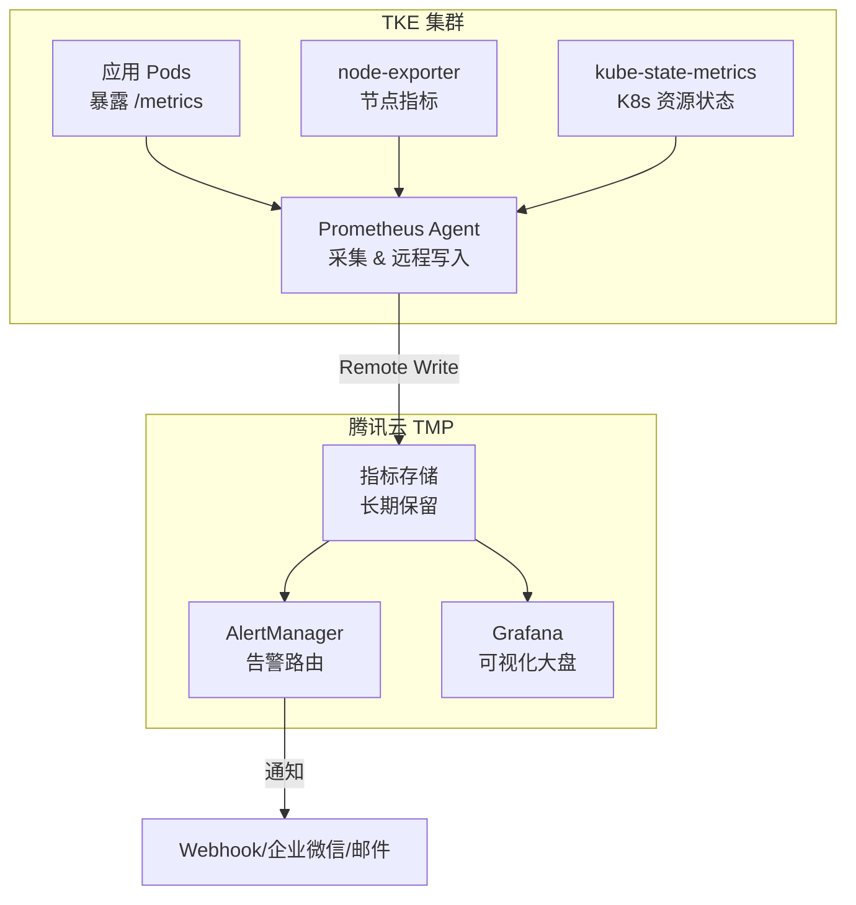

# 监控告警

TKE 提供基于 Prometheus 的监控方案（TMP，Tencent Managed Prometheus），支持集群级别的指标采集、自定义告警规则和可视化大盘。本文介绍如何为 TKE 集群配置生产级监控。

---

## 📋 前置条件

- [ ] 已创建 TKE 集群（版本 1.20+）
- [ ] 已开通腾讯云 TMP（Managed Prometheus）服务
- [ ] 已安装 kubectl 并配置 kubeconfig
- [ ] 了解 Prometheus/PromQL 基础概念

---

## 🏗️ TKE 监控架构



---

## 🚀 快速接入 TMP

### 方式一：控制台一键接入（推荐）

1. 进入 [TMP 控制台](https://console.cloud.tencent.com/monitor/prometheus)
2. 创建 Prometheus 实例（选择与集群同 VPC）
3. 进入实例 → **集成容器服务** → 关联 TKE 集群
4. TKE 会自动部署采集组件，约 3 分钟完成

### 方式二：kubectl 手动部署

```bash
# 安装 kube-prometheus-stack
helm repo add prometheus-community https://prometheus-community.github.io/helm-charts
helm repo update

helm install kube-prometheus prometheus-community/kube-prometheus-stack \
  --namespace monitoring \
  --create-namespace \
  --set prometheus.prometheusSpec.remoteWrite[0].url="https://tmp-xxx.ap-guangzhou.tmp.tencentcos.cn/api/v1/prom/write" \
  --set prometheus.prometheusSpec.remoteWrite[0].basicAuth.username.name=tmp-secret \
  --set prometheus.prometheusSpec.remoteWrite[0].basicAuth.username.key=username \
  --set prometheus.prometheusSpec.remoteWrite[0].basicAuth.password.name=tmp-secret \
  --set prometheus.prometheusSpec.remoteWrite[0].basicAuth.password.key=password

# 验证部署
kubectl get pods -n monitoring
```

---

## 📊 核心监控指标

### 集群健康指标

```text
# 节点就绪率
sum(kube_node_status_condition{condition="Ready",status="true"}) / count(kube_node_info) * 100

# Pod 运行率
sum(kube_pod_status_phase{phase="Running"}) / sum(kube_pod_status_phase) * 100

# API Server 请求延迟（P99）
histogram_quantile(0.99, rate(apiserver_request_duration_seconds_bucket[5m]))
```

### 工作负载指标

```text
# Deployment 期望副本数 vs 实际副本数
kube_deployment_spec_replicas - kube_deployment_status_replicas_available

# 容器 CPU 使用率（%）
rate(container_cpu_usage_seconds_total{container!=""}[5m]) 
  / on(pod, container) kube_pod_container_resource_limits{resource="cpu"} * 100

# 容器内存使用率（%）
container_memory_working_set_bytes{container!=""}
  / on(pod, container) kube_pod_container_resource_limits{resource="memory"} * 100
```

### 节点资源指标

```text
# 节点 CPU 使用率
100 - (avg by(instance) (rate(node_cpu_seconds_total{mode="idle"}[5m])) * 100)

# 节点内存使用率
(1 - node_memory_MemAvailable_bytes / node_memory_MemTotal_bytes) * 100

# 节点磁盘使用率
(1 - node_filesystem_avail_bytes{mountpoint="/"} / node_filesystem_size_bytes{mountpoint="/"}) * 100
```

---

## 🔔 告警规则配置

### 创建 PrometheusRule

```yaml
# alert-rules.yaml
apiVersion: monitoring.coreos.com/v1
kind: PrometheusRule
metadata:
  name: tke-cluster-alerts
  namespace: monitoring
  labels:
    prometheus: kube-prometheus  # 必须匹配 Prometheus 的 ruleSelector
spec:
  groups:
  - name: cluster.health
    interval: 30s
    rules:
    # 节点不可用告警
    - alert: NodeNotReady
      expr: kube_node_status_condition{condition="Ready",status="true"} == 0
      for: 5m
      labels:
        severity: critical
      annotations:
        summary: "节点 {{ $labels.node }} 不可用"
        description: "节点已持续 5 分钟未就绪，请检查节点状态"

    # Pod 频繁重启
    - alert: PodCrashLooping
      expr: rate(kube_pod_container_status_restarts_total[15m]) > 0.25
      for: 5m
      labels:
        severity: warning
      annotations:
        summary: "Pod {{ $labels.namespace }}/{{ $labels.pod }} 频繁重启"
        description: "15 分钟内重启超过 3 次，请检查应用日志"

    # 容器 OOM
    - alert: ContainerOOMKilled
      expr: kube_pod_container_status_last_terminated_reason{reason="OOMKilled"} == 1
      for: 0m
      labels:
        severity: warning
      annotations:
        summary: "容器 {{ $labels.container }} 被 OOM Kill"
        description: "请检查内存 Limit 配置或优化应用内存使用"

  - name: resource.usage
    rules:
    # 节点 CPU 高负载
    - alert: NodeHighCPU
      expr: 100 - (avg by(node) (rate(node_cpu_seconds_total{mode="idle"}[5m])) * 100) > 85
      for: 10m
      labels:
        severity: warning
      annotations:
        summary: "节点 {{ $labels.node }} CPU 使用率超过 85%"

    # 节点内存紧张
    - alert: NodeHighMemory
      expr: (1 - node_memory_MemAvailable_bytes / node_memory_MemTotal_bytes) * 100 > 90
      for: 5m
      labels:
        severity: critical
      annotations:
        summary: "节点 {{ $labels.node }} 内存使用率超过 90%"
```

```bash
kubectl apply -f alert-rules.yaml
```

### 配置告警接收（企业微信）

```yaml
# alertmanager-config.yaml
apiVersion: monitoring.coreos.com/v1alpha1
kind: AlertmanagerConfig
metadata:
  name: wechat-receiver
  namespace: monitoring
spec:
  route:
    receiver: wechat
    groupBy: ['alertname', 'cluster']
    groupWait: 30s
    groupInterval: 5m
    repeatInterval: 4h
  receivers:
  - name: wechat
    wechatConfigs:
    - apiURL: 'https://qyapi.weixin.qq.com/cgi-bin/'
      corpID: 'your-corp-id'
      apiSecret:
        name: wechat-secret
        key: apiSecret
      agentID: 1000001
      toUser: '@all'
      message: |
        {{ range .Alerts }}
        [{{ .Labels.severity }}] {{ .Annotations.summary }}
        {{ .Annotations.description }}
        {{ end }}
```

---

## 📈 Grafana 大盘

### 导入 TKE 官方大盘

TMP 控制台内置以下大盘，直接启用：

| 大盘名称 | 内容 |
|---------|------|
| **集群总览** | 节点数、Pod 数、CPU/内存总量 |
| **节点详情** | 单节点 CPU/内存/磁盘/网络 |
| **工作负载监控** | Deployment/StatefulSet 副本状态 |
| **K8s 系统组件** | apiserver、etcd、scheduler 延迟 |

### 导入社区大盘

```bash
# 常用大盘 ID（在 grafana.com 搜索）
# 3119 - Kubernetes cluster monitoring（Prometheus 官方）
# 6417 - Kubernetes Cluster (Prometheus)
# 8685 - Kubernetes Deployment Statefulset Daemonset
```

---

## ✅ 验证步骤

```bash
# 1. 检查采集组件 Pod 状态
kubectl get pods -n monitoring
# 期望所有 Pod 为 Running

# 2. 检查 ServiceMonitor
kubectl get servicemonitor -n monitoring

# 3. 验证指标采集（通过 port-forward）
kubectl port-forward svc/kube-prometheus-prometheus 9090:9090 -n monitoring
# 浏览器访问 http://localhost:9090，执行查询 up

# 4. 检查告警规则加载
kubectl get prometheusrule -n monitoring
# TMP 控制台：查看"告警规则"是否有 Firing 状态

# 5. 触发测试告警
kubectl run test-pod --image=invalid-image-xxx  # 会触发 ImagePullBackOff
# 约 5 分钟后检查告警是否收到通知
```

---

## ⚠️ 常见问题

### Q1: 采集组件 Pod 一直 Pending

```bash
kubectl describe pod <prometheus-pod> -n monitoring
```
- 检查节点资源是否充足（Prometheus 默认需要约 2C4G）
- 检查节点是否有污点（Taint）阻止调度

### Q2: 指标有缺失

```bash
# 查看 Prometheus 采集目标状态
kubectl port-forward svc/kube-prometheus-prometheus 9090 -n monitoring
# 访问 http://localhost:9090/targets，查看 DOWN 的 target
```

### Q3: 告警发出但通知没收到

- 检查 AlertManager 配置是否正确（企业微信 API 密钥）
- 查看 AlertManager 日志：`kubectl logs -n monitoring alertmanager-xxx`
- 确认 `for` 时间窗口是否够长（告警需持续触发才发送）

---

## 📖 相关资源

- [TMP 产品文档](https://cloud.tencent.com/document/product/1416)
- [kube-prometheus-stack](https://github.com/prometheus-community/helm-charts/tree/main/charts/kube-prometheus-stack)
- [PromQL 入门](https://prometheus.io/docs/prometheus/latest/querying/basics/)
- [日志采集](logging.md)
- [链路追踪](tracing.md)

---

**文档维护者**: TKE Workshop Agent  
**最后更新**: 2026-04-03  
**Agent 友好度**: ⭐⭐⭐⭐⭐
