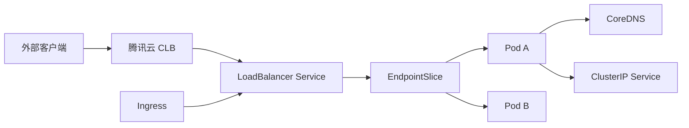

# 网络

TKE 网络板块面向日常操作场景，帮助你完成服务发现、四层负载均衡、七层路由、网络隔离、VPC-CNI 规划和连通性排障。生产环境的选型原则和治理建议放在 [网络最佳实践](../best-practices/networking/)。

---

## 学习路径

| 阶段 | 目标 | 推荐文档 |
|------|------|----------|
| 服务访问 | 理解 ClusterIP、NodePort、LoadBalancer、ExternalName 的适用场景 | [Service 类型](service/01-service-types.md) |
| 对外暴露 | 通过腾讯云 CLB 暴露 HTTP/TCP 服务 | [LoadBalancer Service](service/02-loadbalancer-service.md) |
| 七层路由 | 使用 Ingress 统一入口、域名和路径转发 | [CLB Ingress](ingress/01-clb-ingress.md) |
| 网络隔离 | 使用 NetworkPolicy 控制 Pod 入站和出站流量 | [命名空间隔离](network-policy/01-namespace-isolation.md) |
| 高性能网络 | 规划 VPC-CNI 子网、Pod IP 和固定 IP 场景 | [VPC-CNI](vpc-cni/) |
| 故障定位 | 从 Pod、Service、Endpoint、CLB、安全组逐层排查 | [Service 连通性排障](troubleshooting/01-service-connectivity.md) |

---

## TKE 网络模型



Kubernetes Service 负责把一组 Pod 抽象成稳定访问入口；TKE 在 `LoadBalancer` Service 场景下自动创建或绑定腾讯云 CLB。Ingress 负责 HTTP/HTTPS 七层路由，通常仍然通过 Service 和 CLB 承接流量。VPC-CNI 场景下，Pod 直接使用 VPC 子网 IP，适合低时延、固定 IP 或 LB 直通 Pod 的业务。

---

## 快速命令

```bash
# 查看 Service 和 Endpoint
kubectl get svc,endpoints,endpointslice -A

# 查看 Ingress
kubectl get ingress -A

# 查看 Pod IP 和所在节点
kubectl get pods -A -o wide

# 检查 DNS
kubectl run dns-check --rm -it --image=busybox:1.36 --restart=Never -- nslookup kubernetes.default
```

---

## 官方参考

- [腾讯云 TKE Service 基本功能](https://cloud.tencent.com/document/product/457/45489)
- [腾讯云 TKE VPC-CNI 模式介绍](https://cloud.tencent.com/document/product/457/50355)
- [腾讯云 TKE 安全组设置](https://cloud.tencent.com/document/product/457/9084)
