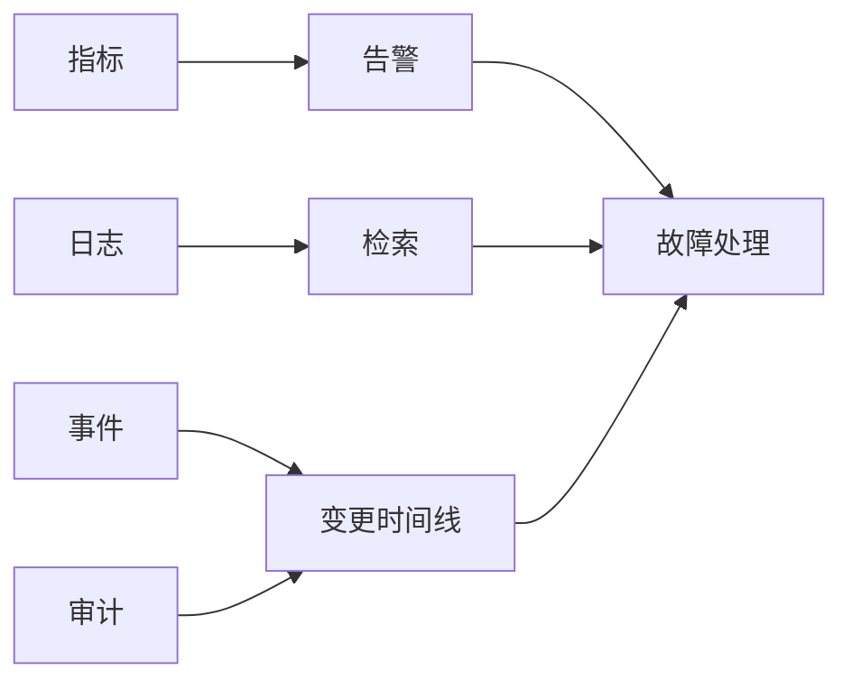

# 运维监控

运维监控板块面向 TKE 集群上线后的日常运维，覆盖集群监控、工作负载监控、日志采集、事件审计、告警配置和故障看板。生产环境的指标设计、日志留存、链路追踪和告警治理请参考 [可观测性最佳实践](../best-practices/observability/)。

---

## 学习路径

| 阶段 | 目标 | 推荐文档 |
|------|------|----------|
| 集群健康 | 观察节点、控制面、系统组件和资源水位 | [集群监控](01-cluster-monitoring.md) |
| 应用状态 | 观察 Deployment、Pod、HPA、重启和资源使用 | [工作负载监控](02-workload-monitoring.md) |
| 日志检索 | 采集容器 stdout/stderr 和业务文件日志 | [日志采集](03-log-collection.md) |
| 事件审计 | 使用 Kubernetes Events、审计日志和操作记录定位变更 | [事件与审计](04-event-and-audit.md) |
| 告警闭环 | 配置节点、Pod、存储、网络和控制面告警 | [告警配置](05-alerting.md) |
| 故障定位 | 从看板和命令快速定位常见异常 | [故障看板](06-troubleshooting-dashboard.md) |

---

## 运维视角



TKE 日常运维建议把指标、日志、事件和审计组合起来看：指标告诉你“哪里异常”，日志解释“应用发生了什么”，事件说明“Kubernetes 做了什么”，审计记录“谁改了什么”。

---

## 快速命令

```bash
kubectl get nodes
kubectl top nodes
kubectl top pods -A
kubectl get events -A --sort-by=.lastTimestamp
kubectl get pods -A --field-selector=status.phase!=Running
```

`kubectl top` 依赖 metrics-server 或集群监控组件。如果命令不可用，先检查集群是否启用了指标采集能力。
