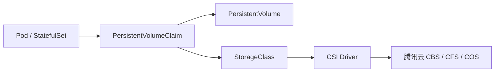

# 存储基础概念

Kubernetes 通过 PV、PVC、StorageClass 和 CSI 把云存储能力抽象成可声明的资源。理解这些对象之间的关系，是排查存储问题的起点。

---

## 核心对象

| 对象 | 作用 |
|------|------|
| PersistentVolume | 集群级存储卷，代表一块云硬盘、文件系统或对象存储挂载点 |
| PersistentVolumeClaim | 命名空间级存储申请，由业务声明容量、访问模式和 StorageClass |
| StorageClass | 动态供给模板，定义云盘类型、可用区、回收策略等 |
| CSI Driver | Kubernetes 与云厂商存储服务之间的插件 |



---

## 访问模式

| 模式 | 含义 | 常见存储 |
|------|------|----------|
| ReadWriteOnce | 单节点读写 | CBS |
| ReadOnlyMany | 多节点只读 | CFS、COS |
| ReadWriteMany | 多节点读写 | CFS、COS |

访问模式是调度和挂载约束，不代表应用层并发写入一定安全。多 Pod 共享写入时，应用仍需处理锁、并发和一致性。

---

## 回收策略

| 策略 | 行为 | 建议 |
|------|------|------|
| Delete | 删除 PVC 后同步删除后端存储 | 测试环境或可重建数据 |
| Retain | 删除 PVC 后保留 PV 和后端存储 | 生产数据、需要人工确认 |

生产环境默认倾向 `Retain`，避免误删 PVC 导致云盘或文件系统被释放。选择 `Delete` 前要确认数据已有备份。

---

## 卷绑定模式

| 模式 | 行为 |
|------|------|
| Immediate | PVC 创建后立即创建或绑定 PV |
| WaitForFirstConsumer | 等待 Pod 调度后再按节点可用区创建或绑定 PV |

CBS 这类有可用区属性的块存储建议使用 `WaitForFirstConsumer`，避免云硬盘创建在与 Pod 节点不一致的可用区。

---

## 常用检查命令

```bash
kubectl get storageclass
kubectl describe storageclass <storage-class-name>
kubectl get pvc -A
kubectl describe pvc <pvc-name> -n <namespace>
kubectl get events -n <namespace> --sort-by=.lastTimestamp
```

遇到存储问题时，先看 PVC 事件，再看 Pod 事件，最后看 CSI 组件日志和云资源状态。
