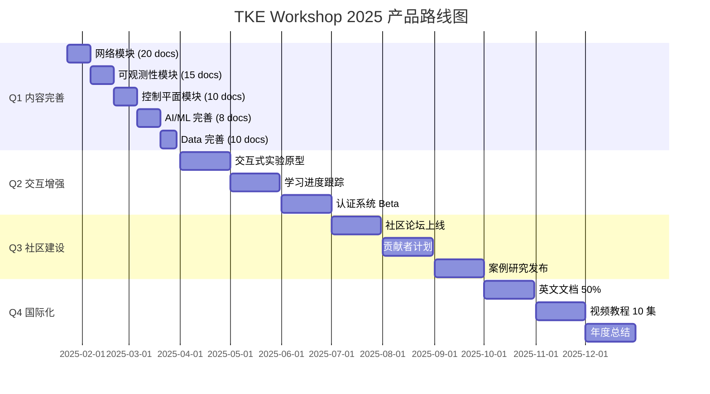
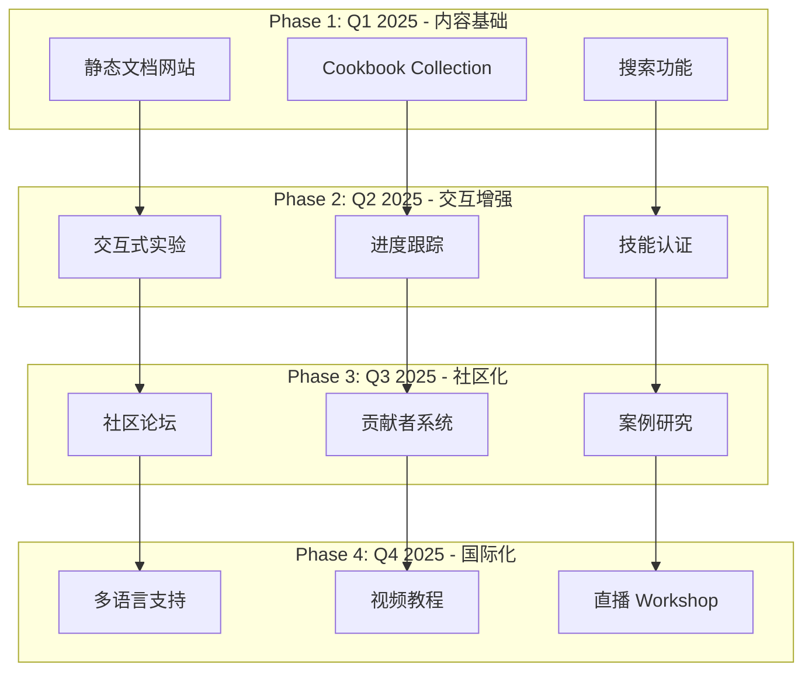
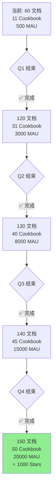

# TKE Workshop 产品路线图可视化

## 📅 2025 年度时间线

```mermaid
gantt
    title TKE Workshop 2025 产品路线图
    dateFormat YYYY-MM-DD
    section Q1 内容完善
    网络模块 (20 docs)           :2025-01-23, 14d
    可观测性模块 (15 docs)       :2025-02-06, 14d
    控制平面模块 (10 docs)       :2025-02-20, 14d
    AI/ML 完善 (8 docs)         :2025-03-06, 14d
    Data 完善 (10 docs)         :2025-03-20, 10d
    
    section Q2 交互增强
    交互式实验原型              :2025-04-01, 30d
    学习进度跟踪               :2025-05-01, 30d
    认证系统 Beta              :2025-06-01, 30d
    
    section Q3 社区建设
    社区论坛上线               :2025-07-01, 30d
    贡献者计划                :2025-08-01, 30d
    案例研究发布               :2025-09-01, 30d
    
    section Q4 国际化
    英文文档 50%              :2025-10-01, 30d
    视频教程 10 集            :2025-11-01, 30d
    年度总结                  :2025-12-01, 30d
```

## 🏗️ 产品架构演进

```mermaid
graph TB
    subgraph "Phase 1: Q1 2025 - 内容基础"
        A[静态文档网站]
        B[Cookbook Collection]
        C[搜索功能]
    end
    
    subgraph "Phase 2: Q2 2025 - 交互增强"
        D[交互式实验]
        E[进度跟踪]
        F[技能认证]
    end
    
    subgraph "Phase 3: Q3 2025 - 社区化"
        G[社区论坛]
        H[贡献者系统]
        I[案例研究]
    end
    
    subgraph "Phase 4: Q4 2025 - 国际化"
        J[多语言支持]
        K[视频教程]
        L[直播 Workshop]
    end
    
    A --> D
    B --> E
    C --> F
    D --> G
    E --> H
    F --> I
    G --> J
    H --> K
    I --> L
```

## 🎓 学习路径图

```mermaid
graph LR
    A[新手入门] -->|基础操作| B[初级开发者]
    B -->|网络 + 工作负载| C[中级开发者]
    C -->|可观测性 + CI/CD| D[高级开发者]
    D -->|最佳实践 + 控制平面| E[架构师]
    E -->|AI/ML + 性能优化| F[专家]
    
    style A fill:#e1f5ff
    style B fill:#b3e0ff
    style C fill:#80ccff
    style D fill:#4db8ff
    style E fill:#1aa3ff
    style F fill:#0080ff
```

## 📈 KPI 达成路径

```mermaid
graph TD
    A[当前: 60 文档<br/>11 Cookbook<br/>500 MAU] --> B{Q1 结束}
    B -->|✅ 完成| C[120 文档<br/>31 Cookbook<br/>3000 MAU]
    C --> D{Q2 结束}
    D -->|✅ 完成| E[130 文档<br/>40 Cookbook<br/>8000 MAU]
    E --> F{Q3 结束}
    F -->|✅ 完成| G[140 文档<br/>45 Cookbook<br/>15000 MAU]
    G --> H{Q4 结束}
    H -->|✅ 完成| I[150 文档<br/>50 Cookbook<br/>20000 MAU<br/>⭐ 1000 Stars]
    
    style I fill:#90EE90
```

---

**可视化工具**: Mermaid  
**更新日期**: 2025-01-23
